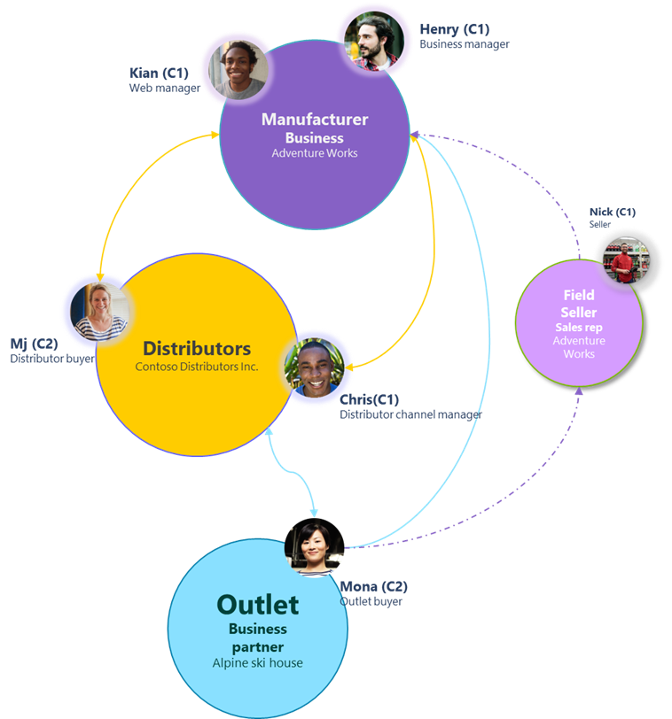
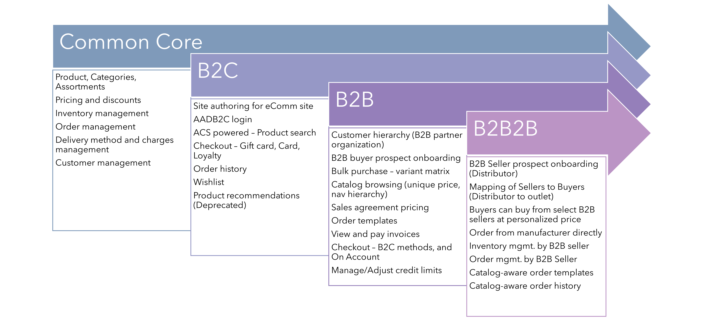
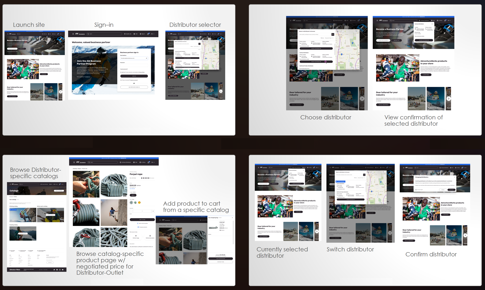

---

title: Native support for B2B Indirect (aka B2B2B)  
description: This document introduces native support for B2B Indirect (aka B2B2B) workflows within Dynamics 365 Commerce, detailing its features and benefits.  
author: ashishmsft  
ms.date: 06/05/2025  
ms.topic: article  
audience: Application User  
ms.reviewer: v-chgriffin  
ms.search.region: Global  
ms.author: asharchw  
ms.search.validFrom: 2021-01-31  
ms.dyn365.ops.version: 10.0.40  
ms.search.industry: retail  
ms.search.form: RetailOperations  
---

# Introducing native support for B2B Indirect (aka B2B2B) workflows with Dynamics 365 Commerce

A new feature with a new set of capabilities providing native support for powering B2B Indirect (aka B2B2B) workflows.

## What is B2B Indirect?

B2B Indirect is a business strategy positioned within a multifaceted supply chain, where transactions occur from one company to another before reaching the end purchaser. This approach broadens market access by including multiple business intermediaries in the distribution cycle. For instance, producers of consumer packaged goods (CPG manufacturers) could distribute their products via a chain of distributors who then execute sales to business entities such as retail outlets.

## How does Dynamics 365 Commerce support B2B Indirect workflows?

Dynamics 365 Commerce is a cloud-based platform that provides a comprehensive set of capabilities to enable B2B commerce scenarios. The platform supports both direct and indirect B2B workflows in a headless, composable manner, allowing merchants to manage multiple types of business relationships and transactions. Some of the key features of Dynamics 365 Commerce for B2B Indirect workflows are:

- Ability to create and manage multiple B2B Seller and B2B Buyer accounts, each with their own pricing, catalog, and inventory management.
- Ability to configure and apply complex pricing and discount rules based on various criteria such as account type, order quantity, product category, and more.
- Ability to create and manage multiple catalogs and assortments for different B2B Seller and B2B Buyer accounts, with the option to inherit, override, or extend the product information from the master catalog.
- Ability to allow B2B Buyers to buy from a select authorized and approved list of B2B Sellers or from the Manufacturer directly.
- Ability to allow Customer service agents (aka field sellers) from the Manufacturer’s organization to order on behalf of (OBO) a B2B Buyer (outlet-buyer) with a specific B2B Seller (Distributor/Wholesaler).
- Ability to provide a rich and responsive user interface for B2B Seller and B2B Buyer portals, with features such as product search, browsing, filtering, sorting, comparison, reviews, ratings, wish lists, cart, checkout, order history, and more.
- Ability to integrate with various external systems and services, such as ERP, CRM, payment, tax, shipping, and more, using the platform's APIs and connectors.

## Why choose Dynamics 365 Commerce for B2B Indirect workflows?

Dynamics 365 Commerce is designed to support high-volume merchants and provides a suite of advanced features to cater to the specific needs of B2B transactions. Some of the benefits of choosing Dynamics 365 Commerce for B2B Indirect workflows are:

- B2B Indirect workflows are introduced as a natural extension to existing B2B workflows, leveraging the same platform capabilities and data model, and providing a consistent and seamless user experience.
- B2B Indirect workflows are available in a headless manner, meaning that merchants can use the platform's APIs and SDKs to build custom extensions and integrations to fit their existing business processes and workflows.
- B2B Indirect workflows are scalable, secure, and reliable, as they are built on the Microsoft Azure cloud platform, which offers high availability, performance, and compliance.
- B2B Indirect workflows are flexible and customizable, allowing merchants to configure and modify various aspects of the platform, such as business rules, user interface, workflows, and more, to suit their specific business needs and preferences.

## B2B Seller Prospect Sign-up and Approval Process

The following is a brief overview of the steps involved in becoming a B2B seller on the platform:

- Submit B2B Seller Prospect Application: Prospective B2B sellers submit an application expressing their interest in becoming a seller on the platform. The application includes relevant business information, contact details, etc.
- Sync Prospect Application: The submitted application is synced to HQ and made available for review. Run or schedule a P-001 sync job from the Distribution Schedule and run ‘sync Customer requests’.
- Review Prospect Application: The platform team evaluates the prospect’s suitability based on predefined criteria. Criteria may include business size, industry, product offerings, and compliance with platform policies. The review process aims to identify genuine businesses and filter out potential fraud or non-serious applicants.
- Approve/Reject B2B Seller Prospect: Based on the review, the prospect application is either approved or rejected. Approved prospects receive confirmation and further instructions on the next steps. Rejected applicants are informed of the decision and the reasons behind it.

Once approved, the system sets up the following elements in the back office and associates them with the B2B seller through these steps:

- Creates a Copy of Existing Online B2B Channel: The platform creates a new B2B channel specifically for the approved seller. This channel has a unique site and warehouse, allowing the seller to manage their inventory separately.
- Employee Record Creation: An employee record is set up automatically for the B2B seller. This record enables the seller to carry out inventory management, order management, and other operational tasks.
- Customer Hierarchy Mapping: The B2B seller (channel) is mapped to a specific customer hierarchy. This hierarchy defines the relationships between the seller and their customers, such as pricing, discounts, payment terms, etc.
- Manufacturer Channel Mapping: The B2B seller’s channel is linked to the manufacturer channel. This ensures that the seller can purchase products directly from the manufacturer, maintaining supply chain efficiency and quality control.

By following these steps, the B2B seller can become a part of the platform and can start selling to their retail outlets.

## Overview of Capabilities

As part of this feature, you will be able to natively leverage the following capabilities, in addition to all existing B2B capabilities that are already available:

- Onboard 'B2B Seller' as a new B2B Prospect type.
- Convert existing 'B2B Buyers’ to become 'B2B Seller and Buyer'.
- Allow customers from the 'B2B Seller' organization to carry out order and inventory management operations.
- Create B2B catalog-aware Commerce orders in HQ and Call Center, along with the ability to choose the fulfilling channel (B2B Seller or distributor) in the order header.
- Map individual B2B Buyer organizations to B2B Sellers and Manufacturers, giving you control over who can buy from whom. Directly from the B2B Buyer’s customer hierarchy, by mapping associated B2B channels they can buy from.
- Allow B2B Buyers to choose to purchase from multiple B2B Sellers and/or the Manufacturer. At any point in time, they can buy from a single B2B Seller (aka distributor) or Manufacturer, but they can have multiple active carts at the same time with individual B2B Sellers and the Manufacturer.
- Order templates are now catalog-aware.
- Order-on-behalf-of allows C1 from the Manufacturer (not the B2B Seller) to place an order for C2 (B2B Buyers) directly with both the Manufacturer or a B2B Seller.
- Order history allows you to filter by various options, including the channel (B2B Seller or Manufacturer) where the order originated.
- Lastly, there are additional APIs available to allow C1 from the B2B Seller (Distributor's) organization to manage their inventory on hand as well as accept or reject orders.

