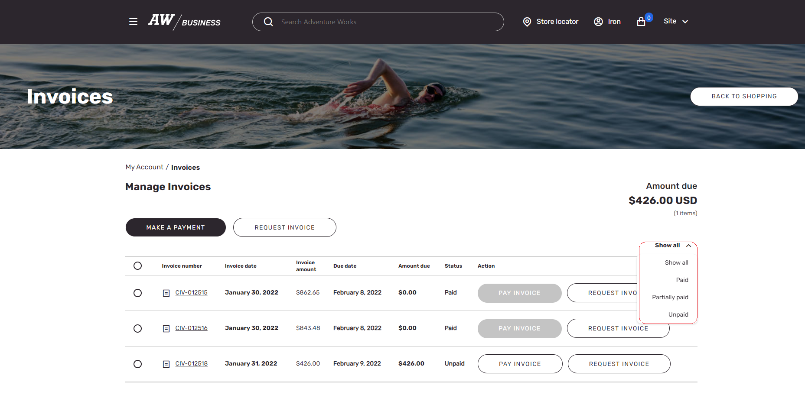
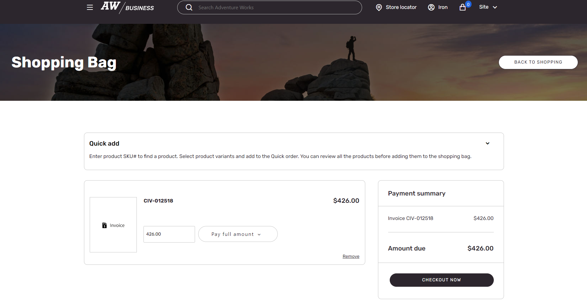
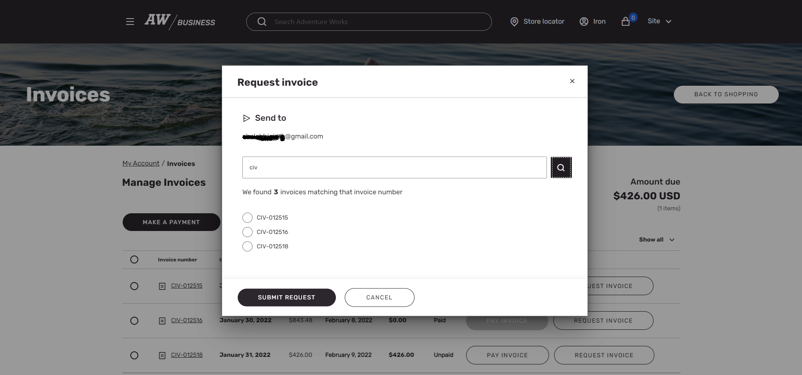

# Invoice management for B2B e-commerce websites

[!include [banner](../../includes/banner.md)]

This article describes the invoice management capabilities of Microsoft Dynamics 365 Commerce business-to-business (B2B) e-commerce websites.

It's a common practice for companies that handle B2B transactions to accept orders on customer credit and then send an invoice to customers after they fulfill the order. Payment terms are defined for customers, and there might be some discounts to motivate customers to pay on time or before time. To help increase the probability that payments will be received on time, B2B e-commerce websites let customers view all their invoices. Customer can easily filter the invoices to view paid, unpaid, and partially paid invoices together with the due dates.

> [!NOTE]
> A signed-in user can view and pay only their own invoices. If an organization account is configured on the **Invoice account** drop-down menu on the **Invoice and delivery** FastTab of the customer record in Commerce headquarters, the user will be able to view and pay invoices for the organization account.

On the **Invoices** page of a B2B website, a user can select an unpaid or partially paid invoice and then select **Pay invoice**. The selected invoice is added to the cart, and the user can proceed with payment. The user can then decide whether to pay the full amount of the invoice or a partial amount. The user can't use the on-account payment method to pay for invoices.

> [!NOTE]
> Invoices can be added to the cart only if no items are currently in it. Conversely, items can be added to the cart only if no invoices are currently in it. Microsoft plans to remove this restriction in future Commerce releases.

On the **Invoices** page, a user can also select **Request invoice** next to an invoice. In this way, the user can request to have the details of the invoice sent to their registered email address.

After a user requests an invoice, the request is moved to the **B2B Requests** section of the **My account** page. Then, after the **P-0001** and **Synchronize orders and channel requests** jobs are run in Commerce headquarters, the invoice email is triggered, and the status of the B2B request is marked as completed.

[!INCLUDE[footer-include](../../includes/footer-banner.md)]
