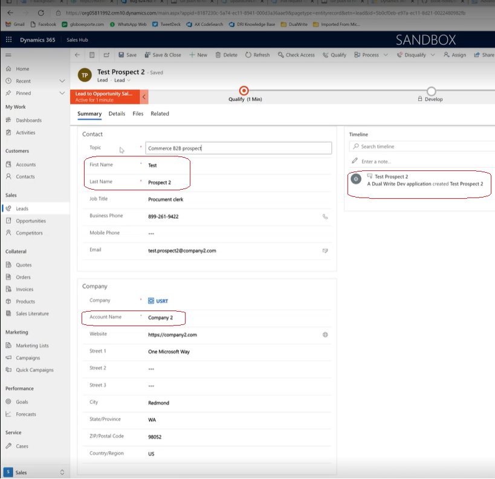

---
# required metadata

title: Manage business partner users on B2B e-commerce websites using Dynamics 365 Sales
description: This topic describes how to use Microsoft Dynamics 365 Sales to manage business partner approvals for Dynamics 365 Commerce business-to-business (B2B) websites.
author: shajain
ms.date: 2/16/2022
ms.topic: article
ms.prod: 
ms.technology:

# optional metadata

ms.search.form:
audience: Application User, IT Pro
# ms.devlang: 
ms.reviewer: v-chgri
#ms.search.scope: Core, Operations, Retail
# ms.tgt_pltfrm: 
# ms.custom: 
ms.search.region: Global
ms.search.industry: retail
ms.author: shajain
ms.search.validFrom: 2022-01-31
ms.dyn365.ops.version: 10.0.21

---

# Manage business partner users on B2B e-commerce websites using Dynamics 365 Sales

[!include [banner](../../includes/banner.md)]

This topic describes how to use Microsoft Dynamics 365 Sales to manage business partner approvals for Dynamics 365 Commerce business-to-business (B2B) websites. Organizations that have already invested in the Dynamics 365 Sales solution can use its lead and opportunity concepts for the B2B e-commerce business partner approval process.

For background information about the B2B business partner approval process, see [Manage business partner users on B2B e-commerce websites](manage-b2b-users.md).

Potential business partners can initiate the onboarding process to a B2B e-commerce website by submitting an onboarding request via a link on the B2B website. After the request is submitted, and the relevant jobs (such as **P-0001** and **Synchronize orders and channel requests**) are run in Commerce headquarters, the onboarding request is saved on the **All prospects** page in Commerce headquarters. The business partner prospect approval process can then be completed in Sales.

After integration between Sales and Commerce is enabled, the creation of a business partner prospect in Commerce causes the creation of a *lead* in Sales.

The following illustration shows an example of a lead creation page for a business partner prospect in Sales.

In the illustration, the **Contact** section shows the person who submitted the onboarding request, and the **Company** section shows the organization. A note in the **Timeline** section indicates that the lead was generated by the dual-write infrastructure. Because it was created by the dual-write infrastructure, this lead won't appear in the **My open leads** drop-down list. Instead, it will appear under a new view that is named **All commerce B2B leads**.

Per the standard lead qualification process in Sales, when a user "qualifies" the lead, an *opportunity* record, a *contact* record, and an *account* record are created. The dual-write infrastructure is used to write the contact and the account records to Commerce. The contact is created as a customer of the *person* type, and the company is created as a customer of the *organization* type. If a user selects **Close as Won** for the opportunity, the prospect is approved in Commerce. Approval of a prospect causes a customer hierarchy to be created.

All remaining business processes occur in Commerce. These processes include sending email to the business partner, defining credit limit management for the users, and adding more users to the B2B site. However, if a user disqualifies the lead or marks the opportunity as lost instead of qualifying the lead, the prospect in Commerce is marked as rejected, and a decline onboarding email is sent to the requestor.

## Enable integration between Sales and Commerce

Integration between Sales and Commerce relies on the dual-write infrastructure. Therefore, dual-write should be enabled and working, so that customers that are created in one system are written to the other system. For more information about the dual-write infrastructure, see [Dual-write overview](/dynamics365/fin-ops-core/dev-itpro/data-entities/dual-write/dual-write-overview).

After the dual-write setup has been completed, the implementation partner can go to [Microsoft AppSource](https://appsource.microsoft.com/) and search for the solution that is named [Dual-write Commerce solutions](https://partner.microsoft.com/dashboard/commercial-marketplace/offers/7ca1d8c9-dc79-4cb7-a82e-8dc96a25acca/overview). Install the package by using the standard installation wizard, and then test it by creating a prospect on a B2B site. After the prospect is created, verify that the request is shown on the **All prospects** appears in Commerce, and then verify that the prospect is shown as a lead in Sales.

## Additional resources

[Manage business partner users on B2B e-commerce websites](manage-b2b-users.md)

[!INCLUDE[footer-include](../../includes/footer-banner.md)]
