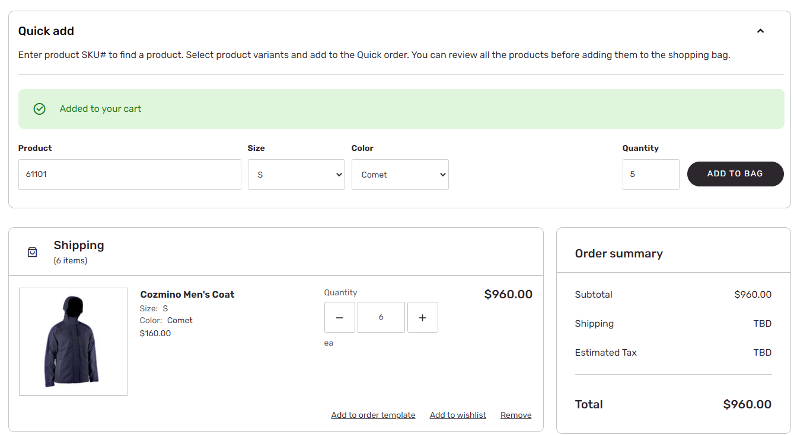
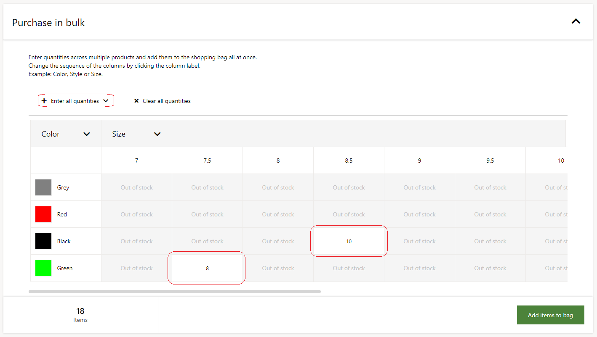
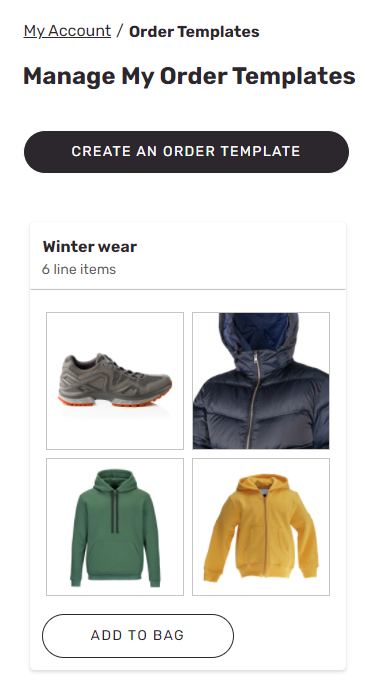
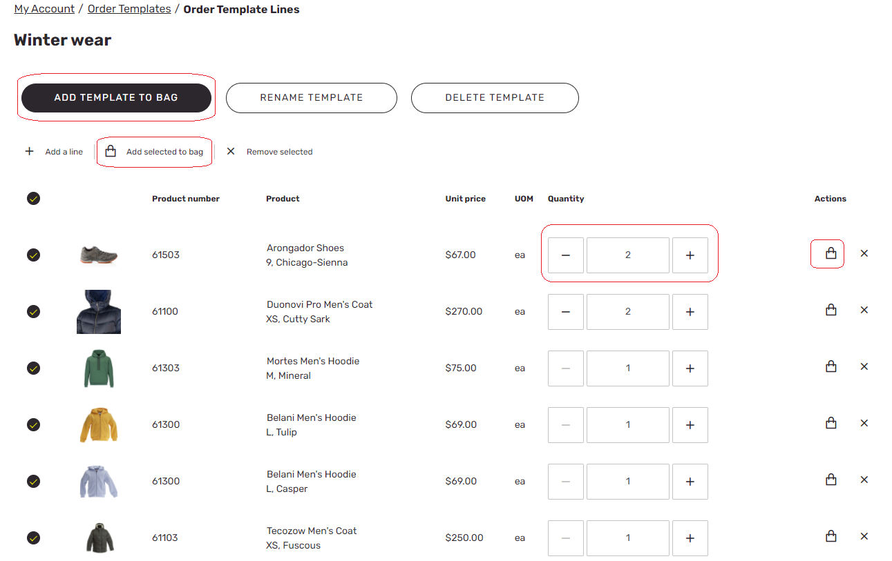
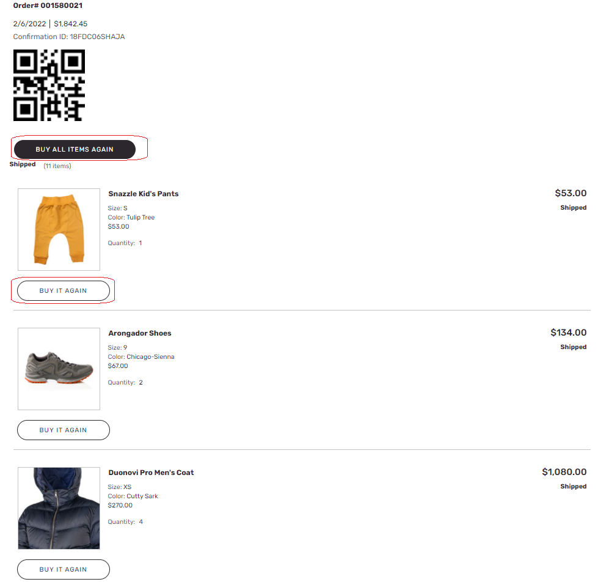

# Place B2B website orders quickly

[!include [banner](../../includes/banner.md)]

This article describes the capabilities of Microsoft Dynamics 365 Commerce that let business-to-business (B2B) site users quickly place bulk and repeat orders.

Dynamics 365 Commerce B2B e-commerce websites let users perform standard operations such as discovering new products via searching and browsing, viewing product details, adding items to the cart, and checking out. However, whereas the customers of business-to-consumer (B2C) sites generally order items in small quantities and order them only once, B2B customers typically order items in large quantities and reorder them multiple times. Because these customers usually know exactly what items they want to buy, they often they skip the product discovery phase and move directly to ordering. To meet the needs of these customers, Commerce B2B e-commerce websites provide various capabilities that help them place orders quickly.

## Bulk order by item number

Commerce B2B e-commerce websites let site users add items to the cart by entering product item numbers together with the desired quantity.

The following illustration shows an example of quick order entry by product item number.

## Bulk order by variant

Commerce B2B e-commerce websites let site users quickly add different variants of the same product in a single view that shows inventory availability by size, color, and style. In addition, site users can easily enter the same quantity for all in-stock products by selecting **Enter all quantities**.

The following illustration shows an example of quick order entry where the "enter all quantities" functionality is used.

## Use order templates for quick order entry

Buyers on B2B websites often order specific items together. For example, if you're placing orders for a construction site, you might want to order shirts, jackets, pants, shoes, and hats together. If you're placing orders for a hospital, where doctors, nurses, and cleaning staff have different uniforms, you might want to group each uniform type together for easier ordering. For these types of scenarios, Commerce B2B sites enable order templates to be created. Site users can create any number of custom templates and then order all or some of the items from those templates as they require. 

You can create new order templates by going to **My account \> Manage order templates** and selecting **Create an order template**. Another way to create a new order template is by navigating to a product details page (PDP) for an item, selecting a variant (if applicable), and then selecting **Add to order template**. This action opens the **Add to order template** view, where you can select **Create new** to create a new order template. 

The following illustration shows an example of an order template.

The following illustration shows an example of the details view for an order template.

## Reorder from order history

Commerce B2B e-commerce websites let site users quickly reorder items from their order history. Site users can either buy selected items from their order history or add all previously purchased items to the cart.

The following illustration shows an example of a user's order history and the options for reordering items from it.

This article has described just some of the ways that Commerce B2B sites help users quickly find, order, and reorder the products that they want. More capabilities are in development to further simplify the process of capturing bulk orders.
