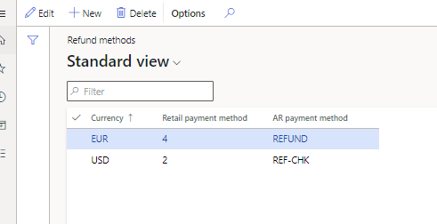
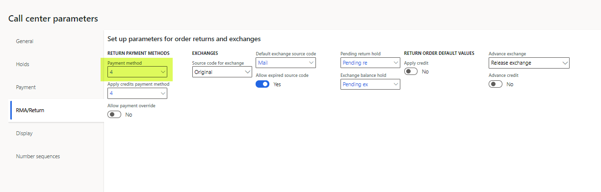
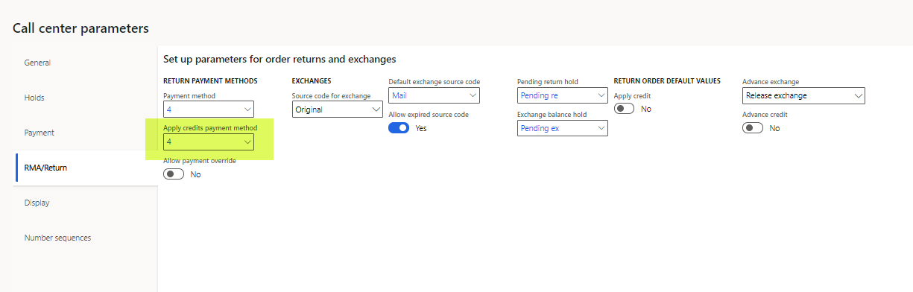
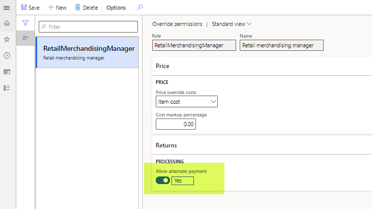
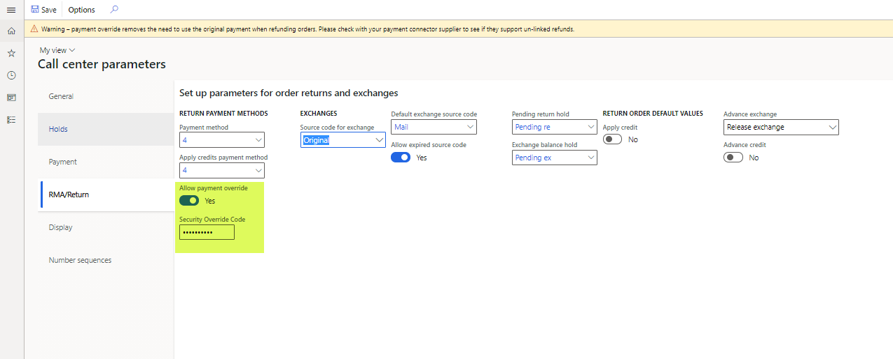

---
# required metadata

title: Refund payment processing in call centers
description: This topic explains how payment refunds are generated through call centers when returns are created, or when orders or order lines are canceled.
author: hhainesms
ms.date: 01/05/2020
ms.topic: article
ms.prod:
ms.technology: 

# optional metadata

# ms.search.form:
audience: Application User
# ms.devlang: 
ms.reviewer: v-chgri
# ms.tgt_pltfrm: 
# ms.custom:
ms.search.region: global
# ms.search.industry:
ms.author: hhaines
ms.search.validFrom:
ms.dyn365.ops.version: 
---

# Refund payment processing in call centers

This topic explains how payment refunds are generated through call centers when returns are created, or when orders or order lines are canceled.

A user who creates a return order for a customer as a call center user in Microsoft Dynamics 365 Commerce headquarters uses the **Return order** page to create the initial return materials authorization (RMA). The RMA defines the products that the customer wants to return or exchange, and it creates a linked return sales order that has an order type of **Returned order**. This linked returned order is used to track the posting of the returned inventory and any credit notes or payment refunds that are posted.

If the **Enable order completion** option is set to **Yes** for the call center channel, the call center user who creates the RMA must run the order completion processing flow by selecting **Complete** on the **Return order** page. The **Complete** function provides a calculated return summary that outlines the refund amount that is due. Additionally, when it's correctly configured, it systematically creates a refund payment line against the returned order.

Call center logic determines the payment method for the refund payment line, based on the payment method that was used for the original order. If the return order that is created isn't linked to an original order, a default payment method that is taken from a system parameter is applied.

## How a call center determines which payment method to apply to a return order

The call center uses the payment method of the original order to determine the payment method that should be applied to a return order. Here is how this process works for the following original payment methods:

- **Normal** (cash) or **Check** – When a return order that is created references an original order that was paid for by using the normal (cash) or check payment type, the call center application references configurations on the **Call center refund methods** page. This page enables organizations to define, by order currency, how refunds are issued to customers for orders that were originally paid for by using the normal or check payment type. The **Call center refund methods** page also enables organizations to select if a system-generated refund check should be sent to the customer. In these scenarios, call center logic references the currency of the return order and then uses the **Retail payment method** value for that currency to create a refund payment line on the return sales order. Later, an accounts receivable (AR) customer payment journal that uses the mapped AR payment method is linked to the currency.

    The following illustration shows the configuration for a scenario where a customer returns products from a sales order that is linked to the USD currency, and that was originally paid for by using the normal or check payment type. In this scenario, a refund will be issued to the customer through a system-generated refund check. The **REF-CHK** AR payment method has been configured as a refund check payment type.

    

    > [!NOTE]
    > Customer account is not a supported refund method for cash or check payments.

- **Credit card** – When a return order that is created references an original order that was paid for by using a credit card, call center logic for refund payments applies the same original credit card to the return order.
- **Loyalty card** – When a return order that is created references an original order that was paid for by using a customer loyalty card, call center logic for refund payments applies the refund to the same loyalty card.
- **Gift card** (internal) – When a return order that is created references an original order that was paid for by using a gift card that was issued from Dynamics 365 Commerce (internal gift card functionality), call center logic for refund payments applies the refund to the same original gift card number.
- **Gift card** (External) – When a return order that is created references an original order that was paid for by using an external third-party gift card, call center logic for refund payments applies the default return payment method that is defined on the **RMA/Return** tab of the **Call center parameters** page.

If the original order payment type is unknown for any reason, or if multiple payment methods were used to pay for the original order, call center logic applies the default return payment method that is defined on the **RMA/Return** tab of the **Call center parameters** page.

The following illustration shows the **Payment method** field on the **RMA/Return** tab of the **Call center parameters** page.

> [!NOTE]
> The refund processing rules that are described earlier also apply to orders or order lines that a call center user cancels in Commerce headquarters. If the cancellation of an order or specific order lines causes any overpayments, the same rules will be used to generate refund payment lines.

Typically, a return order goes through a standard process, where inventory is received (or scrapped), a packing slip is posted against the return order, and then an invoice posting process is run for the return sales order. The return sales order is linked and systematically generated as part of the process of creating the return order. In typical scenarios, payment refunds aren't issued to customers until the invoice for the return sales order is posted.

### What happens when an invoice is posted on a return sales order

The following scenarios explain what happens when an invoice is posted on a return sales order:

- If the refund payment on the return order is for a credit card, additional logic is invoked when the invoice is posted. This logic calls the payment processor to refund payment to the customer's credit card. A refund customer payment voucher is also created and systematically posted against the customer's account. This payment journal will be settled against the return order credit note voucher.
- If the refund payment that must be issued is for the check payment type, a customer payment voucher that uses the AR payment method is created, and must be manually posted or printed before the payment voucher can be posted against the customer account. To process the refund check, users can use either the **Customer payment journal** page in Accounts receivable or the specialized **Refund check processing** page in Retail and Commerce.
- If the refund payment that must be issued is for the internal gift card or loyalty card payment type, when the return order is invoiced, the refund payment voucher is created and posted against the customer account. This invoicing step also adds the refund amount back to the customer's internally tracked gift card balance or loyalty points balance.
- If a payment method that uses the **Customer** function (for example, a customer account) is linked to the return sales order, credit limit validations are ignored when the payment is processed. No payment voucher is created or posted in this context. When a customer payment type is used on a return order, the credit note voucher that the invoice posting process creates serves as the customer credit voucher and indicates a refund to the customer's AR balance.

## Advance credit

When a user processes return orders as a call center user in a call center where the **Enable order completion** option is set to **Yes**, an exception to the previously described process for refund payment posting can occur if the call center user who is creating the return order sets the **Advance credit** option to **Yes** on the **RMA/Return** tab of the **Call center parameters** page. In this case, the payment refund occurs immediately after the return order is successfully submitted by using the **Submit** function on the **Return summary** page. The system immediately creates a prepayment customer payment voucher for the return value, even though the return sales order itself hasn't yet been invoiced. This approach can be used in situations where an organization must issue refunds to customers in advance because of customer service issues, and it doesn't want to require that returned inventory be received before the refunds are issued.

## Replacement orders

When a return order is issued, the **Replacement order** function can be used to generate a new sales order for the customer. This approach can be used in exchange scenarios. The **Replacement order** function creates another sales order for the new items that must be sent, but a cross-reference link on the **RMA/Return** tab of the **Call center parameters** page links the replacement order, the RMA, and the returned sales order.

When payments on a replacement order are processed, organizations have two options:

- Refund the customer for the return order, based on the original payment method, and then collect a separate payment for the replacement order. No additional configuration is required to use this option.
- Set the **Apply credit** option to **Yes** on the **RMA/Return** tab of the **Call center parameters** page. In this case, a customer payment method is systematically applied to both the return order and the replacement order. This option can help prevent any external refund payment from being issued. It also helps prevent any payment processing on the transaction. It can be useful in situations where an even exchange is being processed, and the organization prefers to use the credit voucher that is generated when the return order is invoiced to pay for the invoice that is generated by the replacement order. When the **Apply credit** option is set to **Yes**, the organization must manually settle the credit note against the replacement order's invoice after both those financial documents have been generated.

A setting of **Yes** for the **Apply credit** option is applicable only when the return order will be linked to a replacement order. In this case, the customer payment method that will be used to systematically pay for the return and the exchange order is defined by the **Apply credits payment method** field on the **RMA/Return** tab of the **Call center parameters** page. Only a payment of the **Customer** function payment type can be selected in this field.

> [!NOTE]
> For a return order that has no linked replacement order, a setting of **Yes** for the **Apply credit** option will have no effect on the return order payment logic, because this setting applies only to replacement orders.

> [!IMPORTANT]
> If users who create replacement orders plan to use the **Apply credit** option, they should not run the **Complete** function on the return order before they set the **Apply credit** option to **Yes**. After the **Complete** function is run, the refund payment is calculated and applied to the return sales order. Any attempt to set the **Apply credit** option to **Yes** after a refund payment has already been calculated and applied won't trigger a recalculation of the refund payment, and the payment method that is selected in the **Apply credits payment method** field won't be applied. If the **Apply credit** option must be used in this context, the user must delete the replacement order and the RMA, and then start over and create a new RMA. This time, the user must ensure that the **Apply credit** option is set to **Yes** before the **Complete** function is run.

## Payment overrides for call center returns

Although call center logic systematically determines the refund payment method in the manner that is described earlier in this topic, users might sometimes want to override those payments. For example, a user might edit or remove existing refund payment lines, and apply new payment lines. System-calculated refund payments can be changed only by users who have the correct override permissions. These permissions can be configured on the **Override permissions** page in Retail and Commerce. To do a refund payment override, the user must be linked to a security role where the **Allow alternate payment** option is set to **Yes** on the **Override permissions** page.

Alternatively, an organization can set the **Allow payment override** option to **Yes** on the **RMA/Return** tab of the **Call center parameters** page. In this case, a security override code must be selected in the **Security Override Code** field. The security override code is an alphanumeric code that must be externally managed, because users can't view it in Commerce headquarters after it's set. The security override code should be known by only a few key, trusted people in an organization. When the **Allow payment override** option is set to **Yes**, if any users who don't have the correct role permissions try to change the method of payment on a return order, they will have the option to enter the security override code. If they don't know it, or if a manager or supervisor can't enter it on the page for them, they won't be able to override the return payment method.

> [!NOTE]
> If the security override code is lost or forgotten, the organization will have to reset it by defining a new security override code in the **Security Override Code** field on the **RMA/Return** tab of the **Call center parameters** page.

> [!IMPORTANT]
> Before organizations try to override refund payments that use credit card payment types, they should verify that their credit card processor allows for unlinked returns. Many processors require that refunds be posted back to the original card. Any attempt to issue a refund to a card that has no previous captures might cause posting failures with the processor.

## Additional resources

[Payment methods in call centers](work-with-payments.md)

[!INCLUDE[footer-include](../includes/footer-banner.md)]