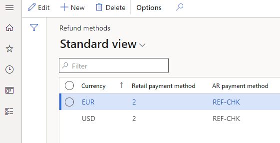

---
# required metadata

title: Refund payment processing in call centers
description: This topic covers how payment refunds are generated through call centers when returns are created or order/order lines are canceled.
author: hhainesms
manager: annbe
ms.date: 12/17/2020
ms.topic: article
ms.prod:
ms.service: dynamics-365-commerce
ms.technology: 

# optional metadata

# ms.search.form:
audience: Application User
# ms.devlang: 
ms.reviewer: josaw
ms.search.scope: Core, Operations, Retail
# ms.tgt_pltfrm: 
# ms.custom:
ms.search.region: global
# ms.search.industry:
ms.author: hhaines
ms.search.validFrom:
ms.dyn365.ops.version: 
---

# Refund payment processing in call centers

This topic covers how payment refunds are generated through call centers when returns are created or order/order lines are canceled.

When creating a return order for a customer as a call center user in Dynamics 365 Commerce headquarters, the user will use the **Return order** form to create the initial Return Materials Authorization (RMA). The RMA defines which products the customer wishes to return or exchange and creates a linked return sales order with an order type of **Returned order**.  This linked returned order is used to track the postings of the returned inventory and any credit notes or payment refunds posted. 

If the call center channel has **Enable order completion** turned on, the call center user creating the RMA will be required to execute the order completion processing flow by selecting the **Complete** function from the **Return order** form.  Selecting **Complete** provides the user with a calculated return summary that outlines the refund amount due and will also (if configured correctly) systematically create a refund payment line against the returned order.

Call center logic will determine the payment method for the refund payment line systematically based on the original order's payment method. If the return order being created is not linked to an original order, a default payment method pulled from a system parameter will be applied.

## How a call center determines which payment method to apply to the return order based on the original order payment method

If the original payment method function was:

-**Normal** (cash) or **Check** - When creating a return order that references an original order that was paid by the normal or check payment types, the call center application will reference configurations in the **Call center refund methods** form. This form allows organizations to define, by order currency, how the customer will be refunded for orders originally paid by normal or check payment types. The **Call center refund methods** form also allows organizations to choose whether to send a system-generated refund check to the customer, or to create a customer account credit against the internal customer account balance. In these scenarios, call center logic will reference the currency of the return order and then create a refund payment line on the return sales order using the configured **Retail payment method** for that currency. Subsequently, an accounts receivable **Customer payment journal** using the mapped **AR payment method** is tied to the currency.

The following image shows a configuration where a customer returning products from a sales order tied to the USD currency that was originally paid by normal or check payment types will be refunded by a systematically-generated refund check. The accounts receivable payment method of **REF-CHK** has been configured as a refund check payment type.

- **Credit card** - When creating a return order that references an original order that was paid by credit card, call center refund payments logic will apply that same original credit card to the return order. 
- **Loyalty card** - When creating a return order that references an original order that was paid by a customer loyalty card, call center refund payments logic will refund back to the same loyalty card
- **Gift card** (Internal) - When creating a return order that references an original order that was paid for by a gift card issued from Dynamics 365 Commerce (internal gift card functionality), call center refund payments logic will refund back to that same original gift card number.
- **Gift card** (External) - When creating a return order that references an original order that was paid for by an external third-party gift card, call center refund payments logic will apply the default return payment method as defined on the **RMA/Returns** tab in **Call center parameters**.

If for any reason the original order payment type is unknown or if the original order was paid for with multiple payment methods, call center logic will revert to applying the default return **payment method** as defined on the **RMA/Return** tab in **Call center parameters**.

The following image highlights the **Payment method**on the **RMA/Return** tab in **Call center parameters**.

> [!NOTE]
> The refund processing rules above also apply to orders or order lines canceled in Commerce Headquarters by a call center user. Any overpayments resulting from the cancellation of an order or specific order lines will generate refund payment lines using the same business rules defined above.

Typically, a return order goes through a standard process of inventory receipt (or scrapping of inventory) and packing slip posting against the return order, followed by an invoice posting process of the return sales order (which is linked and is systematically generated as part of the return order creation process). In typical scenarios, payment refunds are not issued to customers until the return sales order has its invoice posted.   

### When posting the invoice on the return sales order:

- If the refund payment on the return order is a **credit card**, additional logic is invoked at the time of posting the invoice to call the payment processor to refund the customer's credit card. A refund customer payment voucher is also created and posted sysetematically against the customer's account.  This payment journal will be settled against the return order credit note voucher.

- If the refund payment to be issued is a **check** payment type, a customer payment voucher with the AR payment method is created and must then be manually posted/printed before the payment voucher is posted against the customer account.  Users may process the refund check using the **Customer payment journal** form found in the **Accounts receivable** menu, or they may utilize the specialized **Refund check processing** form found in the **Retail and commerce** menu.

- If the refund payment is issued to an **internal gift card** or **loyalty card**, invoicing the return order not only creates and posts the refund payment voucher against the customer account, but this invoicing step will also deposit the refund amount back to the customer's internally tracked gift card balance or loyalty points balance.   

- If the return sales order has a **Customer** function payment method linked (e.g. customer account) credit limit validations are ignored when processing this payment and no payment voucher is created or posted in this context. When using a **Customer** payment type on a return order, the credit note voucher created by the invoice posting process serves as the customer credit voucher to indicate a refund to the customer’s AR balance.  

## Using advanced credit

When processing return orders as a call center user in a call center where **enable order completion** is turned on, an exception to the previously outlined refund payment posting process occurs when the user creating the return order enables the **Advanced credit** option on the RMA header.  When **Advanced credit** is enabled, the payment refund will occur immediately upon successful submission of the return order using the **Submit** function on the **Return summary** form. When using **Advanced credit** the system will create a prepayment customer payment voucher for the return value immediately, even though the return sales order itself has not yet been invoiced.   This can be used in situations where the organization needs to issue refunds to customers in advance due to customer service issues and does not wish to require waiting for returned inventory to be received before refunding the customer.

## Replacement orders

When issuing an return order, it is possible to use the **Replacement order** function to generate a new sales order for the customer.  This can be used in exchange scenarios.  Using **Replacement order** will create another sales order for the new items to be sent, but there will be a cross-reference link (which can be found in the RMA header) linking the replacement order, the RMA, and the returned sales order together.

When processing payments on a replacement order, organizations have two choices:

- They can choose to refund the customer for the return order based on the original payment method and then collect a separate payment for the replacement order (no additional configuration is required to use this option)
- They can choose to enable **Apply credit** functions on the RMA header which will sysetmatically apply a **Customer** payment method to both the return and replacement order.  This can be used to prevent the issuance of any external refund payment.  This option avoids any payment processing on the transaction and can be useful in situations where an even exchange is being processed and the organization would prefer to use the credit voucher generated when invoicing the return order to pay for the invoice generated by the replacmeent order. When using **Apply credit** the organization must manually settle the credit note against the replacement order's invoice once both of these financial documents have been generated.

Enabling **Apply credits** on the RMA header is only applicable when the return order will be linked to a replacement order.  When **Apply credits** is enabled, the customer payment method that will be used to sysetmatically pay for the return and the exchange order is defined in the **Apply credits payment method** parameter on the **RMA/Return** tab of the **Call center parameters** form. The only type of payment that can be configured in this parameter is a **Customer** function payment type.

> [!NOTE]
> Enabling the **Apply credit** toggle on an return order that has no linked replacement order will have no effect on the return order payment logic as this setting is only applicable for replacement orders.

> [!IMPORTANT NOTE]
> When creating replacement orders with an intent to use **Apply credits**, users should not click the **Complete** operation on the return order prior to enabling the **Apply credits** setting.  Once the **Complete** operation is executed, the refund payment is calculated and applied to the return sales order. Later attempts by the user to enable the **Apply credit** setting once this refund payment has already been calculated and applied will not trigger a recalculation of the refund payment and therefore the **Apply credits payment method** will not be applied. If it is required to use apply credits in this context, the user must delete the replacement order and the RMA and start over and create a new RMA, making sure to enable **Apply credits**, before clicking the **Complete** operation.

## Payment overrides for call center returns

While call center logic will systematically determine the refund payment method based on logic outlined earlier in this document, there may be times where a user would like to override these payments.   Users may choose to edit or remove existing refund payment lines and apply new payment lines.   Changing the system calculated refund payment is only allowed by users with the proper override permissions.  These user permissions can be configured on the **Override permissions** form found in the **Call center setup** menu.   For a user to be able to perform a refund payment override, ensure the user is linked to a security role where the **Allow alternate payment** configuration has been enabled in the **Override permissions** form.

As an alternative option, the organization can turn on the **Allow payment override** configuration in **Call center parameters**.  When this configuration is enabled, a **Security override code** must be defined. The security code is an alphanumeric code that must be managed externally as once it is set users can not view the defined code through the Commerce HQ application interface. This is a code that is meant to be known by only a few key trusted people within the organization. When the **Allow payment override** setting is enabled, if the user attempting to change the method of payment on a return order does not have the proper role permissions, the user will alternatively be offered an option to enter the **Security override code**.  If the user doesn’t know this code, or if they are not able to have a manager or supervisor enter this code into the form for them, the user will not be able to override the return payment method.
 

> [!NOTE]
> If the override code is lost or forgotten, an organization should define a new security override code in the **Security override code** field on **Call center parameters** form to reset the code.

> [!IMPORTANT NOTE]
> Before attempting to use this capability for overriding refund payments with credit card payment types, organizations should verify that your credit card processor allows for unlinked returns.  Many processors require refunds to be posted back to the original card and an attempt to issue a refund to a card that has no previous captures may result in posting failures with the processor.
