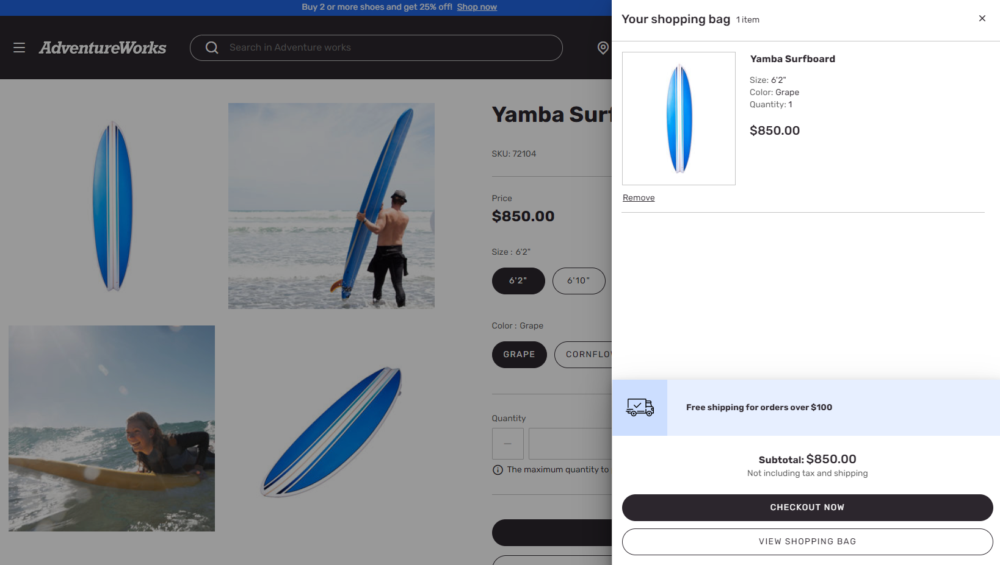

---

# required metadata

title: Cart icon module
description: This topic covers the cart icon module and describes how to add it to site pages in Microsoft Dynamics 365 Commerce.
author: anupamar-ms
ms.date: 08/02/2021
ms.topic: article
ms.prod: 
ms.technology: 

# optional metadata

# ms.search.form: 
audience: Application User
# ms.devlang: 
ms.reviewer: v-chgri
# ms.tgt_pltfrm: 
ms.custom: 
ms.assetid: 
ms.search.region: Global
# ms.search.industry: 
ms.author: anupamar
ms.search.validFrom: 2019-10-31
ms.dyn365.ops.version: Release 10.0.5

---

# Cart icon module

[!include [banner](includes/banner.md)]

This topic covers the cart icon module and describes how to add it to site pages in Microsoft Dynamics 365 Commerce.

The cart icon module represents the cart in the header module of the page, and shows the number of items in the cart. The cart icon module also displays a cart summary (also known as a mini cart) when the cart icon is hovered over. The mini cart provides the user with a summary of the items in the cart without having to navigate to the cart page. In addition, it also allows the user to directly go to checkout page if they are happy with the summary. This reduces the number of page navigations and makes checkout faster. 

The following image shows an example of a cart icon module that displays a mini cart in the Fabrikam header.

## Module properties

- **Show mini cart** – When this property is set to **True**, a cart summary (mini cart) is shown when users hover over the cart icon. This functionality is supported only for desktop view ports.
- **Allow anonymous checkout** – When this property is set to **True**, the mini cart allows users who aren't signed in to do a guest checkout. This property is available in the Commerce version 10.0.21 release, as part of the Commerce module library package.
- **Order of items** – This property controls the order in which items appear in the mini cart. When the **New items added to top of the list** option is selected, new items that are added to the cart appear at the top of the list of mini cart items. When the default option, **New items added to bottom of the list**, is selected, new items that are added to the cart appear at the bottom of the list of mini cart items. This property is available as of the Commerce version 10.0.21 release, as part of the Commerce module library package.

> [!IMPORTANT]
> The **Allow anonymous checkout** and **Order of items** properties are available as of the Commerce version 10.0.21 release. They require that Commerce module library package version 9.31 be installed.

## Module properties and slots in the Adventure Works theme

In the Adventure Works theme, the cart icon module includes two additional slots for the mini cart. These slots are included as a module definition extension.

- **Empty cart promotions** – This slot takes a content block module. When the cart is empty, the specified content block module is shown. The content block module can be used for promotions, marketing content, and links to category pages, to help customers continue their shopping journey.
- **Promotional content** – This slot can be used to showcase promotions, such as "Free shipping on orders over $100." Content block, text block, and image list modules can be used in the promotional content slot.

The following image shows an example of a cart icon module in the Adventure Works theme that displays promotional content on the mini cart.

> [!IMPORTANT]
> The Adventure Works theme slots are available as of the Dynamics 365 Commerce version 10.0.20 release.

## Add a cart icon module to a page

To add a cart icon module, see [Header module](author-header-module.md).

## Additional resources

[Cart module](add-cart-module.md)

[Checkout module](add-checkout-module.md)

[Payment module](payment-module.md)

[Shipping address module](ship-address-module.md)

[Delivery options module](delivery-options-module.md)

[Pickup information module](pickup-info-module.md)

[Order details module](order-confirmation-module.md)

[Gift card module](add-giftcard.md)

[!INCLUDE[footer-include](../includes/footer-banner.md)]
