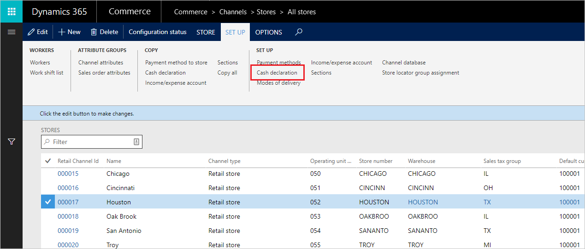

# Configure cash denominations for the point of sale (POS)

[!include [banner](includes/banner.md)]

Cash denominations for notes and coins can be defined in the back office to be used by cashiers, sales associates, and managers at the store from within the POS. These denominations can be used to aid in counting cash for end of day tender declarations or for quickly tendering a sale.

## Define denominations

The denominations are set up per store on the **Set up** \> **Cash declaration** option from the store property page.

To define a denomination:

1. Click **New**.
1. Specify the type (coin or note).
1. Specify the amount (value).

## Configure the functionality profile

When paying by cash in POS, the user can use the note denominations to quickly enter the amount paid by the customer. In the functionality profile, you can configure the two options for showing the denomination in POS.

- **Greater or equal to amount due** – By default, POS will only show the note denominations that are greater than the amount due, which allows for one-touch tendering. For example, if the amount due is $7.50, POS would show the following denominations: $10, $20, $50, and $100. Touching any of these amounts will automatically tender the sale for that amount. The $1 and $5 notes are not shown since these amounts are less than the amount due.
- **All denominations** – Select this option to always show all note denominations in POS, regardless of the amount due. This means that the user can use a combination of notes to reach the amount due. For example, if the amount due is $25.00, the user can choose $20 and $5 to complete the sale.

[!INCLUDE[footer-include](../includes/footer-banner.md)]
