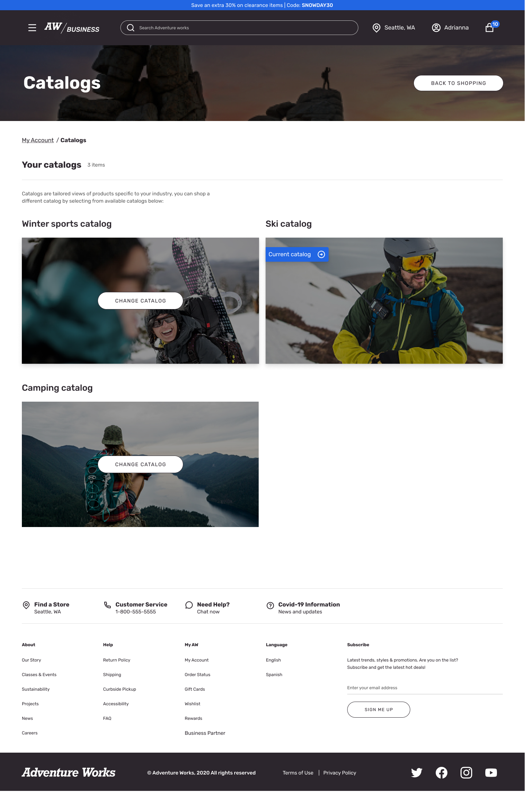
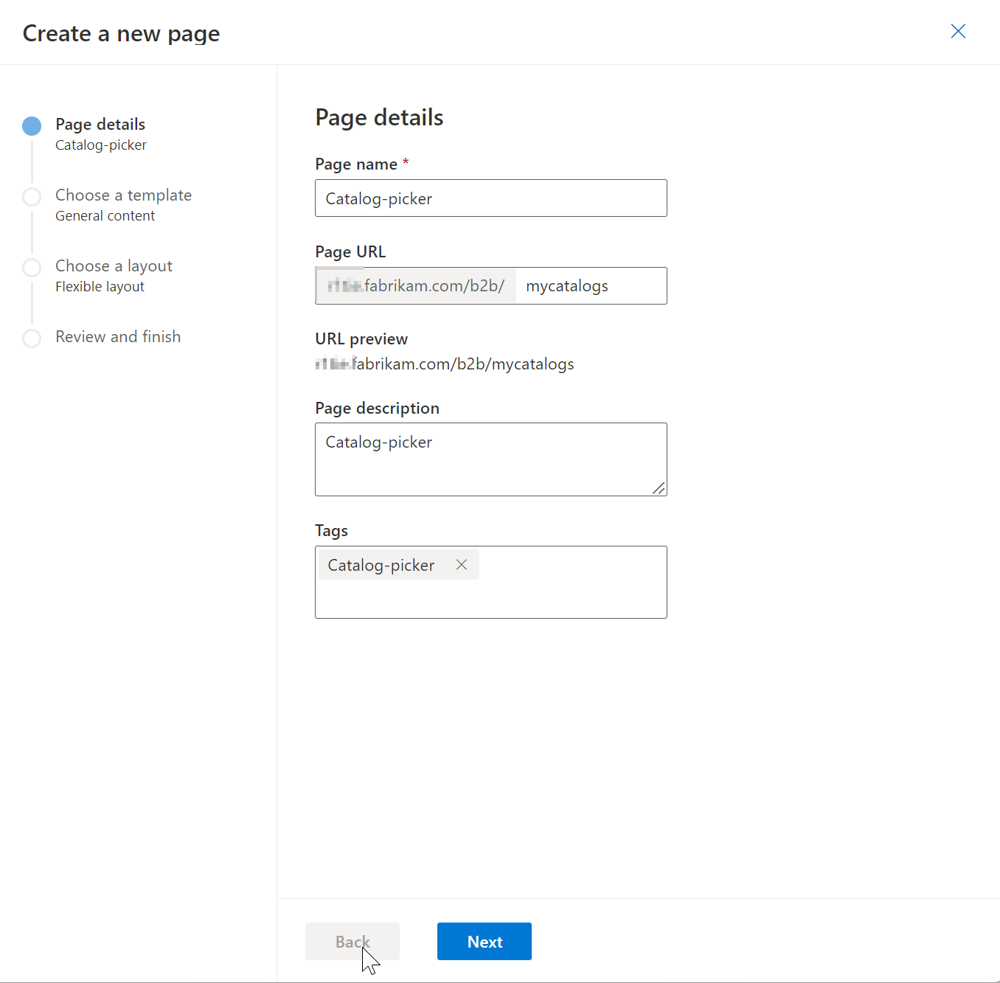
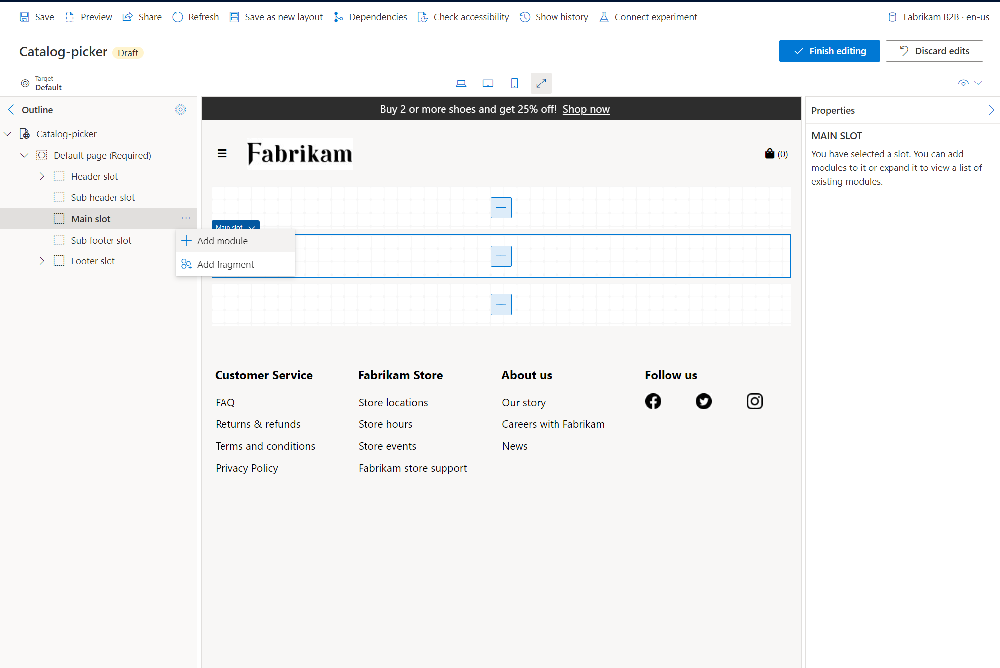
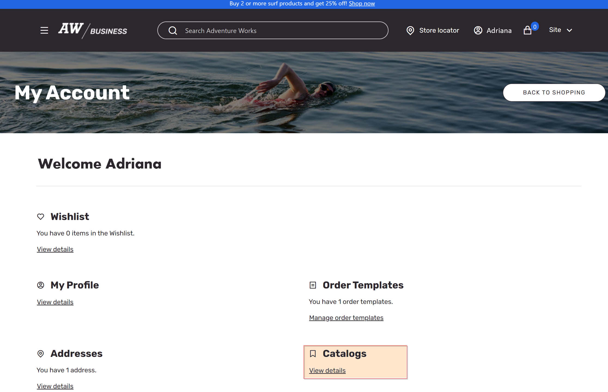
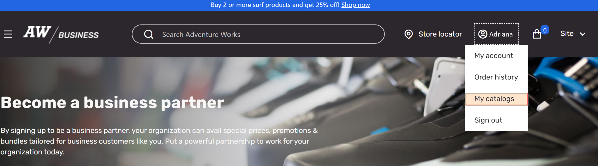

# Catalog picker module

[!include [banner](includes/banner.md)]

This article covers catalog picker modules and describes how to add them to Microsoft Dynamics 365 Commerce business-to-business (B2B) e-commerce sites.

A catalog picker module is a special container that is used to list all the product catalogs that are available to B2B site users for shopping. Multiple catalogs are currently supported only for B2B sites.

The following illustration shows an example of a catalog picker module.

## Add a catalog picker module to your site

To add a catalog picker module to your site in Commerce site builder, follow these steps.

### Create a catalog picker page

First, create a catalog picker page.

1. Go to **Pages**, and select **New** to create a new page.
1. In the **Create a new page** dialog box, under **Page name**, enter **Catalog picker**.
1. Under **Page URL**, enter a URL for the page, and then select **Next**.

    

1. Under **Choose a template**, select **General content**, and then select **Next**.
1. Under **Choose a layout**, select **Flexible layout**, and then select **Next**.
1. Under **Review and finish**, review the page configuration. If you must edit the page information, select **Back**. If the page information is correct, select **Create page**.
1. Under **Catalog picker**, select **Main slot**, select the ellipsis (**...**), and then select **Add module**.

    

1. In the **Select modules** dialog box, select the **Container** module, and then select **OK**.
1. Select the **Container** slot, select the ellipsis (**...**), and then select **Add module**.
1. In the **Select modules** dialog box, select the **Catalog picker** module, and then select **OK**.
1. In the **Catalog picker** properties pane, under **Heading**, select **Catalogs**, and then enter a heading for the catalog picker page.
1. Under **Heading level**, select a heading level, and then select **OK**.
1. Under **Rich text**, enter text that will appear at the top of the catalog picker page.
1. Select **Save**, select **Finish editing** to check in the page, and then select **Publish** to publish it.

### Add a link on your account page

Next, add a reference to your catalog picker page on your **My account** page.

1. Go to **Pages**, find and select your site's **My account** page, and then select **Edit**.
1. Under the **Main** slot of the page, select the **Account generic tile** slot. 
1. In the **Account generic tile** properties pane, under **Links**, select **Add action link**, and then select **Action link**.
1. In the **Action link** dialog box, under **Link text**, enter link text for the link to your catalog picker page.
1. Under **Link target**, select **Add a link**.
1. In the **Add a link** dialog box, select **Custom page**, and then select **Next**.
1. Under **Name**, select your catalog picker page, select **Apply**, and then select **OK**.
1. Select **Save**, select **Finish editing** to check in the page, and then select **Publish** to publish it.

The following illustration shows an example of an accounts page with a reference to the catalog page.

### Add a link from the header

Finally, add a link from the header of your site to your catalogs.

1. Go to **Fragments**, find and select your site's header fragment, and then select **Edit**.
1. Select the **Header** slot. 
1. In the **Header** properties pane, under **My account links**, select **Add action link**, and then select **Action link**.
1. In the **Action link** dialog box, under **Link text**, enter link text for the link to your catalog picker page.
1. Under **Link target**, select **Add a link**.
1. In the **Add a link** dialog box, select **Custom page**, and then select **Next**.
1. Under **Name**, select your catalog picker page, select **Apply**, and then select **OK**.
1. Select **Save**, select **Finish editing** to check in the header fragment, and then select **Publish** to publish it.

The following illustration shows an example of an ecommerce website header with a link to the B2B catalog.

## Additional resources 

[Create Commerce catalogs for B2B sites](catalogs-b2b-sites.md)

[Extensibility impact of Commerce catalogs for B2B customizations](dev-itpro/catalogs-b2b-sites-dev.md)

[Commerce catalogs for B2B FAQ](catalogs-b2b-sites-FAQ.md)

[Account management pages and modules](account-management.md)

[Header module](author-header-module.md)
