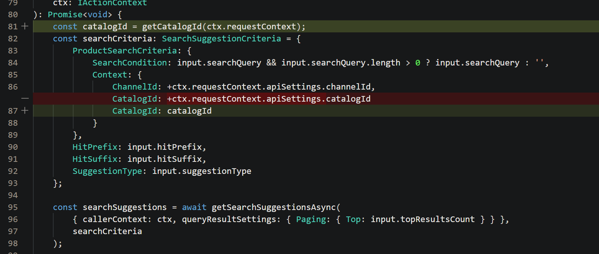

---

# required metadata

title: Development impact of Commerce catalogs for B2B feature
description: This topic describes the development impact of the Commerce catalogs for B2B feature in Microsoft Dynamics 365 Commerce.
author: ashishmsft
ms.date: 03/15/2022
ms.topic: article
audience: Application User, Developer, IT Pro
ms.reviewer: v-chgriffin
ms.search.region: Global
ms.author: asharchw
ms.search.validFrom: 2022-02-28
---

# Development impact of Commerce catalogs for B2B feature 

[!include [banner](includes/banner.md)]

This topic describes the development impact of the Commerce catalogs for B2B feature in Microsoft Dynamics 365 Commerce.

## As a developer, what's the critical change I must be watchful with introduction of this feature as well as if I were to be interested in extending catalog-context to my custom-scenarios? 

> [!NOTE] This is the standard process the customer need to follow as upon upgrade their customization may not auto-support latest features, and if your customization indeed were to want any new feature or bug fix to be included in their experiences, we recommend to update their customization code accordingly, similar to the changes Microsoft may have done for the core code. Review further below if indeed your customizations must be updated. 
All merchandising APIs have been attempted to be 'catalog-aware' for which passing in 'CatalogID' parameter is critical. 

The default (catalogID=0) is not a valid catalog for signed-in B2B users when they are . Thus all API calls that pass 0 or use a default value will fail since the user won’t have access to catalog 0. In order to get the right experience, the API calls that customer does need to be updated to pass the catalog id that was selected from the catalog picker. Even if you use some default value, if the user switches the catalog, the website should provide the data accordingly to the selected catalog, so the APIs from customization should pass the selected catalog as well to match the APIs that are executed from core eCommerce code.

These are the cases that are possible:

- A customer introduced their own data action that calls a product-related API or calls a product related data action. For more information, see [Data actions](e-commerce-extensibility/data-actions.md). Required steps from the customer:
    1. If it uses a direct API call, update data action to pass catalog id, e.g.: 

    1. If it calls a different product-related data action inside the customization, the code needs to be updated to pass some new parameters such as requestContext (which is used to retrieve the current catalog id):

- A customer has an overridden data action. For more information, see [Data action overrides](e-commerce-extensibility/data-action-overrides.md). 
Required steps: update the data action similar to #1.

-  A customer has module ejection, view extension, or created a new module, which includes calls to APIs or calls to data actions. For more information, see [Clone a module library module](e-commerce-extensibility/modules-overview.md#clone-a-module-library-module).
Required steps: update similar to #1, e.g.:

- If a customer uses getById API call, they need to switch to getByIds instead since getById has some limitations and it won’t support catalog awareness.
- If a customer has any data action that retrieves info for multiple products that could be from different catalogs, they need to split the API calls by catalog id. E.g. for the APIs in the cart, the cart may have products from different catalogs, so in order to receive product info, they need to group the products in the cart lines by catalog id, and call API for each catalog separately. E.g.

