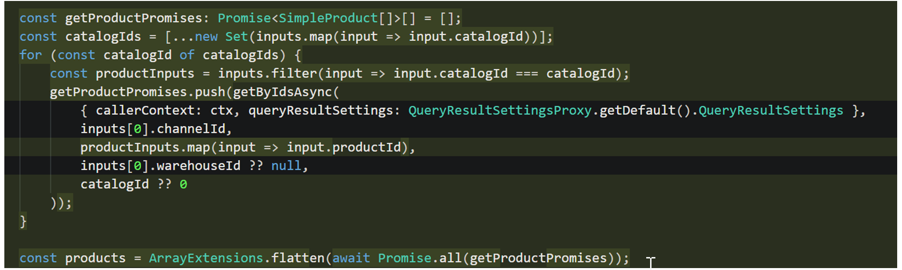

---

# required metadata

title: Extensibility impact of Commerce catalogs for B2B customizations
description: This topic describes the extensibility impact of the Commerce catalogs for B2B feature in Microsoft Dynamics 365 Commerce.
author: ashishmsft
ms.date: 03/17/2022
ms.topic: article
audience: Application User, Developer, IT Pro
ms.reviewer: v-chgriffin
ms.search.region: Global
ms.author: asharchw
ms.search.validFrom: 2022-02-28
---

# Extensibility impact of Commerce catalogs for B2B customizations 

[!include [banner](includes/banner.md)]

This topic describes the extensibility impact of the Commerce catalogs for B2B feature in Microsoft Dynamics 365 Commerce.

If you are interested in extending catalog context to custom scenarios, your customizations may need to be updated. This follows the standard process customers need to follow since after upgrades their customizations may not automatically support the latest features. If your customizations include any new feature or bug fixes in their experiences, it is recommended that you update the customization code accordingly. This is similar to the changes Microsoft may have made for the core code. 

Review the customization cases below to determine if your customizations must be updated. 

> [!NOTE]
> - All merchandising APIs should be catalog-aware, so passing the **CatalogID** parameter is critical. 
> - The default catalog (catalogID=0) is not a valid catalog for signed-in B2B users, so all API calls that pass "0" or use a default value will fail since site users don't have access to catalog 0. To get the right experience, the customer API calls must be updated to pass the catalog ID that was selected from the catalog picker. If you use a default value and the user switches catalogs, the website should provide the data for the selected catalog, so customized APIs should pass the selected catalog to match the APIs that are executed from core Commerce code.

The following customization cases require development updates:

- **Case 1**: A customer introduces their own [data action](e-commerce-extensibility/data-actions.md) that calls a product-related API or data action. Required update steps:
    1. If the data action uses a direct API call, update the data action to pass the catalog ID, as shown in the following example illustration. 

    1. If the data action calls a different product-related data action inside the customization, the code needs to be updated to pass some new parameters such as **requestContext** which is used to retrieve the current catalog ID, as shown in the following example illustration.  

- **Case 2**: A customer has an [overridden data action](e-commerce-extensibility/data-action-overrides.md). Required update steps: 
    - Update the data action similar to case 1.

- **Case 3**: A customer has a view extension, script injector module, or [cloned module](e-commerce-extensibility/modules-overview.md#clone-a-module-library-module) that includes calls to APIs or calls to data actions. Required update steps: 
    -  Update the code similar to case 1, as shown in the following example illustration.

- **Case 4**: A customer uses a **getById** API call. Required update steps: 
    - Switch to **getByIds** API call instead since the **getById** APT call has some limitations and doesn't support catalog awareness.

- **Case 5**: A customer has a data action that retrieves information for multiple products that could be from different catalogs. Required update steps: 
    -  Split the API calls by catalog ID. For example, for cart APIs the cart may contain products from different catalogs. The product lines should be grouped by catalog ID and call the API for each catalog separately, as shown in the following example illustration.

## Additional resources

[Create Commerce catalogs for B2B sites](catalogs-b2b-sites.md)

[Commerce catalogs for B2B FAQ](catalogs-b2b-sites-FAQ.md)
