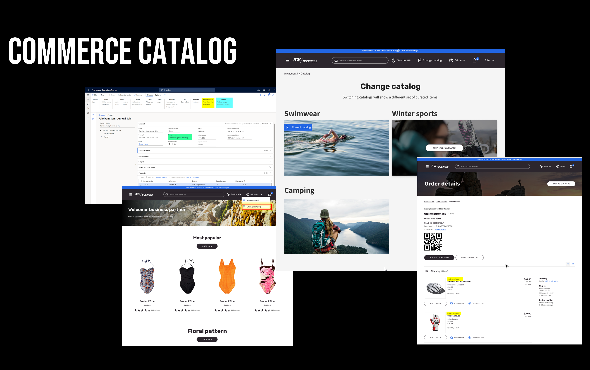

---
  
# required metadata

title: Create Commerce catalogs for B2B sites
description: This topic describes how to create Commerce catalogs for Microsoft Dynamics 365 Commerce business-to-business (B2B) sites.
author: ashishmsft
ms.date: 03/15/2022
ms.topic: article
audience: Application User, Developer, IT Pro
ms.reviewer: v-chgriffin
ms.search.region: Global
ms.author: asharchw
ms.search.validFrom: 2022-02-28
---

# Create Commerce catalogs for B2B sites 

[!include [banner](includes/banner.md)]

This topic describes how to create Commerce catalogs for Microsoft Dynamics 365 Commerce business-to-business (B2B) sites. For answeres to freqewntly asked questions regarding Commerce catalogs for B2B sites, see [Commerce catalogs for B2B FAQ](catalogs-b2b-sites-FAQ.md).

> [!NOTE]
> This topic applies to Dynamics 365 Commerce version 10.0.26 and later releases.

You can use Commerce product catalogs to identify the products that you want to offer in your B2B online stores. When you create a catalog, you identify the online stores that the products are offered in, add the products that you want to include, and enhance the product offerings by adding merchandising details. You can create multiple catalogs for a B2B online store.

Commerce product catalogs allow you to define the following:

- **Catalog-specific navigation hierarchy** - Allows organizations to create a distinct category structure for their specific catalog.
- **Catalog-specific attribute metadata** - Attributes contain details about a product. You can assign attributes to a category of navigation hierarchy to define values for those attributes at product level that are assigned to that category. Organizations will then be able to:
    - Define catalog-specific attribute values.
    - Control the visibility of attributes at the catalog level. 
    - Choose the refiners specific to an individual catalog.
- **Channels** - Organizations are able to associate more than one B2B online channel with a catalog. End-to-end support for catalogs is currently only available for B2B online stores.  
- **Customer hierarchies** - For a given B2B channel, organizations can choose to make a specific catalog available to their select B2B partners by associating customer hierarchies with a catalog. 
- **Price groups** - A core reason for defining a catalog to use with a B2B channel is to be able to configure specific prices and promotions for that catalog. B2B customers ordering from a configured catalog can benefit form special prices and promotions after signing in to a Commerce B2B site. To configure catalog-specific prices, select the **Price groups** on the **Catalogs** tab to link one or more price groups to the catalog. All trade agreements, price adjustment journals, and advanced discounts (such as threshold, quantity, mix and match) that have been linked to the same price group will be applied when customers order from this catalog.
    - Price groups for catalogs allow organizations to make products available to their intended B2B organizations with their preferred pricing and discounts. 
    - For more information on price groups, see [Price groups](price-management.md#price-groups).
  
<!-- -->

> [!NOTE]
> This feature is available starting with the Dynamics 365 Commerce version 10.0.26 release. To configure catalog-specific configurations like navigation hierarchy and customer hierarchy in Commerce headquarters, go to the Feature management workspace, enable the **Enable use of multiple catalogs on retails channels.** feature, and then run the **1110 CDX** job. 

<!-- -->

## Catalog process flow

Creating and processing a catalog is a four step process. The following diagram illustrates the catalog process flow:

1. **Configuration** 
    - Associate navigation hierarchy.
    - Specify effective and expiration dates (if applicable).
    - Add and categorize products. 
    - Associate price groups.
    - Associate customer hierarchy (specific to your B2B organizations). 
    - Associate 'Default dimension attribute group for refiners like Size, Style, Color' through attribute groups from top-ribbon. 
    - Set attribute metadata (choose which attributes are supposed to be viewable & refinable. By default, all viewable attributes are searchable as well).  
1. **Validation** - Runs validation rules that enforce behavior, such as: 
    - There are no uncategorized products. 
    - All items assorted to each channel are associated with a catalog.
1. **Approval** 
1. **Publishing**

## Set up the catalog

Follow the steps below to set up your catalog.

### Configure the catalog

In Commerce headquarters, go to **Retail and Commerce \> Catalogs and assortments \> All catalogs** to configure your catalog.

When you create a new catalog, you must first associate the catalog with one or more channels. Only items linked to your selected channel [assortments](/dynamics365/unified-operations/retail/assortments) can be used when creating the catalog. This is done on the **Commerce channels** FastTab of the **Catalog setup** form. Select **Add** to associate one or more channels. 

#### Associate navigation hierarchy

To add products to a catalog, a navigation hierarchy must first be chosen. The navigation hierarchy supports the category structure for the catalog. You must pick from one of the navigation hierarchies associated with the channels selected on the **Commerce channels** FastTab of the **Catalog** page. To associate a navigation hierarchy default with each of your channels, go to **Retail and Commerce \> Channel setup \> Channel categories and product attributes**.

#### Specify effective and expiration dates

To specify effective and expiration dates for a catalog, select the top node of the catalog hierarchy to return to the main catalog header view, and then on the **General** FastTab configure effective and expiration dates as necessary.

#### Add and categorize products

To configure products to add to the catalog, on the **Catalogs** menu tab of the **Catalog setup** page select **Add products**. Alternatively, you can select a node in the navigation hierarchy, which will change the screen presentation and allow you to add products directly to a category within the catalog.

<!--NEED CATEGORIZE STEPS-->

#### Associate price groups

<!--NEED MORE INFO-->

For more information on price groups, see [Price groups](price-management.md#price-groups).

> [!NOTE]
> - You cannot create a new price group from the catalogs form. Instead you must create the new price group from the **All price groups** form and then be able to associate in this view.
> - You cannot create a new customer hierarchy from the catalogs form. Instead must create a new customer hierarchy from the **Customer hierarchies** form and then be able to associate in this view.

#### Associate customer hierarchy

<!--NEED STEPS-->

#### Associate 'Default dimension attribute group for refiners like Size, Style, Color'

<!--NEED STEPS-->

#### Set attribute metadata

<!--NEED STEPS-->

### Validate the catalog

Before the catalog is available to use, it must be validated and published. 

To validate a catalog, follow these steps.

1. Select **Validate catalog** on the **Catalogs** menu to process a validation. This is required action and will validate that the required setup is accurate. 
1. Select **View results** to see the details of the validation. If errors are found, you must correct the data and run validation again until the validation has passed.

### Approve the catalog

After a catalog is validated, it must be approved. 

To start the catalog approval workflow, follow these steps.

1. Select **Workflow** on the menu. 
1. Select **Workflow \> Submit** to execute the process. 
1. Go to **Retail and Commerce \> Headquarters setup \> Commerce workflows** to configure the steps and authorized users for the workflow. The workflow will define the steps needed to get the catalog into an **Approved** status.

### Publish the catalog

When the catalog is in an **Approved** status, to publish the catalog select **Publish** option on the **Catalogs** menu. After the catalog is in a **Published** state, it can be used in call center order entry and send catalog processes. You can publish a catalog manually or by using a batch process. The effective date that you defined for the catalog determines when the products are available in the online store. The expiration date that you defined for the catalog determines when the products are removed from the online store.
 
> [!NOTE]
> You can publish a catalog that contains products that have warnings, but those products won't appear in the online store.
 
## Developer FYI

#### As a developer, what's the critical change I must be watchful with introduction of this feature as well as if I were to be interested in extending catalog-context to my custom-scenarios? 

> 
 Please note - this is the standard process the customer need to follow as upon upgrade their customization may not auto-support latest features, and if your customization indeed were to want any new feature or bug fix to be included in their experiences, we recommend to update their customization code accordingly, similar to the changes Microsoft may have done for the core code. Review further below if indeed your customizations must be updated. 

All merchandising APIs have been attempted to be 'catalog-aware' for which passing in 'CatalogID' parameter is critical. 

As discussed earlier that catalog 0 is not a valid catalog for B2B users when they are signed in. Thus all API calls that pass 0 or use a default value will fail since the user won’t have access to catalog 0. In order to get the right experience, the API calls that customer does need to be updated to pass the catalog id that was selected from the catalog picker. Even if you use some default value, if the user switches the catalog, the website should provide the data accordingly to the selected catalog, so the APIs from customization should pass the selected catalog as well to match the APIs that are executed from core eCommerce code.

These are the cases that are possible 
1.	A customer introduced their own data action that calls a product-related API or calls a product related data action. For more information, see [Data actions](e-commerce-extensibility/data-actions.md). Required steps from the customer:
    1. If it uses a direct API call, update data action to pass catalog id, e.g.: 

    1. If it calls a different product-related data action inside the customization, the code needs to be updated to pass some new parameters such as requestContext (which is used to retrieve the current catalog id):

2. A customer has an overridden data action. For more information, see [Data action overrides](e-commerce-extensibility/data-action-overrides.md). 
Required steps: update the data action similar to #1.

3. A customer has module ejection, view extension, or created a new module, which includes calls to APIs or calls to data actions. For more information, see [Clone a module library module](e-commerce-extensibility/modules-overview.md#clone-a-module-library-module).
Required steps: update similar to #1, e.g.:

4. If a customer uses getById API call, they need to switch to getByIds instead since getById has some limitations and it won’t support catalog awareness.
5. If a customer has any data action that retrieves info for multiple products that could be from different catalogs, they need to split the API calls by catalog id. E.g. for the APIs in the cart, the cart may have products from different catalogs, so in order to receive product info, they need to group the products in the cart lines by catalog id, and call API for each catalog separately. E.g.

