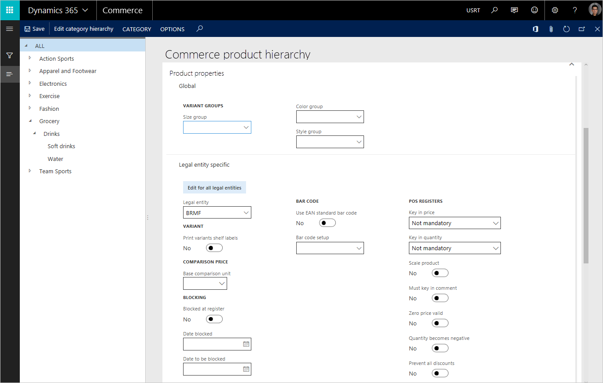

---
# required metadata

title: Manage product categories and products
description: This article describes how merchandising managers can use product categories to manage relationships between the Commerce product hierarchy and released product details.
author: ashishmsft
ms.date: 10/23/2017
ms.topic: article
ms.prod:
ms.technology:

# optional metadata
ms.search.form: EcoResCategorySearchList, EcoResAttribute, COODualUseCategories, EcoResProductCategory, EcoResCategoryAddProduct, EcoResAttributeValue
# ROBOTS:
audience: Application User
# ms.devlang:
ms.reviewer: josaw
# ms.tgt_pltfrm:
ms.custom:
ms.assetid: c7ed2ba5-87c6-4d99-9728-2a83e6d95ca9
ms.search.region: global
ms.search.industry: Retail
ms.author: asharchw
ms.search.validFrom: 2017-09-01
ms.dyn365.ops.version: AX 7.0.0, Retail July 2017 update
---

# Manage product categories and products

[!include [banner](./includes/banner.md)]

This article describes an enhanced way to manage product categories and products in Dynamics 365 Commerce. The enhancements let merchandising managers view a structure of product properties that is shared between the product hierarchy and released product details.

To learn more about how to manage product categories, in the **Category and product management** workspace, select the **Commerce product hierarchy** tile.

Notice the enhanced structure of the **Commerce product hierarchy** page that appears. In previous versions of the app, product properties were divided into *basic product properties* and *Retail product properties*, based on the scope of their applicability. Retail product properties are *global* in their scope of applicability. In other words, for a given product property, the same value is shared across all legal entities. By contrast, basic product properties are *legal entity–specific*. In other words, for a given basic product property, the value can differ across legal entities, depending on the individual business requirements of each legal entity.

In the enhanced product category structure, product properties are logically separated based on their applicability in a group, to reflect the structure of the released product details form structure.

You can switch between managing legal entity–specific properties across all legal entities and managing them for a specific legal entity.

To manage properties across all legal entities, select **View for all legal entities** (or **Edit for all legal entities**).

To manage properties for a specific legal entity, select **View for a specific legal entity** (or **Edit for a specific legal entity**).

Additionally, in the enhanced product category structure, a merchandising manager can now define default values for an additional set of product properties at the level of the individual category. Then, when products are created, they inherit default values for their product properties, based on the association of those properties with an individual category in the product hierarchy. These inherited product properties can also be modified for each product to meet individual business requirements.

## Selecting properties to update products on the Commerce product hierarchy page

You can use the new enhanced structure for product properties to select updated product properties that must be pushed to the associated products. On the **Commerce product hierarchy** page, on the Action Pane, select **Category**, and then select **Update products** to open the **Update products** dialog box.

> [!NOTE]
> If you use "Schedule batch job" from the **Update products** dialog, you can find the log via **System administration \> Inquiries \> Batch jobs** form. Find the **Update products** batch job, then **Batch job history** menu, **Log** menu, click the top-right **Message details** button to see if any warning or error in the log.

[!INCLUDE[footer-include](../includes/footer-banner.md)]