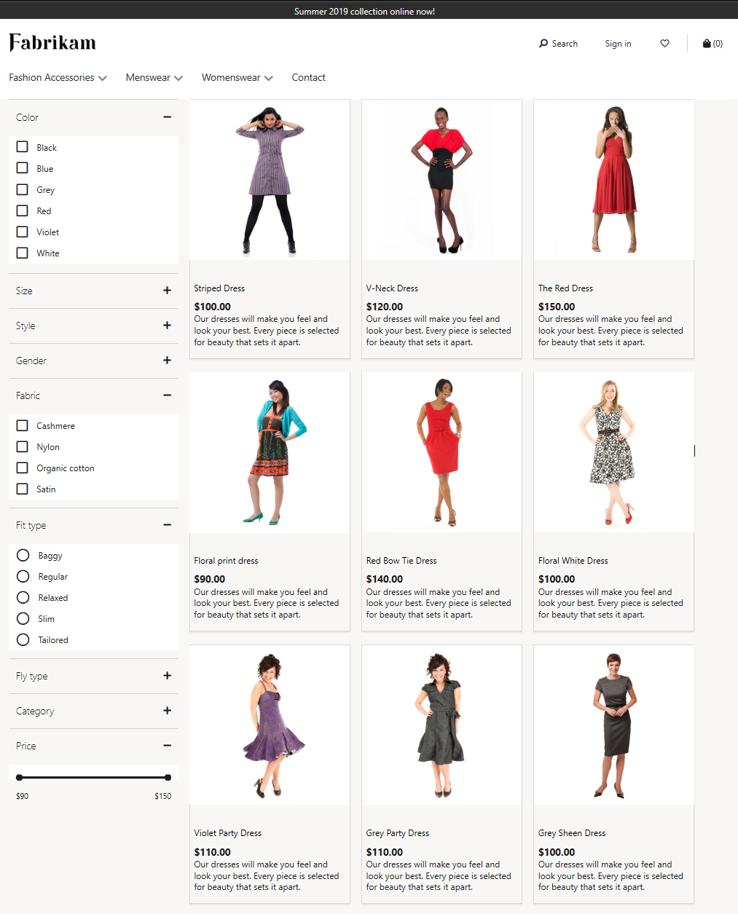
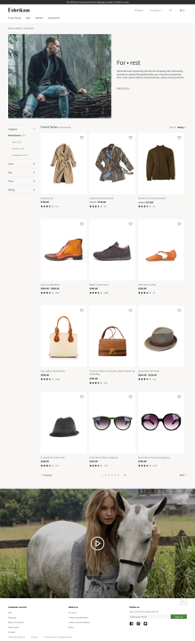

# Default category landing page and search results page overview

[!include [banner](includes/banner.md)]

This article provides an overview of the default category landing page and search results page in Microsoft Dynamics 365 Commerce e-Commerce.

## Default category landing page

The default category landing page is the page that website users typically are taken to when they select a category in the navigation hierarchy. The category page lets you browse, and you can also sort and refine the categorized products.

At the top of the page is a header that shows all the product categories and other pages that the merchandising manager has categorized. Configuration is done as part of the configuration of the channel navigation hierarchy. At the bottom of the page is a footer that includes quick links to various articles that a shopper might be interested in.

The following components are essential for a category:

- **Product placement tiles** show the products that the merchandising manager has defined in a category as part of the configuration of the navigation hierarchy.
- **Refiners and choice summary** are filters that provide counts and that can be used to refine items. The merchandising manager configures them as part of the configuration of the metadata related to channel categories and product attributes.
- **Sorting options** are used by website visitors to sort the products. By default, the following sorting options are available:

    - Price – low to high
    - Price – high to low
    - Product name – \[A-Z\]
    - Product name – \[Z-A\]
    - Ratings – low to high
    - Ratings – high to low

- **Advanced Sorting options** are used by website visitors to sort the products using intelligent criteria. By enabling [Product recommendations](product-recommendations.md), the following sorting options are available. For more information, refer to the [Types of product recommendations](product-recommendations.md#types-of-product-recommendations) article.

    - New
    - Best-selling
    - Trending

- **Pagination** lets website visitors move from one page of categorized product results to another page.
- **Total count** provides the total number of products that are defined in a category.

## Enrich a category landing page

If you want a category landing page to have a more tailored experience for a specific category, you can "enrich" the category landing page for that category. For example, you can add a marketing video and some category storytelling to get the shopper's attention. For more information, see [Enrich a category landing page](enrich-category-page.md).

## Auto-suggest and search results pages

Website users can explore a site either by going to a category from the navigation hierarchy or by entering a search term in the search field.

As soon as users start to type in the search field, they experience the immersive auto-suggest functionality that suggests search terms.

Here are some of the types of suggestions that might be shown:

- **Keywords** are used to find items across all products that are assorted to the channel.
- **Products** provide direct links to the product details page.
- **Scoped category search suggestions** list various categories and let users search for the keyword in a specific category.

When users select one of the keyword or scoped category search suggestions, or when there are no suggestions for the search term that they enter, they are redirected to a search results page. The users can then browse, sort, and refine the list of search results to find the desired item.

The following components are essential for a search results page:

- **Product placement tiles** show the products for the user's search. By default, these tiles are sorted by the cloud-powered search relevancy score for the user search.
- **Refiners and choice summary** are filters that provide counts and that can be used to refine items. The merchandising manager configures them as part of the configuration of the "channel categories and product attributes" metadata.
- **Standard Sorting options** are used by website visitors to sort the products. By default, the following sorting options are available:

    - Price – low to high
    - Price – high to low
    - Product name – \[A-Z\]
    - Product name – \[Z-A\]
    - Ratings – low to high
    - Ratings – high to low
    - Default 
    
    > [!NOTE]
    > If **Display order** values are defined for the products in the navigation heirarchy, sorting by default on a category page honors the values defined in **Display order**. Otherwise, sorting will be done by the **Product number**.)
    
- **Advanced Sorting options** are used by website visitors to sort the products using intelligent criteria. By enabling [Product recommendations](product-recommendations.md), the following sorting options are available. For more information, refer to the [Types of product recommendations](product-recommendations.md#types-of-product-recommendations) article.

    - New
    - Best-selling
    - Trending

- **Pagination** lets website visitors move from one page of categorized product results to another page.
- **Total count** provides the total number of products that are defined in a category and that match the search criteria.

>[!NOTE]
>These cloud-powered search capabilities are available starting in version 10.0.8. Ensure that under **Commerce Parameters > Configuration Parameters** there is an entry for "ProductSearch.UseAzureSearch set to 'true'". 

>Additionally, to use advanced sorting options such as new, best-selling, and trending, you must enable [Product recommendations](product-recommendations.md) for your environment. Advanced sorting options are available with Commerce SDK version 9.35+ and Commerce version 10.0.20.

## Additional resources

[Cloud-powered search overview](cloud-powered-search-overview.md)

[Home page overview](quick-tour-home-page.md)

[Product details pages overview](quick-tour-pdp.md)

[Cart and checkout pages overview](quick-tour-cart-checkout.md)

[Account management pages overview](quick-tour-account-management.md)

[!INCLUDE[footer-include](../includes/footer-banner.md)]
