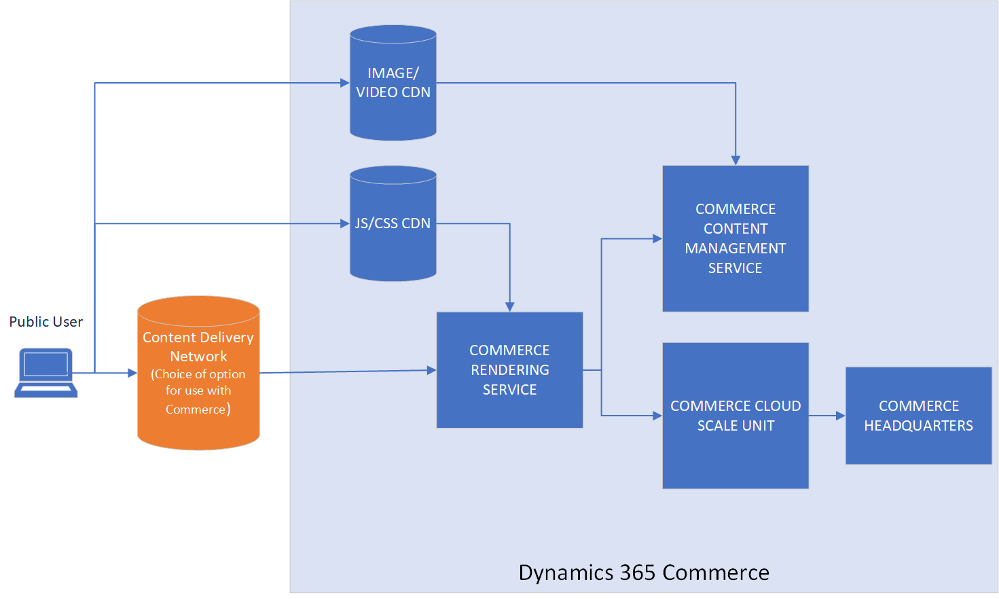
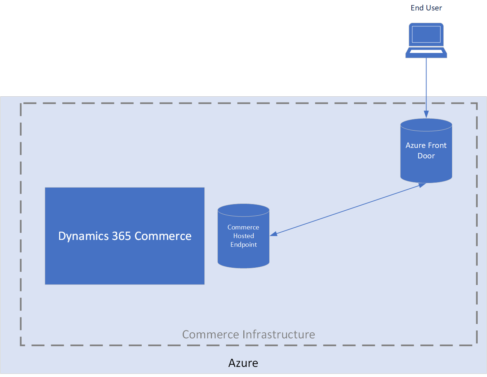
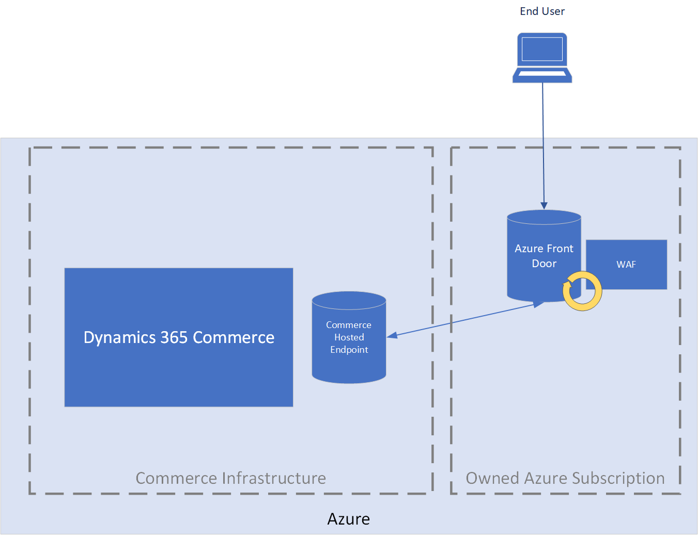
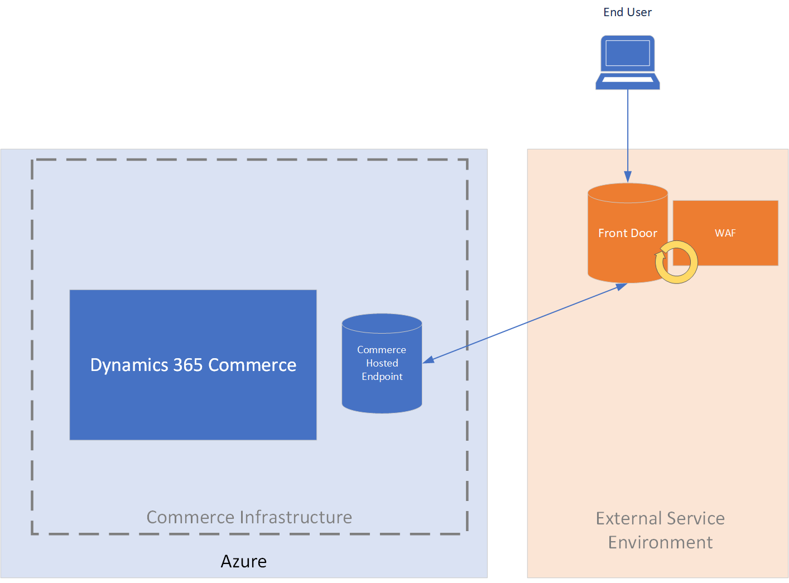

---
# required metadata

title: Content delivery network implementation options
description: This topic reviews the different options for content delivery network (CDN) implementation that can be used with Microsoft Dynamics 365 Commerce environments. These options include native, Commerce-provided instances of Azure Front Door and customer-owned instances of Azure Front Door.
author: BrianShook
ms.date: 07/22/2021
ms.topic: article
ms.prod: 
ms.technology: 

# optional metadata

# ms.search.form: 
audience: Application User
# ms.devlang: 
ms.reviewer: v-chgri
ms.search.scope: Core, Operations, Retail
# ms.tgt_pltfrm: 
ms.custom: 
ms.assetid:
ms.search.region: Global
# ms.search.industry:
ms.author: brshoo
ms.search.validFrom: 2020-11-01
ms.dyn365.ops.version: 10.0.14

---

# Content delivery network implementation options

[!include [banner](includes/banner.md)]

This topic reviews the different options for content delivery network (CDN) implementation that can be used with Microsoft Dynamics 365 Commerce environments. These options include native, Commerce-provided instances of Azure Front Door and customer-owned instances of Azure Front Door.

Commerce customers have several options when they are considering which CDN service to use with their Commerce environment. Commerce is released with basic Azure Front Door support that covers basic hosting and custom domain requirements. For companies that want more control and more specific security abilities, such as a web application firewall (WAF), the best option might be to use either a customer-owned instance of Azure Front Door or an external CDN service.

The following three CDN implementation options can be used with Commerce environments:

- The Commerce-provided instance of Azure Front Door
- A customer-owned instance of Azure Front Door (for increased control and additional security features)
- An external CDN service

All three CDN implementation options deliver only dynamic HTML content from custom domains. Commerce automatically handles all JavaScript, Cascading Style Sheets (CSS), images, video, and other static content through Microsoft-managed CDNs. The option that you choose determines the operational capabilities, control capabilities, and additional security capabilities that are available.

The following illustration shows an overview of the Commerce architecture.

For more information about how to set up an instance of Azure Front Door for your Commerce site, see [Add CDN Support](add-cdn-support.md).

## Use the Commerce-provided Azure Front Door instance

The following table lists the pros and cons of using the Commerce-provided instance of Azure Front Door to manage content endpoints.

| Pros | Cons |
|------|------|
| <ul><li>The instance is included in the Commerce cost.</li><li>Because the instance is managed by the Commerce team, less maintenance is required, and there are shared setup steps.</li><li>The Azure-hosted infrastructure is scalable, secure, and reliable.</li><li>The Secure Sockets Layer (SSL) certificate requires a one-time setup and is automatically renewed.</li><li>The instance is monitored for errors and anomalies by the Commerce team.</li></ul> | <ul><li>A WAF is not supported.</li><li>There are no specific customizations or setting adjustments.</li><li>The instance depends on the Commerce team for updates or changes.</li><li>A separate Azure Front Door instance is required for apex domains, and extra work is required to integrate apex domains with Azure DNS.</li><li>No telemetry about responses per second (RPS) or the error rate is provided to the customer.</li></ul> |

The following illustration shows the architecture of the Commerce-provided Azure Front Door instance.

## Use a customer-owned Azure Front Door instance

The following table lists the pros and cons of using a customer-owned instance of Azure Front Door to manage content endpoints.

| Pros | Cons |
|------|------|
| <ul><li>Setup is secure and easy to manage.</li><li>The Azure-hosted infrastructure is scalable, secure, and reliable.</li><li>The instance allows for WAF integration and granular rule controls for finer-grade security that is tuned specifically for your site.</li><li>The instance allows for finer control of SSL certificates (both customer-owned and Azure Front Door–managed) and domain linking.</li><li>The instance offers an apex domain solution if it's paired directly with Azure DNS.</li><li>Telemetry and alerting are provided.</li><li>The SSL certificate requires a one-time setup and is automatically renewed.</li></ul> | <ul><li>The instance is self-managed.</li><li>Initial knowledge ramp-up is required.</li></ul> |

The following illustration shows a Commerce infrastructure that includes a customer-owned Azure Front Door instance.

## Use an external CDN service

The following table lists the pros and cons of using an external CDN service to manage content endpoints.

| Pros | Cons |
|------|------|
| <ul><li>This option is useful when the existing domain is already hosted on an external CDN.</li><li>WAF: Depends on external provider.</li></ul> | <ul><li>A separate contract and additional costing are required.</li><li>SSL might incur additional costs.</li><li>Because the service is separate from the Azure cloud structure, additional infrastructure must be managed.</li><li>The service might require longer time investments in endpoint and security setup.</li><li>The service is self-managed.</li><li>The service is self-monitored.</li></ul> |

The following illustration shows a Commerce infrastructure that includes an external CDN service.

## Additional resources

[Add support for a content delivery network (CDN)](add-cdn-support.md)
