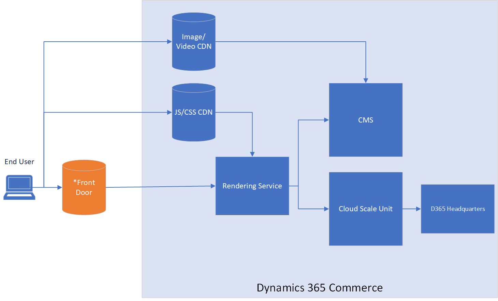

---
# required metadata

title: Content delivery network implementation options
description: This topic reviews the different content delivery network (CDN) implementation options that can be used with Dynamics 365 Commerce environments, including both native Commerce and customer-owned instances of Azure Front Door.
author: BrianShook
manager: AnnBe
ms.date: 12/09/2020
ms.topic: article
ms.prod: 
ms.service: dynamics-365-commerce
ms.technology: 

# optional metadata

# ms.search.form: 
audience: Application User
# ms.devlang: 
ms.reviewer: v-chgri
ms.search.scope: Core, Operations, Retail
# ms.tgt_pltfrm: 
ms.custom: 
ms.assetid:
ms.search.region: Global
# ms.search.industry:
ms.author: brshoo
ms.search.validFrom: 2020-11-01
ms.dyn365.ops.version: 10.0.14

---

# Content delivery network implementation options

[!include [banner](includes/banner.md)]

This topic reviews the different content delivery network (CDN) implementation options that can be used with Dynamics 365 Commerce environments, including both native Commerce and customer-owned instances of Azure Front Door.

Dynamics 365 Commerce customers have options when considering which CDN service to use with their Commerce environment. Commerce ships with basic Azure Front Door support that covers basic hosting and custom domain requirements. For companies looking for greater control and more specific security abilities such as web application firewall (WAF), using a customer-owned Azure Front Door instance or an external CDN may be the best options. 

The three CDN implementation options that can be used with Dynamics 365 Commerce environments are:

- The Dynamics 365 Commerce Azure Front Door instance.
- A customer-owned Azure Front Door instance (for increased control and additional security features).
- An external CDN service.

Only custom domain dynamic HTML content is delivered using these CDN implementation options. Commerce automatically handles all JavaScript, Cascading Style Sheets (CSS), images, video, and other static content through Microsoft-managed CDNs. The CDN implementation option chosen determines the operational, control, and additional security capabilities that are available.

The following illustration shows an overview of Dynamics 365 Commerce architecture. 

For more information on setting up an Azure Front Door instance for your Commerce site, see [Add CDN Support](add-cdn-support.md).

## Use a Dynamics 365 Commerce Azure Front Door instance

The following table lists the pros and cons of using a Dynamics 365 Commerce Azure Front Door instance to manage your content endpoints.

| Pros | Cons |
| ---- | ---- |
| &#8226; Built-in to Commerce cost. &#8226; Managed by Commerce team (lower maintenance, shared setup steps). &#8226; Azure-hosted infrastructure is scalable, secure, reliable. &#8226; Secure Sockets Layer (SSL) certificate is a one-time setup and is automatically renewed. &#8226; Monitored by the Commerce team for errors and anomalies. | &#8226; WAF not supported. &#8226; No specific customizations or setting adjustments. &#8226; Dependent upon Commerce team for updates or changes. &#8226; A separate Azure Front Door instance is needed for apex domains, and extra work is needed for apex domain integration with Azure DNS. &#8226; No telemetry to customer on response per second (RPS) or error rate. |

The following illustration shows the architecture of the Commerce-provided Azure Front Door instance.

 

## Use a customer-owned Azure Front Door instance

The following table lists the pros and cons of using a customer-owned Azure Front Door instance to manage your content endpoints.

| Pros | Cons |
| ---- | ---- |
|&#8226; Secure, easy-to-manage setup. &#8226; Azure-hosted infrastructure is scalable, secure, and reliable. &#8226; Allows for WAF integration and granular rule controls for finer-grade security tuned specifically for your site. &#8226; Finer control of SSL certificates (customer-owned and Azure Front Door-managed certificates) and domain linking. &#8226; Offers an apex domain solution if paired directly with Azure DNS. &#8226; Telemetry and alerting. &#8226; SSL certificate is a one-time setup and is automatically renewed. | &#8226; Self-managed. &#8226; Initial knowledge ramp-up needed. |

The following illustration shows Commerce infrastructure with a customer-owned Azure Front Door instance. 

 

## Use an external content delivery network (CDN)

The following table lists the pros and cons of using an external CDN provider to manage your content endpoints.

| Pros | Cons |
| ---- | ---- |
| &#8226; Useful when existing domain is already hosted on external CDN. &#8226; Competitor CDNs (for example, Akamai) may have more WAF capabilities. | &#8226; Separate contract, additional costing. &#8226; SSL may incur additional costs. &#8226; Separate from Azure cloud structure, so an additional infrastructure to manage. &#8226; Potentially longer time investments in endpoint and security setup. &#8226; Self-managed. &#8226; Self-monitored. |

The following illustration shows Commerce infrastructure with an external CDN service. 

 

## Additional resources

[Add CDN Support](add-cdn-support.md)
