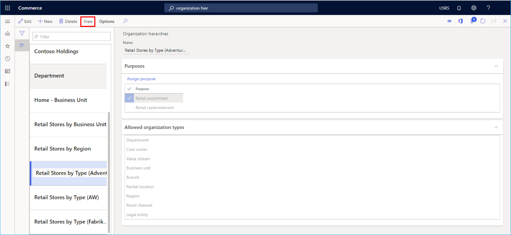

# Add a channel to an organizational hierarchy

[!include [banner](includes/banner.md)]

This article describes how to add a channel to an organizational hierarchy in Microsoft Dynamics 365 Commerce.

Channels need to be associated with one or more organizational hierarchies. Before creating channels, you need to confirm that your organizational hierarchies are set up.  

See [Organizational hierarchies](channels-org-hierarchies.md) for more details on how to create organizational hierarchies.

## Select a hierarchy

To select a hierarchy, follow these steps.

1. In the navigation pane, go to **Go to Navigation pane > Modules > Organization administration > Organizations > Organization hierarchies**.
1. From the list, select the organization hierarchy to which you're adding the channel.
1. On the action pane, select **View** to view hierarchy details.

The following image shows organizational hierarchy details for the selected hierarchy.

## Add a channel to a hierarchy node

To add a channel to a hierarchy node, follow these steps.

1. On the action pane, select **Edit**.
1. Select the hierarchy node you want the channel added to, then from the **Insert** drop-down list, select **Retail Channel**. 
1. Select the channel to add, then select the **OK** button.
1. On the action pane, select **Save**.
1. On the action pane, select **Publish** and provide an **Effective date** in the past to have this action go into effect immediately.

The following image shows how to select a channel to add to a hierarchy node.

The following image shows a hierarchy with various channels added.

## Additional resources

[Channels overview](channels-overview.md)

[Channel setup prerequisites](channels-prerequisites.md)

[Organizations and organizational hierarchies overview](../fin-ops-core/fin-ops/organization-administration/organizations-organizational-hierarchies.md?toc=/dynamics365/commerce/toc.json)

[Plan your organizational hierarchy](../fin-ops-core/fin-ops/organization-administration/plan-organizational-hierarchy.md?toc=/dynamics365/commerce/toc.json)

[Organization hierarchies](channels-org-hierarchies.md)

[Set up a retail channel](channel-setup-retail.md)
	
[Set up an online channel](channel-setup-online.md)

[!INCLUDE[footer-include](../includes/footer-banner.md)]
