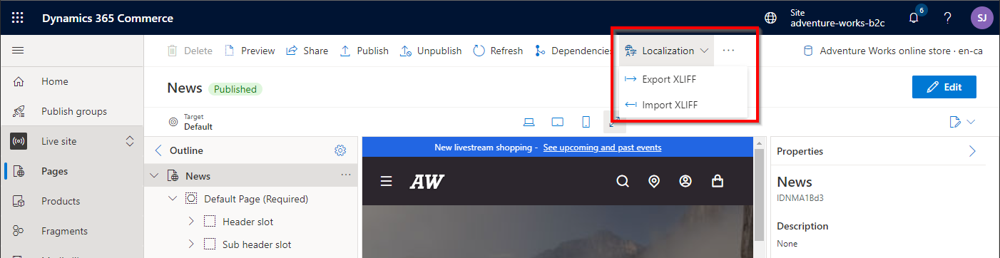

---
# required metadata

title: Channel mapping to e-commerce sites
description: This topic describes some of the more common channel mapping scenarios in Microsoft Dynamics 365 Commerce that can be extrapolated for most other business requirements.
author: samjarawan
ms.date: 04/05/2022
ms.topic: article
ms.prod: 
ms.technology: 

# optional metadata

# ms.search.form: 
audience: Application user
# ms.devlang: 
ms.reviewer: v-chgriffin
# ms.tgt_pltfrm: 
ms.custom: 
ms.assetid: 
ms.search.region: Global
# ms.search.industry: 
ms.author: samjar
ms.search.validFrom: 2019-10-31
ms.dyn365.ops.version: Release 10.0.5

---
# Channel mapping to e-commerce sites

This topic describes some of the more common channel mapping scenarios in Microsoft Dynamics 365 Commerce that can be extrapolated for most other business requirements.

Dynamics 365 Commerce supports many business scenarios to map [online channels](#online-channels) with a configured set of products, prices, and discounts to [e-commerce site](#e-commerce-site) experiences for their customers.

Scenarios covered in this topic include:
- **A single language channel with a single e-commerce site experience.** For example, this could be a single brand site configured for the English United States market.
- **A multi-language channel with a single localized site experience.** For example, this could be a single brand site configured for Canada with French and English language support where both languages provide the same site experience but are localized into the appropriate languages.
- **A multi-language channel with different site experiences per language.** For example, this could be a single brand site configured for Canada with unique site experiences for French Quebec region users and English region users.
- **Multiple channels (with single and/or multiple languages) with a single localized site experience.** For example, this could be a single brand site configured for Australia and New Zealand, where both countries share the same site experience but each country is configured with different products, currency, prices, discounts, and shipping modes.
- **Multiple channels (with single and/or multiple languages) with different site experiences per channel.** For example, this could be a single brand site configured for Australia, Canada and Germany, where each country has a unique site experience along with different products, currency, prices, discounts, and shipping modes.

## Online channels

An online channel represents an online e-commerce storefront that is used to map products, pricing, discounts, languages, payment methods, delivery modes, fulfillment centers and other aspects of the online experience that will be available to your e-commerce customers. Online channels are created and managed in Commerce headquarters and map to a single [legal entity](../fin-ops-core/fin-ops/organization-administration/organizations-organizational-hierarchies.md?toc=/dynamics365/commerce/toc.json#legal-entities). the legal entity is usually based in a single country that requires the tax reporting for the channel and can only be configured with a single currency.

For more information on channels, see [Channel overview](channels-overview.md). For more information about creating an online channel, see [Set up an online channel](channel-setup-online.md).

The following example illustration from Commerce headquarters shows the default online channels that are deployed with Dynamics 365 Commerce if the demo data option is selected.

## E-commerce site

An e-commerce site contains a set of site pages that that customers use to browse and shop. E-commerce sites are managed from within Commerce site builder, as shown in the following example illustration.  

To learn more about how to create and manage sites from within site builder, see [E-commerce site overview](online-store-overview.md).

## Common channel mapping scenarios

Dynamics 365 Commerce supports a wide range of channel mapping scenarios. The channel mapping scenarios that follow are just a subset of all possible channel mapping scenarios and are meant as a guide to help you plan for any unique business scenarios that you may have. The fictitious Adventure Works sporting goods store included with the Dynamics 365 Commerce demo data is used as an example for each scenario.

### Single language channel with a single e-commerce site experience

The most basic scenario is a single channel with a single language for selling in a single market. An example for this scenario is the Adventure Works online store that is set up only for the United States English market. The following example illustration shows an example of the channel setup within headquarters where the online channel only supports a single language ("en-us"), a single currency ("USD"), and a single business entity ("usrt") that is used for tax reporting.

The single online channel can be mapped to a single e-commerce site within site builder. To learn how to create a new site and map it to a channel, see [Map a channel to a site in site builder](#map-a-channel-to-a-site-in-site-builder).

### Multi-language channel with a single localized site experience

In this scenario, a single channel supports more than one language which allows the localization of product names, descriptions, and attributes in headquarters. Marketing content on the site can also be localized within site builder to provide a complete localized site experience.  

The limitation of this scenario is that a single channel can only be configured with one currency, one legal entity, and one set of products and prices. This configuration works best for countries with a single currency and multiple languages, for example Canada with both English and French languages but a single currency, single legal entity, and single set of products and prices.

The following example illustration shows the Adventure Works online channel configured with multiple languages. For information on allowing customers to swithc between languages, see [Enable the site picker](#enable-the-site-picker).  

Different languages within a channel can be configured with their own domain names, for example `www.adventure-works.ca` for the Canada English version and `www.adventure-works-fr.ca` for the Canada French version. Alternatively, different languages within a channel can be configured within a single domain using different paths for each language, for example `www.adventure-works.ca` for the Canada English version and `www.adventure-works.ca/fr` for the Canada French version. [Geo detection](geo-detection-redirection.md) can also be enabled to automatically redirect a user to the correct site based on the user's location.

For information on customizing localized pages and fragments, see [managing site content with multiple channels and languages](#manage-site-content-with-multiple-channels-and-languages).

### Multi-language channel with different site experiences per language

Similar to the previous scenario, you may want to offer a completely different site experience between languages. The recommended way is to use the page variants on a single site as discussed in the previous scenario but if desired you can create a new e-commerce site in site builder and map each to a single online channel and language. This would result in a single online channel being mapped to multiple e-commerce sites, one per language. This scenario would add extra management since you will now have multiple sites to independently manage within site builder.

### Multiple channels (with single and/or multiple languages) with a single localized site experience

A branded site may require multiple online channels per region to support a different set of products, prices and currency for each but retain a single site. For example, Adventure Works could have one online channel for the Canadian market with multiple languages, a channel for the American market and one for the German market.  Each online channel would be configured to a region specific business entity and can either have the same set of products, sub set of products, or a different set of product each with their own unique prices (in their regional currency), taxes, discounts, and shipping modes.

To configure multiple channels on a site, see [Configure multiple channels on an e-commerce site](#configure-multiple-channels-on-an-e-commerce-site) below.  

The different markets can be configured with their own domain names such as www.adventure-works.com for the English US market and www.adventure-works.de for the German market or alternately using different paths for such as www.adventure-works.com for the US market and www.adventure-works.com/de for the German market.  [Geo detection](geo-detection-redirection.md) can also be enabled to automatically redirect to the correct site based on the region.

The site may also want to display a drop-down list to select a specific market allowing a user to switch, for more information see [enable the site picker](#enable-the-site-picker) below.

### Multiple channels (with single and/or multiple languages) with different site experiences per channel.

Similar to the previous scenario, you may have multiple channels for a single brand in different regions and want different site experiences per region.  There are two options for this, one is to use page variants as discussed earlier or different sites can be configured per online channel following the general details found in the above scenarios.

Similar to the previous scenario, you may want to offer a completely different site experience for one region over the other.  The recommended way is to use the page variants on a single site as discussed in previous scenarios but if desired you can create new e-commerce sites in site builder and map each to a different online channel and language. This scenario would add extra management since you will now have multiple sites to independently manage within site builder.

## Cross-channel sharing

Cross-channel sharing is useful when multiple channels on a single site can share content. For example, a retailer that has multiple brands and storefronts that are grouped under a single site can share some content among some or all of the storefronts. This shared content can include pages for terms and conditions, payment terms, shipment methods, and frequently asked questions (FAQ).  See the [Enable and use cross-channel sharing](cross-channel-sharing.md) topic for more information.

## Map a channel to a site in site builder

The below shows different ways sites can be created and configured to use different online channels.

### Create a new channel

Channels can be created within site builder on the **Manage sites** page using the **New site** link.  The below shows where you select the default online channel and language for the site.

### Create a new channel with site copy

In general you won't create new sites as shown above since it will start out as an empty site without any site pages (ie: homepage, category page, product page, ...). A better practice is to start out with a copy of one of the provided starter sites such as Fabrikam or Adventure Works.  In this case you will select **Copy site** where you can pick the source site and the destination site name.  

Notice in the image above that the online channel and language selection is not an option to pick at this point, this can be done once the site copy has completed.  When the site is selected in site builder site list for the first time, it will bring up a setup dialog where the default channel and language can be selected as shown in the following example illustration.

### Manage an existing site channel

Once a site has been configured with its channel, it can easily be managed/changed from within the selected site in site builder under the **Site Settings**, **Channels** tab as shown in the following example illustration.

### Support multiple sites in a single tenant

Many branded sites can co-exist in a single tenant.  Notice the site list in the following example illustration has three different branded sites (Adventure Works, Adventure Works Business (B2B site) and a site for Fabrikam) each mapped to different single online channel.

### Domain name and path

A single domain name can be used for multiple sites and the path is used to separate the sites and or languages.  For example the domain could be "www.MyCompany.com" which is configured for two different e-commerce sites: one for Fabrikam and one for Adventure Works.  The default (ie: blank path) can be used for one site such as the Fabrikam site and a path could be added for the second site such as "adventureworks" so that the site is accessed with "www.MyCompany.com/adventureworks" or a path can be added for both sites (www.MyCompany.com/fabrikam). Alternately a different domain name can be used for each site ie: www.adventure-works.com and www.fabrikam.com and paths could be used for different regions such as www.adventure-works.com/fr-ca for French Canada.

## Configure multiple languages on a site

The languages can then be configured on the e-commerce site within site builder as shown below in the **Site settings** -> **Channels** tab.  Notice each language has been configured with the locale for the path giving each language a unique URL.

To add a new channel language, select the channel link highlighted in the following example illustration and a channel locale mapping will pop up where you can select **Add a locale** where you can pick the channel and locale to add plus the path to use for that channel.

#### Enable the site picker

Once you have configured a site to have multiple languages and or channels, you may want to add a language selector to the header to select the language or country.  The module library [header](author-header-module.md) module has built in support for users to select a language using the [site picker](site-selector.md) module.  The site picker can be added within the header fragment which has the header module as shown in the following example illustration. As can be seen, the header module has a **Site Picker** slot, edit the fragment and add the **Site picker** module to the slot and then select **Add site options list** from the site picker module configurations to add a new language.  You can then add the text that will show up in the picker drop-down list and the URL with the path you created when adding the channel to the site (ie: www.adventure-works.com/fr-ca).

Once the site selector is saved and published in the header you should see a drop-down list on the e-commerce site as shown in the below example.

#### Page variants per language

Site builder supports the ability to change how a page looks based on the selected language by creating a page variant for it.  From within site builder, there is a link at the top right that shows the current channel and language, selecting it will bring up a channel and language picker.  In this scenario there is only one channel but multiple languages.  If you want to override the page for this language, just change it and you will be prompted to create a variant of the page if one does not exist or you will see the variant and can now make edits to that variant.  If no variant is created the original page will render and show the appropriate language for module strings and product information pulled from HQ, however if text was provided directly in the default page modules like a page title or other marketing information that will remain in the original language, creating a page variant will allow you to add localized content.  Pages can also be exported as xliff files to be localized and the variants can then be imported.

## Manage site content with multiple channels and languages

A site that has multiple channels and/or languages stores unique variants of each page and fragment per channel/language combination, this allows the variant to contain localized data but also provides the flexibility to change the look and feel of the page for that variant.  

The following example illustration shows how to change the channel or language context within site builder.  

You will see a warning message if the variant for the selected page or fragment has not been created yet and selecting **Create page variant** will provide an option to start with a copy of an existing variant or create a brand new page from one of the templates.

An alternative to manually creating each page and fragment is to export each page and fragment to an xliff file which can then be sent off for localization and re-imported.  Select **Localization** to see these options on a page or fragment as shown below.

## Configure multiple channels on an e-commerce site

Adding additional channels to an e-commerce site can be done in site builder under the **Site settings**, **Channels** tab with the **Add a channel** button as shown in the following example illustration, where the online channel and default locale can be selected.  

