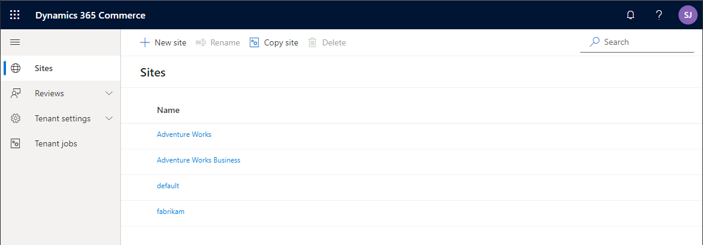

---
# required metadata

title: Channel mapping to e-commerce sites
description: This article will provide guidance for setting up common channel mapping scenarios.
author: samjarawan
ms.date: 09/21/2021
ms.topic: article
ms.prod: 
ms.technology: 

# optional metadata

# ms.search.form: 
audience: Application user
# ms.devlang: 
ms.reviewer: v-chgri
# ms.tgt_pltfrm: 
ms.custom: 
ms.assetid: 
ms.search.region: Global
# ms.search.industry: 
ms.author: samjar
ms.search.validFrom: 2019-10-31
ms.dyn365.ops.version: Release 10.0.5

---
# Channel mapping to e-commerce sites

Dynamics 365 Commerce provides support for many difference business scenarios of mapping [online channels](channels-overview.md#online-channels) to [e-commerce sites](online-store-overview.md).  They range from a single language channel mapped to a single e-commerce site (a single brand in a single region with a single language), multi-language channel mapped to a single or multi-language e-commerce sites (a single brand site in a single region serving multiple languages an example is Canada with French and English could have the same or different e-commerce site experiences) or multiple online channels mapped to a single e-commerce site (multiple online channels set up to support different geographical regions with a single set of e-commerce pages, an example is single web site serving Australia and New Zealand markets, users from both regions get the same experience but can have different products, prices, discount, shipping options, etc... This article will provide guidance for setting common channel mapping scenarios.

## Online channel

An online channels represent an online e-commerce storefront which is used to map products, pricing, discounts, languages, payment methods, delivery modes, fulfillment centers and other aspects of the online experience that will be available to your customers. Online channels are created and managed within the headquarters (HQ) tool. 

For an overview on channels see the [Channel overview](channels-overview.md) topic and to learn about creating an online channel see the [Set up an online channel](channel-setup-online.md) topic.

The below image shows the default online channels that are deployed with Dynamics 365 Commerce if the demo data option was selected.

## E-commerce site

An e-commerce site represents the set of pages that make up the website that customers use to shop.  E-commerce sites are managed from within the site builder tool as shown in the below image.  To learn more about how to create and manage sites from within the site builder see the [E-commerce site overview](online-store-overview.md) topic.

## Channel mapping scenarios

Dynamics 365 Commerce supports a great range of channel mapping scenarios. Understanding the below set of common scenarios should help in planning out any unique business scenarios you may have.  You will find examples below using the Dynamics 365 Commerce ficticious storefronts included with demo data including the Fabrikam fashion store and Adventure Works sporting goods.

### Single market site with a single online site experience
An example for this scenario is the Adventure Works online store setup for a single market (US) with a single language (en-us) and a single online experience.  The below image shows an example of the channel setup within HQ.  Notice how an online channel only maps to a single legal entity, which is usually based in a single country that requires the tax reporting for the channel, a single currency, but can be localized into multiple languages (only en-us in this example).

The above single online channel can then be mapped to a single e-commerce site within the site builder tool. The below shows how a new site is created in site builder where the online store channel and default language are chosen.

**Note:** In general you won't create new sites as shown above since it will start out as an empty site without any site pages (ie: homepage, category page, product page, ...). A better practice is to start out with a copy of one of the provided starter sites such as Fabrikam or Adventure Works.  In this case you will select **Copy site** where you can pick the source site and the destination site name.  

Notice in the screen capture above the online channel is not an option to pick yet, this can be picked once the site copy has completed.  When the site is first selected in site builder, it will bring up a setup dialog where the default channel and language can be selected as shown in the below image.  

**Note:** A single domain name can be selected for multiple sites and the path is used to separate the sites.  For example the domain could be "www.MyCompany.com" which is configured for two different e-commerce sites: one for Fabrikam and one for Adventure Works.  The default (ie: blank path) can be used for one site such as the Fabrikam site and a path could be added for the second site such as "adventureworks" so that the site is accessed with "www.MyCompany.com/adventureworks" or a path can be added for both sites (www.MyCompany.com/fabrikam).

Once a site has been configured with its channel, it can easily be managed/changed from within the selected site in site builder under the **Site Settings**, **Channels** tab as shown in the below image.

Many branded sites sites can co-exist in a single tenant.  Notice the site list in the below image has three different branded sites (Adventure Works, Adventure Works Business (B2B site) and a site for Fabrikam) each mapped to different single online channel.

### Single market site with multiple languages but same site experience
A common scenario is to have a single market site that is localized into other languages but the products, prices and currency stay the same as the languages are changed.  An example is a site for Canada which has two regional languages English and French, but the currency, products, shipping options and pricing are the same. The below image shows Adventure Works online channel configured with many different languages.

All of the languages can then be configured on the channel as shown below.  Notice each language has been configured with the locale for the path.

To add a new channel language, select the channel link highlighted in the below image and a channel locale mapping will pop up where you can select "Add a locale" where you can pick the channel and locale to add plus the path to use for that channel.

#### Enable the site language selector

Once you have configured a site to have multiple languages, you may want to add a language selector to the header to select the language.  The module library [header](..\author-header-module.md) module has built in support for a language selector.  This can be changed in the header fragment as shown in the below image. As can be seen the header module has a **Site Picker** slot, edit the fragment and add the **Site picker** module to the slot and then select **Add site options list** to add a new language.  You can then add the text that will show up and the URL for the path you created when adding the channel to the site (ie: www.adventure-works.com/fr-ca).

Once the site selector is saved and published in the header you should see a drop down list on the e-commerce site as shown in the below example.

#### Page variants per language

Site builder supports the ability to change how a page looks based on the selected language by creating a page variant for it.  From within site builder, there is a link at the top right that shows the current channel and language, selecting it will bring up a channel and language picker.  In this scenario there is only one channel but multiple languages.  If you want to override the page for this language, just change it and you will be prompted to create a variant of the page if one does not exist or you will see the variant and can now make edits to that variant.  If no variant is created the original page will render and show the appropriate language for module strings and product information pulled from HQ, however if text was provided directly in the default page modules like a page title or other marketing information that will remain in the original language, creating a page variant will allow you to add localized content.  Pages can also be exported as xliff files to be localized and the variants can then be imported.

### Single market site with multiple languages but different site experiences
Similar to the scenario above, you may want to 

### Brand with multiple markets and single site
AW en-us channel with US currency single site
AW de-de channel with EU currency single site

### Brand with multiple markets and site but different page experiences
AW en-us channel with US currency single site
AW de-de channel with EU currency single site

### Brand with multiple markets and site but different site experiences
AW en-us channel with US currency site 1
AW de-de channel with EU currency site 2

