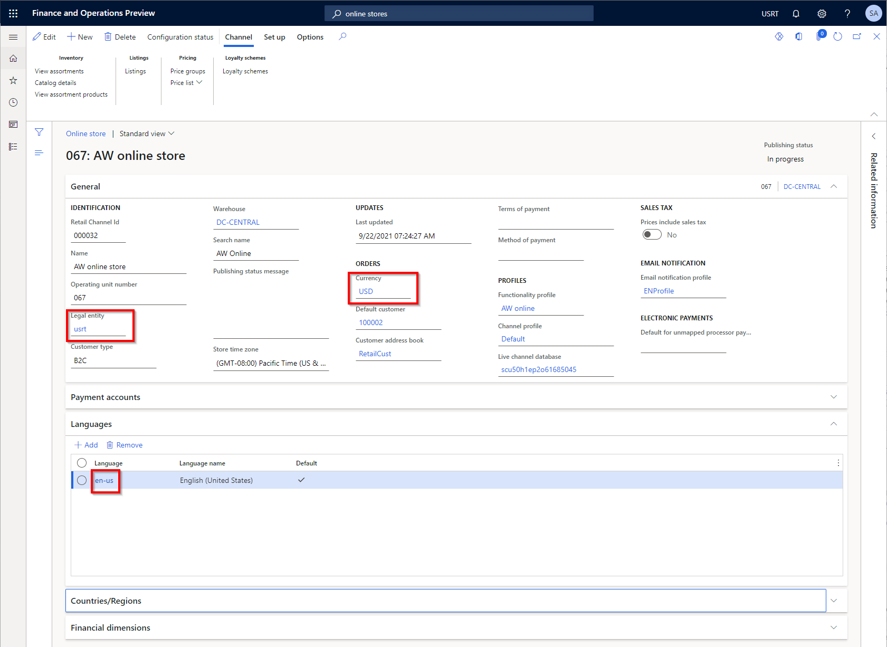

---
# required metadata

title: Channel mapping to e-commerce sites
description: Dynamics 365 Commerce supports many business scenarios to map online channels with a configured set of products, prices, discounts, etc... to e-commerce site experiences for their customers. This article provides guidance for some of the more common mapping scenarios which can be extrapolated for most other business requirements.
author: samjarawan
ms.date: 09/21/2021
ms.topic: article
ms.prod: 
ms.technology: 

# optional metadata

# ms.search.form: 
audience: Application user
# ms.devlang: 
ms.reviewer: v-chgri
# ms.tgt_pltfrm: 
ms.custom: 
ms.assetid: 
ms.search.region: Global
# ms.search.industry: 
ms.author: samjar
ms.search.validFrom: 2019-10-31
ms.dyn365.ops.version: Release 10.0.5

---
# Channel mapping to e-commerce sites

Dynamics 365 Commerce supports many business scenarios to map [online channels](#online-channels) with a configured set of products, prices, discounts, etc... to [e-commerce site](#e-commerce-site) experiences for their customers. This article provides guidance for some of the more common mapping scenarios which can be extrapolated for most other business requirements.

The scenarios covered in this topic include:
* A single language channel with a single e-commerce site experience.
  * ie: a single brand site configured for the English United States market.
* A multi-language channel with a single localized site experience.
  * ie: a single brand site configured for Canada with French and English language support where both languages provide the same site experience but are localized into the appropriate languages.
* A multi-language channel with different site experiences per language.
  * ie: a single brand site configured for Canada with unique site experiences for French Quebec region users and English region users.
* Multiple channels (with single and/or multiple languages) with a single localized site experience.
  * ie: a single brand site configured for Australia and New Zealand, where both contries share the same site experience but each country is configured with different products, currency, prices, discounts, shipping modes, etc...
* Multiple channels (with single and/or multiple languages) with different site experiences per country.
  * ie: a single brand site configured for Australia, Canada and Germany, where each country has a unique site experience along with different products, currency, prices, discounts, shipping modes, etc...

## Online channels

An online channel represents an online e-commerce storefront which is used to map products, pricing, discounts, languages, payment methods, delivery modes, fulfillment centers and other aspects of the online experience that will be available to your customers. Online channels are created and managed within headquarters and map to a single [legal entity](https://docs.microsoft.com/en-us/dynamics365/fin-ops-core/fin-ops/organization-administration/organizations-organizational-hierarchies?toc=/dynamics365/commerce/toc.json#legal-entities), which is usually based in a single country that requires the tax reporting for the channel and can only be configured with  a single currency.

For an overview on channels see the [Channel overview](channels-overview.md) topic and to learn about creating an online channel see the [Set up an online channel](channel-setup-online.md) topic.

The below image shows the default online channels that are deployed with Dynamics 365 Commerce if the demo data option was selected.

## E-commerce site

An e-commerce site represents the set of pages that make up the website that customers use to shop.  E-commerce sites are managed from within site builder as shown in the below image.  To learn more about how to create and manage sites from within site builder see the [E-commerce site overview](online-store-overview.md) topic.

## Common channel mapping scenarios

Dynamics 365 Commerce supports a great range of channel mapping scenarios and the below list is just a subset meant as a guide to help planning any unique business scenarios you may have.  You will find examples below using the Dynamics 365 Commerce ficticious storefronts included with demo data including the Fabrikam fashion store and Adventure Works sporting goods.

### Single language channel with a single e-commerce site experience
The most basic scenario is a single channel with a single language for selling in a single market. An example for this scenario is the Adventure Works online store setup for the United States English market. The below image shows an example of the channel setup within HQ. 

The single online channel can then be mapped to a single e-commerce site within site builder. See [mapping a channel to a site in site builder](#mapping-a-channel-to-a-site-in-site-builder) to learn how how to create a new site and map it to a channel.

### Multi-language channel with a single localized site experience
A common scenario is a single brand site that is localized into other languages but the products, prices and currency stay the same as the language on the site is changed.  An example is a site for Canada which has two regional languages English and French, but the currency, products, shipping options and pricing are the same. The below image shows Adventure Works online channel configured with many different languages.

The languages can then be configured on the e-commerce site within site builder as shown below in the **Site settings** -> **Channels** tab.  Notice each language has been configured with the locale for the path giving each language a unique URL.

To add a new channel language, select the channel link highlighted in the below image and a channel locale mapping will pop up where you can select **Add a locale** where you can pick the channel and locale to add plus the path to use for that channel.

#### Enable the site language selector

Once you have configured a site to have multiple languages, you may want to add a language selector to the header to select the language.  The module library [header](..\author-header-module.md) module has built in support for users to select a language using the [site picker](site-selector.md) module.  The site picker can be added within the header fragment which has the header module as shown in the below image. As can be seen, the header module has a **Site Picker** slot, edit the fragment and add the **Site picker** module to the slot and then select **Add site options list** from the site picker module configurations to add a new language.  You can then add the text that will show up in the picker drop down and the URL with the path you created when adding the channel to the site (ie: www.adventure-works.com/fr-ca).

Once the site selector is saved and published in the header you should see a drop down list on the e-commerce site as shown in the below example.

#### Page variants per language

Site builder supports the ability to change how a page looks based on the selected language by creating a page variant for it.  From within site builder, there is a link at the top right that shows the current channel and language, selecting it will bring up a channel and language picker.  In this scenario there is only one channel but multiple languages.  If you want to override the page for this language, just change it and you will be prompted to create a variant of the page if one does not exist or you will see the variant and can now make edits to that variant.  If no variant is created the original page will render and show the appropriate language for module strings and product information pulled from HQ, however if text was provided directly in the default page modules like a page title or other marketing information that will remain in the original language, creating a page variant will allow you to add localized content.  Pages can also be exported as xliff files to be localized and the variants can then be imported.

### A multi-language channel with different site experiences per language.

Similar to the scenario above, you may want to offer a completely different site experience for one language over the other.  The recommended way is to use the page variants on a single site as discussed in the previous scenario but if desired you can create a new e-commerce site in site builder and map it to the single online channel and language.  This would result in a single online channel being mapped to multiple e-commerce sites, one per language.

### Multiple channels (with single and/or multiple languages) with a single localized site experience

In this scenario, a branded site may have multiple online channels per region, for example Adventure Works could have one online channel for the Canadian market with multiple languages, another online channel for the American market and another for the German market.  Each online channel would be configured to a region specific business entity and can either have the same set of products, sub set of products, or a different set of product each with their own unique prices (in their regional currency), taxes, discounts, shipping modes, etc...

Adding additional channels to an e-commerce site can be done in site builder under the **Site settings**, **Channels** tab with the **Add a channel** button as shown in the below image, where the online channel and default locale can be selected.  

Different domain names can be configured to point to each site, for example www.adventure-works.com could be mapped to the United States site, www.adventure-works.ca can mapped to the Canadian site, or alternatively a single domain could be configured such that the default domain (www.adventure-works.com) maps to the Unites States site and a path is added for other countries such as www.adventure-works.com/canada.

#### Configure site selector

Similar to the configuring multiple languages discussed in the previous scenario, the header [site picker](site-selector.md) module can be used to give customers a drop down of the different supported country sites.  This can be configured the same way as shown in the previous example, where each country and its URL is selected.  

Alternatively a country/region picker module is available that can be used along with geo detection and redirection to ensure the correct default site is brought up for the customer based on their geo location.  For more information see the [County/region picker module](country-region-picker-module) topic.

### Multiple channels (with single and/or multiple languages) with different site experiences per country.

Similar to the previous scenario, you may have multiple channels for a single brand in different regions and want different site experiences per region.  There are two options for this, one is to use page variants as was shown in the previous multi-language scenario where page variants are used for each online channel or different sites can be configured per online channel following the general details found in the above scenarios.

### Other scenarios

With the flexibility of channel to site mapping available in Dynamics 365 Commerce and the details provided above, a vast number of scenarios are possible to meet most business requirements.

## Mapping a channel to a site in site builder

The below shows different ways sites can be created and configured to use different online channels.

### Creating a new channel

Channels can be created within site builder on the **Manage sites** page using the **New site** link.  The below shows where you select the default online channel and language for the site.

### Creating a new channel with site copy

In general you won't create new sites as shown above since it will start out as an empty site without any site pages (ie: homepage, category page, product page, ...). A better practice is to start out with a copy of one of the provided starter sites such as Fabrikam or Adventure Works.  In this case you will select **Copy site** where you can pick the source site and the destination site name.  

Notice in the image above that the online channel and language selection is not an option to pick at this point, this can be done once the site copy has completed.  When the site is selected in site builder site list for the first time, it will bring up a setup dialog where the default channel and language can be selected as shown in the below image.

### Managing an existing sites channels

Once a site has been configured with its channel, it can easily be managed/changed from within the selected site in site builder under the **Site Settings**, **Channels** tab as shown in the below image.

### Supporting multiple sites in a single tenant

Many branded sites sites can co-exist in a single tenant.  Notice the site list in the below image has three different branded sites (Adventure Works, Adventure Works Business (B2B site) and a site for Fabrikam) each mapped to different single online channel.

### Domain name and path

A single domain name can be used for multiple sites and the path is used to separate the sites and or languages.  For example the domain could be "www.MyCompany.com" which is configured for two different e-commerce sites: one for Fabrikam and one for Adventure Works.  The default (ie: blank path) can be used for one site such as the Fabrikam site and a path could be added for the second site such as "adventureworks" so that the site is accessed with "www.MyCompany.com/adventureworks" or a path can be added for both sites (www.MyCompany.com/fabrikam). Alternately a different domain name can be used for each site ie: www.adventure-works.com and www.fabrikam.com and paths could be used for different regions such as www.adventure-works.com/fr-ca for French Canada.
