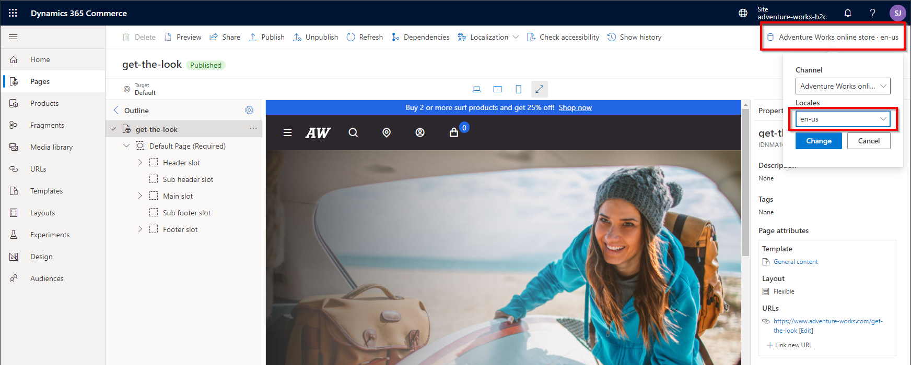

---
# required metadata

title: Map channels to e-commerce sites
description: This topic describes some of the more common channel mapping scenarios in Microsoft Dynamics 365 Commerce that can be extrapolated for most other business requirements.
author: samjarawan
ms.date: 04/20/2022
ms.topic: article
ms.prod: 
ms.technology: 

# optional metadata

# ms.search.form: 
audience: Application user
# ms.devlang: 
ms.reviewer: v-chgriffin
# ms.tgt_pltfrm: 
ms.custom: 
ms.assetid: 
ms.search.region: Global
# ms.search.industry: 
ms.author: samjar
ms.search.validFrom: 2019-10-31
ms.dyn365.ops.version: Release 10.0.5

---
# Map channels to e-commerce sites

This topic describes some of the more common channel mapping scenarios in Microsoft Dynamics 365 Commerce that can be extrapolated for most other business requirements.

Dynamics 365 Commerce supports many business scenarios to map [online channels](#online-channels) with a configured set of products, prices, and discounts to [e-commerce site](#e-commerce-site) experiences for their customers.

Scenarios covered in this topic include:
- **A single language channel with a single e-commerce site experience.** For example, this could be a single brand site configured for the English United States market.
- **A multilanguage channel with a single localized site experience.** For example, this could be a single brand site configured for Canada with French and English language support where both languages provide the same site experience but are localized into the appropriate languages.
- **A multilanguage channel with different site experiences per language.** For example, this could be a single brand site configured for Canada with unique site experiences for French Quebec region users and English region users.
- **Multiple channels (with single and/or multiple languages) with a single localized site experience.** For example, this could be a single brand site configured for Australia and New Zealand, where both countries share the same site experience but each country is configured with different products, currency, prices, discounts, and shipping modes.
- **Multiple channels (with single and/or multiple languages) with different site experiences per channel.** For example, this could be a single brand site configured for Australia, Canada and Germany, where each country has a unique site experience along with different products, currency, prices, discounts, and shipping modes.

## Online channels

An online channel represents an online e-commerce storefront that is used to map products, pricing, discounts, languages, payment methods, delivery modes, fulfillment centers and other aspects of the online experience that will be available to your e-commerce customers. Online channels are created and managed in Commerce headquarters and map to a single [legal entity](../fin-ops-core/fin-ops/organization-administration/organizations-organizational-hierarchies.md?toc=/dynamics365/commerce/toc.json#legal-entities). the legal entity is usually based in a single country that requires the tax reporting for the channel and can only be configured with a single currency.

For more information on channels, see [Channel overview](channels-overview.md). For more information about creating an online channel, see [Set up an online channel](channel-setup-online.md).

The following example illustration from Commerce headquarters shows the default online channels that are deployed with Dynamics 365 Commerce if the demo data option is selected.

## E-commerce site

An e-commerce site contains a set of site pages that that customers use to browse and shop. E-commerce sites are managed from within Commerce site builder, as shown in the following example illustration.  

To learn more about how to create and manage sites from within site builder, see [E-commerce site overview](online-store-overview.md).

## Common channel mapping scenarios

Dynamics 365 Commerce supports a wide range of channel mapping scenarios. The channel mapping scenarios that follow are just a subset of all possible channel mapping scenarios and are meant as a guide to help you plan for any unique business scenarios that you may have. The fictitious Adventure Works sporting goods store included with the Dynamics 365 Commerce demo data is used as an example for each scenario.

### Single language channel with a single e-commerce site experience

The most basic scenario is a single channel with a single language for selling in a single market. An example for this scenario is the Adventure Works online store that is set up only for the United States English market. The following example illustration shows an example of the channel setup within headquarters where the online channel only supports a single language ("en-us"), a single currency ("USD"), and a single business entity ("usrt") that is used for tax reporting.

The single online channel can be mapped to a single e-commerce site within site builder. To learn how to create a new site and map it to a channel, see [Map a channel to a site in site builder](#map-a-channel-to-a-site-in-site-builder).

### Multilanguage channel with a single localized site experience

In this scenario, a single channel supports more than one language which allows the localization of product names, descriptions, and attributes in headquarters. Marketing content on the site can also be localized within site builder to provide a complete localized site experience.  

The limitation of this scenario is that a single channel can only be configured with one currency, one legal entity, and one set of products and prices. This configuration works best for countries with a single currency and multiple languages, for example Canada with both English and French languages but a single currency, single legal entity, and single set of products and prices.

The following example illustration shows the Adventure Works online channel configured with multiple languages. 

Different languages within a channel can be configured with their own domain names, for example `www.adventure-works.ca` for the Canada English version and `www.adventure-works-fr.ca` for the Canada French version. Alternatively, different languages within a channel can be configured within a single domain using different paths for each language, for example `www.adventure-works.ca` for the Canada English version and `www.adventure-works.ca/fr` for the Canada French version. [Geo detection](geo-detection-redirection.md) can also be enabled to automatically redirect a user to the correct site based on the user's location.

For information on allowing customers to manually switch between languages, see [Add and configure the site picker module](#add-and-configure-the-site-picker-module).  

For information on customizing localized pages and fragments, see [managing site content with multiple channels and languages](#manage-site-content-with-multiple-channels-and-languages).

### Multilanguage channel with different site experiences per language

You may prefer a scenario where a single channel supports more than one language but a completely different site experience is rendered for each language. The recommended method to implement this scenario is to use [page variants](#implement-page-variants-for-each-language) on a single site. Another method is to create a new e-commerce site for each language in site builder and then map each site to a single online channel and language, which would result in a single online channel being mapped to multiple e-commerce sites, one per language. The multiple site method requires extra management resources since there will be more than one site to independently manage within site builder.

### Multiple channels (with single and/or multiple languages) with a single localized site experience

A branded site may require multiple online channels per region to support a different currency, set of products, and set of prices for each channel within a single site. For example, the Adventure Works site could have an online channel for the Canadian market with multiple languages, a channel for the American market with one language, and a channel for the German market with one language. In this scenario, each online channel would be configured for a region-specific legal entity and could have the same set of products, a subset of products, or a different set of products from the other channels. Each channel would also have its own prices in the regional currency, taxes, discounts, and shipping modes.

In this example, the different markets could be configured with their own domain names such as `www.adventure-works.com` for the US market and `www.adventure-works.de` for the German market, or alternatively could be configured to use different paths such as `www.adventure-works.com` for the US market and `www.adventure-works.com/de` for the German market. [Geo detection](geo-detection-redirection.md) could also be enabled to automatically redirect users to the correct site based on their region.

You may also want your site to display a drop-down list that allows users to manually switch to a specific market. For more information, see [Add and configure the site picker module](#add-and-configure-the-site-picker-module).

For information on configuring multiple channels on a single site, see [Configure multiple channels on an e-commerce site](#configure-multiple-channels-on-an-e-commerce-site).  

### Multiple channels (with single and/or multiple languages) with different site experiences per channel.

You may want to have multiple channels for a single brand in different regions with different site experiences for each region. There are two methods for implementing this scenario, both described in the previous scenarios:

- Use [page variants](#implement-page-variants-for-each-language).
- Configure different sites in site builder for each online channel and then map each site to a different online channel and language. This method requires extra management resources since there will be more than one site to independently manage within site builder.

## Cross-channel sharing

Cross-channel sharing is useful when multiple channels on a single site can share content. For example, a retailer that has multiple brands and storefronts that are grouped under a single site can share some content among some or all of the storefronts. Shared content can include pages for terms and conditions, payment terms, shipment methods, and frequently asked questions (FAQ). For more information, see [Enable and use cross-channel sharing](cross-channel-sharing.md) topic.

## Map a channel to a site in site builder

There are multiple methods that you can use to create and configure sites to use different online channels.

### Create a new site

You can create a new site in site builder by going to the **Sites** list page and then selecting **New site**, which will bring up the **New site** dialog box. There you can select the default online channel and language for the site, as shown in the following example illustration.

For more information, see [Create an e-commerce site](create-ecommerce-site.md).

### Create a new site with the site copy operation

Instead of creating a new site as shown above that will start out as an empty site without any site pages (for example, home page, category pages, product pages), a better practice is to start out with a copy of one of the starter sites provided in the Commerce module library such as Fabrikam or Adventure Works. 

To copy an existing site, go to the **Sites** list page and then select select **Copy site**, which will bring up the **Copy site** dialog box where you can pick the source site and the destination site name as shown in the following exzmple illustration.  

At this point you aren't able to select the default online channel and language for the site yet, but you can configure these once the site copy operation has completed. When you first select the site on the **Sites** list page in site builder, the **Setup your site** dialog box will appear where the default channel and language can be selected, as shown in the following example illustration.

For more information about the site copy operation, see [Copy an e-commerce site](copy-ecommerce-site.md).

### Manage an existing site channel

Once a site has been configured with a channel, the channel can easiliy be managed and updated from within the selected site in site builder under **Site Settings \> Channels**, as shown in the following example illustration.

## Support multiple sites in a single tenant

Many branded sites can coexist in a single tenant. The following example illustration shows three different branded sites (Adventure Works, Adventure Works Business, and Fabrikam), each mapped to different single online channel.

## Configure single domain name and paths for multiple sites

A single domain name can be used for multiple sites and paths can then be used to separate sites or languages. For example, the domain could be `www.mycompany.com` which is configured for two different e-commerce sites: one for Fabrikam and one for Adventure Works. The default path (`www.mycompany.com`), also known as the blank path, could be used for the Fabrikam site and another path (`www.mycompany.com/adventureworks`) could be used for the Adventure Works site. Another option would be for  the Fabrikam site to also use a custom path (for example, `www.mycompany.com/fabrikam`) instead of the default path. 

Alternatively, a different domain name can be used for each site (for example, `www.adventure-works.com` and `www.fabrikam.com`) and paths could be used for different languages or regions, for example `www.adventure-works.com/fr-ca` for Canada French.

## Configure multiple languages on a site

Languages can be configured for the e-commerce site within site builder under **Site settings \> Channels**. In the following example illustration, each language has been configured with the locale for the path giving each language a unique URL.

To add a new channel language, got to **Site settings \> Channels** and select the channel link. In the pane that appears on the right, select **Add a locale** to select the channel and locale you want to add and specify the path to use for that channel.

In the following example illustration, the **Adventure Works online store (default)** channel link and **Add a locale** are highlighted.

### Add and configure the site picker module

Once you have configured a site to have multiple languages and or channels, you may want to add a language selector to the site page header for users to manually select their language or country. The module library [header module](author-header-module.md) has built-in support for users to select a language using the [site picker module](site-selector.md). The site picker module can be added to the header module within the header fragment. 

For more information on adding and configuring the site picker module, see [Site picker module](site-selector.md).

### Implement page variants for each language

You can change how a page appears based on the selected language by creating a page variant for it. In site builder, selecting the link at the top right that shows the current channel and language will bring up a channel and language picker. 

In this scenario there is only one channel but multiple languages. 

If you want to override the page for this language, just change it and you will be prompted to create a variant of the page if one does not exist or you will see the variant and can now make edits to that variant. 

If no variant is created the original page will render and show the appropriate language for module strings and product information pulled from headquarters, however if text was provided directly in the default page modules like a page title or other marketing information that will remain in the original language, creating a page variant will allow you to add localized content. Pages can also be exported as xliff files to be localized and the variants can then be imported.

## Manage site content with multiple channels and languages

A site that has multiple channels and/or languages stores unique variants of each page and fragment per channel/language combination, this allows the variant to contain localized data but also provides the flexibility to change the look and feel of the page for that variant.  

The following example illustration shows how to change the channel or language context within site builder.  

You will see a warning message if the variant for the selected page or fragment has not been created yet and selecting **Create page variant** will provide an option to start with a copy of an existing variant or create a brand new page from one of the templates.

An alternative to manually creating each page and fragment is to export each page and fragment to an xliff file which can then be sent off for localization and re-imported.  Select **Localization** to see these options on a page or fragment as shown below.

## Configure multiple channels on an e-commerce site

Adding additional channels to an e-commerce site can be done in site builder under the **Site settings**, **Channels** tab with the **Add a channel** button as shown in the following example illustration, where the online channel and default locale can be selected.  

## Additional resources

[Channels overview](channels-overview.md)

[Set up an online channel](channel-setup-online.md)

[Organizations and organizational hierarchies overview](../fin-ops-core/fin-ops/organization-administration/organizations-organizational-hierarchies)

[Set up geo detection and redirection](geo-detection-redirection.md)

[Enable and use cross-channel sharing](cross-channel-sharing.md)

[Create an e-commerce site](create-ecommerce-site.md)

[Copy an e-commerce site](copy-ecommerce-site.md)

[Site picker module](site-selector.md)

