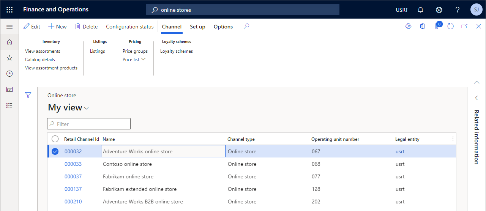

---
# required metadata

title: Channel mapping to e-commerce sites
description: This article will provide guidance for setting up the more common channel mapping scenarios.
author: samjarawan
ms.date: 09/21/2021
ms.topic: article
ms.prod: 
ms.technology: 

# optional metadata

# ms.search.form: 
audience: Application user
# ms.devlang: 
ms.reviewer: v-chgri
# ms.tgt_pltfrm: 
ms.custom: 
ms.assetid: 
ms.search.region: Global
# ms.search.industry: 
ms.author: samjar
ms.search.validFrom: 2019-10-31
ms.dyn365.ops.version: Release 10.0.5

---
# Channel mapping to e-commerce sites

Dynamics 365 Commerce provides support for many difference business scenarios of mapping online channels to e-commerce sites.  They range from a single language channel mapped to a single e-commerce site, multiple language channel mapped to a single or multiple e-commerce sites or multiple online channels mapped to a single e-commerce site.  For example, if multiple online stores are set up to support different geographical regions, a single set of e-commerce pages can be used to provide the unique experiences that are defined by each store.  This article will provide guidance for setting up the more common channel mapping scenarios.

## Online channels

Online channels represent online e-commerce storefronts and are created and managed within the headquarters tool.  Online store channels are used to map products, pricing, discounts, languages, payment methods, delivery modes, fulfillment centers and other aspects of the online expereicne that should be available to your customers. 

For an overview on channels see the [Channel overview](channels-overview.md) topic and to learn about creating an online channel see the [Set up an online channel](channel-setup-online.md) topic.

The below image shows the default online channels that are deployed with Dynamics 365 Commerce if the demo data option was selected.

## E-commerce sites

E-commerce sites represent the set of pages that make up the website that customers use to shop.  E-commerce sites are managed from within the site builder tool as shown in the below image.  To learn more about how to create and manage sites from within the site builder see the [E-commerce site overview](online-store-overview.md) topic.

## Channel scenarios

The below list out common scenarios and how to configure each one.

### Single market site with a single web site
Single online channel with a single language mapped to a single e-commerce site

Wxample:
Adventure Works online channel US currency mapped to single e-commerce site
Fabrikam online channel Euros mapped to single e-com site

### Single market site with multiple languages but same site experience
Single online channel with multiple languages mapped to a single e-commerce site
Adventure Works online channel configured with en-ca and fr-ca - users in both French Canada and English Canada get the exact same experience, same currency but site is localized

### Single market site with multiple languages but different site experiences
online channel with multiple languages mapped to different e-commerce sites

### Brand with multiple markets and single site
AW en-us channel with US currency single site
AW de-de channel with EU currency single site

### Brand with multiple markets and site but different page experiences
AW en-us channel with US currency single site
AW de-de channel with EU currency single site

### Brand with multiple markets and site but different site experiences
AW en-us channel with US currency site 1
AW de-de channel with EU currency site 2

