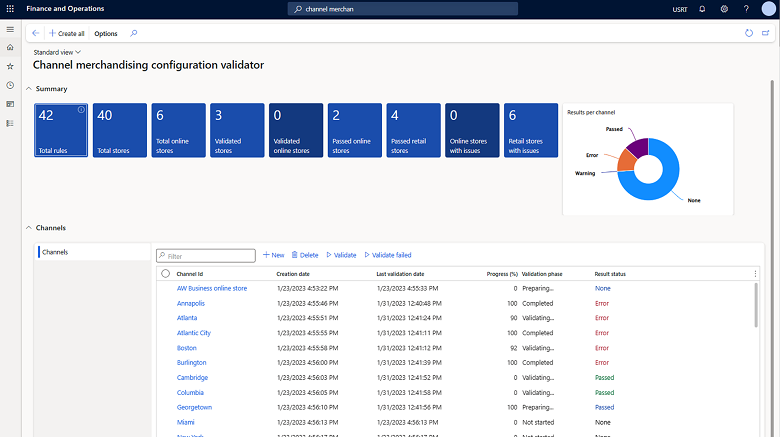

---
# required metadata

title: Channel merchandising configuration validator
description: This article describes how to find missing and invalid configurations for products, categories, and attributes by channel in Microsoft Dynamics 365 Commerce headquarters. 
author: ashishmsft
ms.date: 03/14/2023
ms.topic: article
ms.search.form: RetailCommerceValidatorWorkSpace 
audience: Application User, Developer, IT Pro
ms.reviewer: v-chgriffin
ms.assetid: 6fc835ef-d62e-4f23-9d49-50299be642ca
ms.search.region: Global
ms.author: asharchw
ms.search.validFrom: 2016-02-28

---

# Channel merchandising configuration validator

[!include[banner](../includes/banner.md)]

This article describes how to find missing and invalid configurations for products, categories, and attributes by channel in Microsoft Dynamics 365 Commerce headquarters.

Channel merchandising configuration validator is designed to identify and address incorrect and missing configurations related to products, categories, catalogs and attributes that may result in complications when selling products in eCommerce and POS Commerce channels. By utilizing the configuration validator, you can efficiently resolve these issues and streamline your backoffice operations.

## Capabilities

This feature offers a wide range of capabilities to optimize your backoffice operations:

- **Proactive validation** - The configuration validator proactively identifies and reports missing or invalid configurations related to products, categories, variants, attributes, and catalogs.
- **Validation Across Multiple Locales** - It provides comprehensive validation checks across all locales, ensuring all merchandising configurations are thoroughly assessed for a selected channel.
- **Deep Linking** - Upon identifying invalid configurations, the feature creates deep links to the specific form that allow users to quickly navigate to the source of the issue and resolve it efficiently, streamlining the correction process.
- **Extensive Rule Set** - With a comprehensive set of validation rules, including over 40 distinct rules, the Channel merchandising configuration validator offers a robust and reliable solution to identify and resolve configuration issues.

## Create validation for a new channel

To create validation for a new channel, follow these steps.

1. Go to **Retail and Commerce \> Retail and Commerce IT \> Channel merchandising configuration validator**.
1. Select **New**.
1. In the **Channel Id** field, enter or select a value (for example, "AW Business online store").
1. Select **Validate**.
1. Wait for the progress to become 100% and the validation phase to show **Completed**. 
1. After validation has completed, select **Channel name** to view a detailed summary of the validation results. There are two viewing options: **By entity** and **By rules**. 
    - **By entity** it shows you **all entity records validated** with number of messages, errors and warnings. To view details, select **Show details** to load an additional grid with details of messages, errors and warnings and you can filter by type of the issue. From the **Show details** view you can directly navigate to the entity record to fix the necessary configuration. 
    - **By rules** shows you each rule that was validated with corresponding number of messages, errors and warnings. To view details, select **Show details**. Select **Show details** to load an additional grid with details of messages, errors, and warnings. You can filter by issue type. From the **Show details** view, you can directly navigate to the entity record to fix the necessary configuration. 
1. After fixing the necessary configurations across all entities, you can navigate back to the **Validation summary** view and select **Validate failed** to rerun the validation for the previously failed rules. 

## Create validation for all channels

To create validation for all channels, follow these steps.

1. Go to **Retail and Commerce \> Retail and Commerce IT \> Channel merchandising configuration validator**.
1. Select **Create all**. This action will create a validation for each channel and you will notice the **channel grid** on this workspace getting populated with list of channels. 
1. Next, in channel grid, select the channels for which you would like to initiate the validation process. 
1. If you want to run validation for all channels, from the grid header, select the checkbox that selects all channels. 
1. Select **Validate**. 

## Rules

The following table describes the rules for the channel merchandising configuration validator.

| Rule ID | Entity | Rule description | Rule type | Effect of incorrect configuration|
|--------|--------|--------|--------|--------|
| AttribGroup-Ru-001 | Attribute group  | Attribute group display order is missing. | Information |  If attributes on a product are based of multiple attribute groups, then they will be ordered using default ordering of attributes. |
| AttribGroup-Ru-002 | Attribute group  | AttributeGroup translation for Description and FriendlyName is missing. | Information | This will have an impact on headquarters users, when they have user preferences set to use language different than default system language. |
| Attrib-Ru-001 | Attribute  | Attribute display order inside attribute group is missing. | Information | If attributes on a product are based of multiple attribute groups, then they will be ordered using default ordering of attributes. |
| Attrib-Ru-002 | Attribute  | Attribute translation for Description and FriendlyName is missing.  | Error | If a channel is configured to render data in the language other than system default language (not to be confused with channel default language) then standard attributes (including refiners associated with those attributes) won't be rendered correctly. Also, this will have an impact on headquarters user, when they have user preferences set to use language different than default system language. |
| Attrib-Ru-003 | Attribute  |Attribute enumeration translation for **Description** and/or **Friendly Name** is missing or empty. | Error | If a channel is configured to render data in the language other than the system default language (not to be confused with the channel default language), then list values-based attributes (including refiners associated with those attributes) won't be rendered correctly. Also, this will have an impact on headquarters users, when they have user preferences set to use language different than default system language. |
| Attrib-Ru-004 | Attribute  |Attribute value translation for specified channel attribute override is missing. | Error |  If a channel is configured to render data in the language other than the system default language (not to be confused with the channel default language), then attribute values (including refiner values associated with those attributes) won't be rendered correctly. Also, this will have an impact on headquarters users when they have user preferences set to use a language different than the default system language. |
| Cata-Ru-001 | Catalog | Catalog target is business-to-business (B2B) and the customer type is business-to-consumer (B2C), both should be the same.  | Error | This is a mismatch between the types of channels associated with the catalog, B2B catalogs are only discoverable in B2B online channels. |
| Cata-Ru-002 | Catalog | Catalog target is B2C and the customer type is B2B, both should be the same.  | Error | This is a mismatch between the types of channels associated with the catalog, B2B catalogs are only discoverable in B2B online channels. |
| Cata-Ru-003 | Catalog | Catalog is expired. | Information | This suggests that there are expired catalogs associated with the channel, so they won't be discoverable in channels. |
| Cata-Ru-004 | Catalog | Catalog translation is missing. | Error | If channel is configured to support languages, other than system default language - in that case this catalog won't appear in the catalog picker. |
| Cata-Ru-005 | Catalog | Catalog product isn't assorted. | Warning | There are products in the catalog definition, that are no longer assorted to the channel and hence won't be discoverable in the channel while browsing catalogs. | 
| Cata-Ru-006 | Catalog | Catalog product isn't released. | Warning | There are products in the catalog definition, that aren't released to the legal entity associated with the channel, and so won't be discoverable in the channel while browsing catalogs. | 
| Cata-Ru-007 | Catalog | Catalog product overridden attribute value translation is missing. | Error | If user intended to override product attribute value at a catalog level, but that overridden value isn't translated for languages associated with the channel. These catalog-specific attribute values won't be shown during the catalog browsing. | 
| Cate-Ru-001 | Channel navigation hierarchy | Category is inactive. | Warning | The inactive categories from Channel navigation hierarchy won't be shown in channel while browsing categories or catalogs.|
| Cate-Ru-002 | Channel navigation hierarchy | Category display order isn't specified. | Warning | The categories will be sorted in a default manner (e.g., alphabetically).|
| Cate-Ru-003 | Channel navigation hierarchy | Category translation is missing. | Error | Categories that are missing translation will show up as blank names in the navigation hierarchy module on the eCommerce sites and Category tile with missing names on POS. |  
| Channel-Ru-001 | Channel navigation hierarchy. | Channel category hierarchy is missing | Error |Due to missing category hierarchy association with channel, there won't be any categories shown on the eCommerce sites or POS channels for product browsing.|
| Hierarchy-Ru-001 | Channel navigation hierarchy | Category hierarchy translation is missing. | Warning | This will have an impact on headquarters user, when they have user preferences set to use language different than default system language.|
| Hierarchy-Ru-002 | Channel navigation hierarchy | Channel Category hierarchy isn't assigned to navigation role. | Error |If the navigation role is removed from the category hierarchy after being associated with a channel, then all categories and products won't be discoverable in the channel.|
| KitComp-Ru-001 | Kits and kit components | Kit component isn't released in the legal entity. | Error |Kit won't be discoverable in the POS if the components of the kits have not been released to the legal entity associated with the channel.|
| KitComp-Ru-002 | Kits and kit components | Kit and kit components must be part of the same assortment. | Warning |If the kit and kit components (including substitute components) aren't part of the same assortment, then Kit selling won't function properly on the POS. |
| KitComp-Ru-003 | Kits and kit components | Kit component is excluded from the assortment. | Warning | If the kit component is excluded from the assortment, and if there's no substitution for the component, then kit won't be rendered correctly on POS. Otherwise, entire kit will be excluded from the assortment.|
| KitCompSubs-Ru-001 | Kits and kit components | Substitute of the Kit component isn't released in the legal entity. | Error | If the kit component is excluded from the assortment, and if there's no substitution for the component, then kit won't be rendered correctly on POS.|
| KitCompSubs-Ru-002 | Kits and kit components | Kit and kit components(including substitutions) must be part of the same assortment. | Warning |If the kit and kit components (including substitute components) aren't part of the same assortment, then Kit selling won't function properly on the POS.   |
| Kit-Ru-001 | Kits and kit components | Kit product isn't released in the legal entity. | Error | If a kit product isn't released to a legal entity associated with the channel, the kit won't be discoverable in Commerce channels. | 
| Prod-Ru-001 | Product dimensions | Master product Color translation is missing. | Error | Due to missing translation values of color values for the languages configured for the channel, color options would appear blank and user may not be able to select correct color value for their variant selection. | 
| Prod-Ru-002 | Product dimensions | Master product Style translation is missing. | Error | Due to missing translation values of style values for the languages configured for the channel, style options would appear blank and user may not be able to select correct style value for their variant selection. | 
| Prod-Ru-003 | Product dimensions | Master product Size translation is missing. | Error | Due to missing translation values of size values for the languages configured for the channel, size options would appear blank and user may not be able to select correct size value for their variant selection. | 
| Prod-Ru-004 | Product dimensions | Master product Configuration translation is missing. | Error | Due to missing translation values of configuration values for the languages configured for the channel, configuration options would appear blank and user may not be able to select correct configuration value for their variant selection.| 
| Prod-Ru-005 | Product assortments | The product isn't active in any assortments, and it won't be shown on channel. | Warning | If products are associated with the categories in the channel navigation hierarchies, but aren't part of any assortments associated with the channel, those products won't show up in Comemrce channels. | 
| Prod-Ru-006 | Product assortments | The product is excluded. If any product has at least one exclusion, then it isn't going to show up. | Warning | These are products that are excluded in atleast one assortment that's associated with the channel and these products won't be discoverable in Commerce channels.  | 
| Prod-Ru-007 | Product and product masters | Product name translation is missing. | Error | If channel is configured to support languages, other than system default language - in that case this product won't render correctly in the product browsing results in Commerce channels. | 
| Prod-Ru-008 | Product and product masters | Product isn't categorized. | Error | These are products that are part of the assortment, and released to the LE associated with the channel but missing association to category in the navigation hierarchy, and thus won't be discoverable in product browsing results. | 
| Prod-Ru-009 | Product and product masters | Inventory unit is missing. | Warning | These are products with missing inventory unit of measure, which may have an impact on the inventory related operations | 
| Prod-Ru-010 | Product and product masters | Sales unit is missing. | Error | These are products with missing sales unit of measure, which may have an impact on the product discovery and ordering capabilities. | 
| Prod-Ru-011 | Product and product masters | Invent base price is missing.  | Warning |These are products with missing inventory base price, which may have an impact on the inventory related operations.| 
| Prod-Ru-012 | Product and product masters | Sales price is missing. | Error | These are products with missing sales base price, which may have an impact on the product discovery and ordering capabilities. | 
| Prod-Ru-013 | Product and product masters | Product is stopped for sales. | Warning | These are products that are marked to not be allowed to order, but they will be discoverable in product browsing results in Commerce channels.| 
| Prod-Ru-014 | Product and product masters | Product isn't released but assorted. | Warning | These are products that aren't going to be discoverable in Commerce channels becuase they aren't released to a legal entity associated with the channel. | 
| Prod-Ru-015 | Product and product masters | Product is categorized to an inactive category. | Warning | If products categorized to an inactive category of the channel navigation hierarchy are associated with a channel, they won't be discoverable in Commerce channels. |
| Prod-Ru-016 | Product and product masters | Product master or distinct product attribute translation is missing. | Error | If a channel is configured to render data in the language other than system default language (not to be confused with channel default language) then standard attributes (including refiners associated with those attributes) won't be rendered correctly. Also, this will have an impact on headquarters user, when they have user preferences set to use language different than default system language. |
| Prod-Ru-017 | Product and product masters | Product description translation is missing.  | Error |If a channel is configured to render data in the language other than system default language (not to be confused with channel default language) then product description won't be rendered correctly. Also, this will have an impact on headquarters users, when they have user preferences set to use language different than default system language.  |

