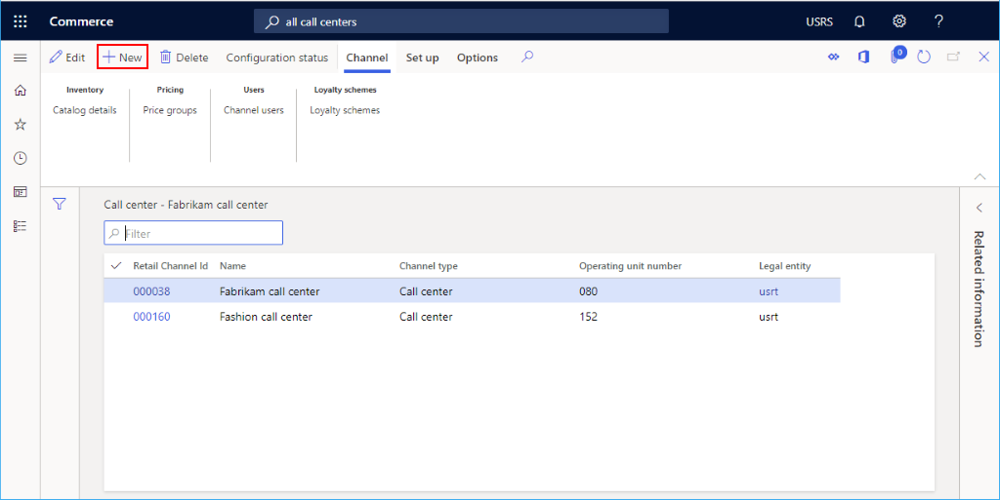

# Set up a call center channel

[!include [banner](includes/banner.md)]

This article describes how to create a new call center channel in Microsoft Dynamics 365 Commerce.

In Dynamics 365 Commerce, a call center is a type of Commerce channel that can be defined in the application. Defining a channel for your call center entities allows the system to tie specific data and order processing defaults to sales orders. While a company can define multiple call center channels in Commerce, it's important to note that an individual user may only be linked to one call center channel. 

Before you create a new call center channel, ensure that you complete the [Channel setup prerequisites](channels-prerequisites.md).

## Create and configure a new call center channel

To create and configure a new call center channel, follow these steps.

1. In the navigation pane, go to **Retail and Commerce \> Channels \> Call centers \> All call centers**.
1. On the action pane, select **New**.
1. In the **Name** field, provide a name for the new channel.
1. Select the appropriate **Legal entity** from the drop-down.
1. Select the appropriate **Warehouse** location from the drop-down. This location is used as the default on sales orders created for this call center channel, unless other defaults are defined at the customer or item level.
1. In the **Default customer** field, provide a valid default customer. This data is used to help autopopulate defaults when new customer records are created. When creating call center orders, it's not advisable to create orders for the default customer.
1. In the **Email notification profile** field, provide a valid email notification profile. As call center orders are created and processed, the email notification profile is used to trigger automated email alerts to customers with information about their order status.
1. Provide a **Price override** info code. You may need to create an info code for this first. This info code provides the set of reason codes that users are prompted to choose from when they use the price override functionality on a call center order.
1. Provide a **Hold code** info code. You may need to create an info code for this first. This info code provides the set of optional reason codes that user are prompted to choose from when they place an order on hold.
1. Provide a **Credit** info code. You may need to create an info code for this first. This info code provides the set of reason codes that users can choose from when they use the call center order credit functionality to give miscellaneous refunds to customers for customer service reasons.
1. Optional: Set up financial dimensions on the **Financial dimensions** FastTab. The dimensions entered here become the default values on any sales order created in this call center channel.
1. Select **Save**.

The following image shows the creation of a new call center channel.

The following image shows an example call center channel.

## Additional channel setup

Additional tasks required for call center channel setup include setting up payment methods and modes of delivery.

The following image shows **Modes of delivery** and **Payment methods** set up options on the **Set up** tab.

### Set up payment methods

To set up payment methods, follow these steps for each payment type supported on this channel. Users are required to select from predefined payment methods to link them to the call center channel. Before setting up your call center payment methods, first set up your master methods of payment in **Retail and Commerce \> Channel setup \> Payment methods \> Payment methods**.

1. On the action pane, select the **Set up** tab, and then select **Payment methods**.
1. On the action pane, select **New**.
1. In the navigation pane, select a payment method from the predefined payments available.
1. Configure any additional settings as required for the payment type. For credit cards, gift cards, or loyalty cards, additional setup is required by selecting the **Card setup** function. 
1. Configure proper posting accounts for the payment type in the **Posting** section.
1. On the action pane, select **Save**.

The following image shows an example of a cash payment method.

### Set up modes of delivery

You can see the configured modes of delivery by selecting **Modes of delivery** from the **Set up** tab on the **Action pane**.  

To change or add a mode of delivery to be associated to the call center channel, follow these steps.

1. From the Call center modes of delivery form, select **Manage modes of delivery**
1. On the action pane, select **New** to create a new mode of delivery, or select an existing mode.
1. In the **Retail channels** section, select **Add line** to add the call center channel. Adding channels using organization nodes instead of adding each channel individually can streamline adding channels.
1. Ensure the mode of delivery is configured with data on the **Products** FastTab and the **Addresses** FastTab. If no products or delivery addresses are valid for the mode of delivery, selecting it during order entry results in errors.
1. After any changes are made to the call center mode of delivery configurations, you must run the **Process delivery modes** job located at **Retail and Commerce \> Retail and Commerce IT \> Process delivery modes**.

The following image shows an example of a mode of delivery.

### Set up channel users

To create a sales order that is linked to the call center channel from Commerce headquarters, the user creating the sales order must be linked to the call center channel. The user can't manually link a sales order created in Commerce headquarters to the call center channel. The link is systematic, and is based on the user and the user's relationship to the call center channel. A user may only be linked to one call center channel.

1. On the action pane, select the **Channel** tab, and then select **Channel users**.
1. On the action pane, select **New**.
1. Choose an existing **User ID** from the dropdown selection list to link this user to the call center channel

After the channel user setup is done and the user creates a new sales order in Commerce headquarters, the sales order is linked to their associated call center channel. Any configurations for this channel are applied systematically to the sales order. A user can confirm which call center channel the sales order is linked to by viewing the channel name reference on the sales order header.

### Set up price groups

Price groups are optional, and if used can control which sales prices are offered to customers placing orders in the call center channel. If a price group isn't configured for the customer, or if catalog price groups aren't being applied to the sales order using the **Source code ID** field on the call center order header, then the channel price group is used to locate item prices. If a price group isn't found on the call center channel, the default item master prices are used. 

To set up a price group, follow these steps.

1. On the action pane, select the **Channel** tab, and then select **Price groups**.
1. On the action pane, select **New**.
1. Select a **Retail price group** from the dropdown list.

## Additional resources

[Channel setup prerequisites](channels-prerequisites.md)

[Call center sales functionality](call-center-functionality.md)

[Set up call center order processing options](set-up-order-processing-options.md)

[Call center catalogs](call-center-catalogs.md)

[Set up and work with fraud alerts](set-up-fraud-alerts.md)

[Set up continuity programs for call centers](set-up-continuity-program.md)

[!INCLUDE[footer-include](../includes/footer-banner.md)]
