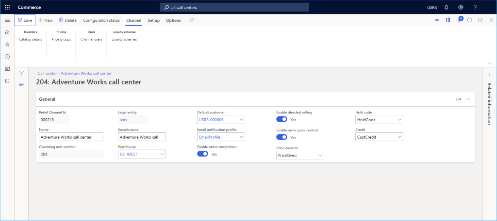
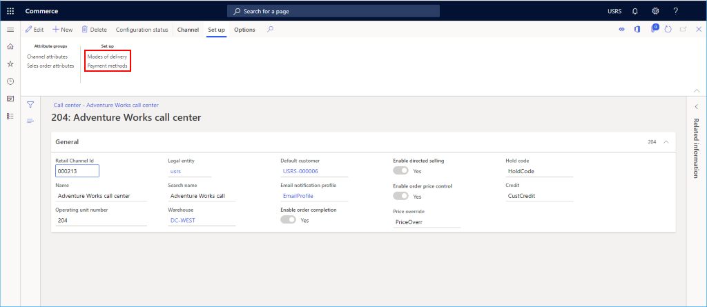

---
# required metadata

title: Set up a call center channel
description: This topic describes how to create a new call center channel in Microsoft Dynamics 365 Commerce.
author: samjarawan
manager: annbe
ms.date: 01/27/2020
ms.topic: article
ms.prod: 
ms.service: dynamics-365-commerce
ms.technology: 

# optional metadata

# ms.search.form: 
audience: Application User
# ms.devlang: 
ms.reviewer: v-chgri
ms.search.scope: Retail, Core, Operations
# ms.tgt_pltfrm: 
ms.custom: 
ms.assetid: 
ms.search.region: Global
# ms.search.industry: 
ms.author: samjar
ms.search.validFrom: 2020-01-20
ms.dyn365.ops.version: Release 10.0.8

---
# Set up a call center channel

[!include [banner](includes/banner.md)]

This topic describes how to create a new call center channel in Microsoft Dynamics 365 Commerce.

## Overview

In Dynamics 365 Commerce, a call center is a type of channel that can be defined in the application. Defining a channel for your call center entities allows the system to tie specific data and order processing defaults to sales orders. A company can define multiple call center channels in Commerce. 

Before you create a new call center channel, ensure that you have completed the [Channel set up prerequisites](channels-prerequisites.md).

## Create and configure a new call center channel

To create and configure a new call center channel, follow these steps.

1. In the navigation pane, go to **Modules \> Channels \> Call centers \> All call centers**.
1. On the action pane, select **New**.
1. In the **Name** field, provide a name for the new channel.
1. Select the appropriate **Legal entity** from the drop down.
1. Select the appropriate **Warehouse** location from the drop down.
1. In the **Default customer** field, provide a valid default customer.
1. In the **Email notification profile** field, provide a valid email notification profile.
1. Provide a **Price override** info code. Note you may need to create an info code for this first.
1. Provide a **Hold code** info code. Note you may need to create an info code for this first.
1. Provide a **Credit** info code. Note you may need to create an info code for this first.
1. Select **Save**.

The following image shows the creation of a new call center channel.

The following image shows an example call center channel.

## Additional channel setup

Additional tasks required for call center channel setup include setting up payment methods and modes of delivery.

The following image shows **Modes of delivery** and **Payment methods** set up options on the **Set up** tab.

### Set up payment methods

To set up payment methods, for each payment type supported on this channel follow these steps.

1. On the action pane, select the **Set up** tab, and then select **Payment methods**.
1. On the action pane, select **New**.
1. In the navigation pane, select a desired payment method.
1. In the **General** section, provide an **Operation name** and configure any other desired settings.
1. Configure any additional settings as required for the payment type.
1. On the action pane, select **Save**.

The following image shows an example of a cash payment method.

### Set up modes of delivery

You can see the configured modes of delivery by selecting **Modes of delivery** from the **Set up** tab on the **Action pane**.  

To change or add a mode of delivery, follow these steps.

1. In the navigation pane, go to **Modules \> Inventory management \> Modes of delivery**.
1. On the action pane, select **New** to create a new mode of delivery, or select an existing mode.
1. In the **Retail channels** section, select **Add line** to add the channel. Adding channels using organization nodes instead of adding each channel individually can streamline adding channels.

The following image shows an example of a mode of delivery.

## Additional resources

[Channel setup prerequisites](channels-prerequisites.md)

[Call center sales functionality](call-center-functionality.md)

[Set up call center order processing options](set-up-order-processing-options.md)

[Call center catalogs](call-center-catalogs.md)

[Set up and work with fraud alerts](set-up-fraud-alerts.md)

[Set up continuity programs for call centers](set-up-continuity-program.md)
