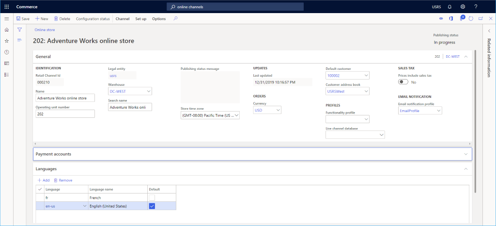
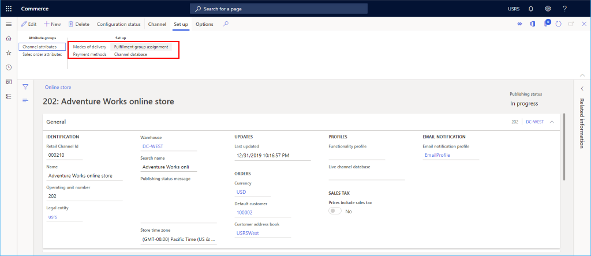

# Set up an online channel

[!include [banner](includes/banner.md)]

This article describes how to create a new online channel in Microsoft Dynamics 365 Commerce.

Dynamics 365 Commerce supports multiple retail channels. These retail channels include online stores, call centers, and retail stores (also known as brick-and-mortar stores). Online stores give customers the option of purchasing products from the retailer's online store in addition to its retail stores.

To create an online store in Commerce, you must first create an online channel. Before you create a new online channel, ensure that you have completed the [Channel set up prerequisites](channels-prerequisites.md).

Before you can create a new site, at least one online store must be created in Commerce. For more information, see [Create an e-Commerce site](create-ecommerce-site.md).

## Create and configure a new online channel

To create and configure a new online channel, follow these steps.

1. In the navigation pane, go to **Modules \> Channels \> Online Stores**.
1. On the action pane, select **New**.
1. In the **Name** field, provide a name for the new channel.
1. In the **Legal entity** drop-down, enter the appropriate legal entity.
1. In the **Warehouse** drop-down, enter the appropriate warehouse.
1. In the **Store time zone** field, select the appropriate time zone.
1. In the **Currency** field, select the appropriate currency.
1. In the **Default customer** field, provide a valid default customer.
1. In the **Customer address book** field, provide a valid address book.
1. In the **Functionality profile** field, select a functionality profile if applicable.
1. In the **Email notification profile** field, provide a valid email notification profile.
1. On the action pane, select **Save**.

The following image shows the creation of a new online channel.

The following image shows an example online channel.

> [!NOTE]
> You should be wary of the implications of changing the warehouse of a running online channel. E-commerce site carts that haven't yet been checked out (unless they are modified) will still be fulfilled from the old warehouse, which will impact the inventory availability calculation.

## Assign the channel to a Commerce Scale Unit

Your new channel must be assigned to a Commerce Scale Unit. For instructions, see [Configure channels to use Commerce Scale Unit](../fin-ops-core/dev-itpro/deployment/initialize-retail-channels.md#configure-channels-to-use-csu).

## Set up languages

If your e-Commerce site will support multiple languages, expand the **Languages** section, and add additional languages as needed.

## Set up payment account

From within the **Payment account** section, you can add a third-party payment provider. For information on setting up an Adyen payment connector, see [Dynamics 365 Payment Connector for Adyen](./dev-itpro/adyen-connector.md).

## Additional channel setup

Additional tasks that are required for online channel setup include setting up payment methods, modes of delivery, and the fulfillment group assignment.

The following image shows **Modes of delivery**, **Payment methods**, and **Fulfillment group assignment** setup options on the **Set up** tab.

### Set up payment methods

To set up payment methods, for each payment type supported on this channel follow these steps.

1. On the action pane, select the **Set Up** tab, then select **Payment methods**.
1. On the action pane, select **New**.
1. In the navigation pane, select a desired payment method.
1. In the **General** section, provide an **Operation name** and configure any other desired settings.
1. Configure any additional settings as required for the payment type.
1. On the action pane, select **Save**.

The following image shows an example of a cash payment method.

### Set up modes of delivery

You can see the configured modes of delivery by selecting **Modes of delivery** from the **Set up** tab on the action pane.

To change or add a mode of delivery, follow these steps.

1. In the navigation pane, go to **Modules \> Inventory management \> Modes of delivery**.
1. On the action pane, select **New** to create a new mode of delivery, or select an existing mode.
1. In the **Retail channels** section, select **Add line** to add the channel. Adding channels using organization nodes instead of adding each channel individually can streamline adding channels.

The following image shows an example of a mode of delivery.

### Set up a fulfillment group assignment

To set up a fulfillment group assignment, follow these steps.

1. On the action pane, select the **Set up** tab, then select **Fulfillment group assignment**.
1. On the action pane, select **New**.
1. In the **Fulfillment group** drop-down list, select a fulfillment group.
1. In the **Description** drop-down list, enter a description.
1. On the action pane, select **Save**.

The following image shows an example of a fulfillment group assignment setup.

## Additional resources

[Channels overview](channels-overview.md)

[Channel setup prerequisites](channels-prerequisites.md)

[Set up a retail channel](channel-setup-retail.md)

[Set up a call center channel](channel-setup-callcenter.md)

[Dynamics 365 Payment Connector for Adyen](./dev-itpro/adyen-connector.md)

[!INCLUDE[footer-include](../includes/footer-banner.md)]
