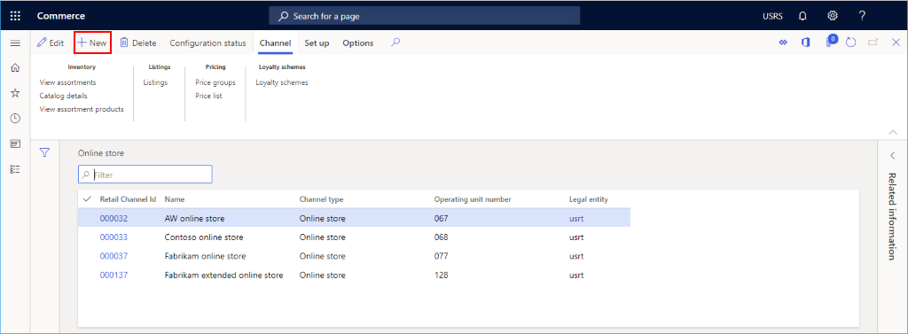

---
# required metadata

title: Set up an online channel
description: This topic presents the steps needed to create a new online channel within Microsoft Dynamics 365 Commerce.
author: samjarawan
manager: annbe
ms.date: 10/01/2019
ms.topic: article
ms.prod: 
ms.service: dynamics-365-commerce
ms.technology: 

# optional metadata

# ms.search.form: 
audience: Developer
# ms.devlang: 
ms.reviewer: v-chgri
ms.search.scope: Retail, Core, Operations
# ms.tgt_pltfrm: 
ms.custom: 
ms.assetid: 
ms.search.region: Global
# ms.search.industry: 
ms.author: samjar
ms.search.validFrom: 2019-10-31
ms.dyn365.ops.version: Release 10.0.8

---
# Set up an online channel

[!include [banner](../includes/preview-banner.md)]
[!include [banner](../includes/banner.md)]

This topic presents the steps needed to create a new online channel within Microsoft Dynamics 365 Commerce.

## Overview
TBD

## Create a new online channel
Before an online channel is created ensure you follow the channel prerequisite steps.

* Go to **Navigation pane** > **Modules** > **Channels** > **Online Stores**.
* On the **Action pane** click **New**.

## Configure the new online channel
* In the **Name** field, provide a name for the new channel.
* Select the appropriate **Legal entity** from the drop down.
* Select the appropriate **Warehouse** location from the drop down.
* Set the appropriate time zone in the **Store time zone** field.
* Set the appropriate currency in the **Currency** field.
* In the **Default customer** field, provide a valid default customer.
* In the **Customer address book** field, provide a valid address book.
* In the **Email notification profile** field, provide a valid email notification profile.
* Select **Save**

## Set up payment account
TBD

## Set up languages
TBD

