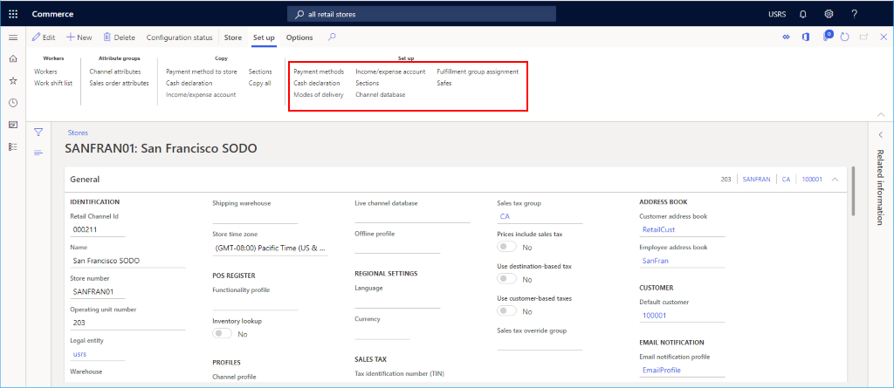

# Set up a retail channel

[!include [banner](includes/banner.md)]
[!include [banner](includes/preview-banner.md)]

This article describes how to create a new retail channel in Microsoft Dynamics 365 Commerce.

Dynamics 365 Commerce supports multiple retail channels. These retail channels include online stores, call centers, and retail stores (also known as brick-and-mortar stores). Each retail store channel can have its own payment methods, price groups, point of sale (POS) registers, income accounts and expense accounts, and staff. You must set up all of these elements before you can create a retail store channel. 

Before a retail channel is created, ensure you follow the [channel prerequisites](channels-prerequisites.md).

## Create and configure a new retail channel

1. In the navigation pane, go to **Modules \> Channels \> Stores \> All stores**.
1. On the Action Pane, select **New**.
1. In the **Name** field, provide a name for the new channel.
1. In the **Store number** field, provide a unique store number. The number can be alphanumeric with a maximum of 10 characters.
1. In the **Legal entity** drop-down list, enter the appropriate legal entity.
1. In the **Warehouse** drop-down list, enter the appropriate warehouse.
1. In the **Store time zone** field, select the appropriate time zone.
1. In the **Sales tax group** drop-down list, select an appropriate sales tax group for the store.
1. In the **Currency** field, select the appropriate currency.
1. In the **Customer address book** field, provide a valid address book.
1. In the **Default customer** field, provide a valid default customer.
1. In the **Functionality profile** field, select a functionality profile if applicable.
1. In the **Email notification profile** field, provide a valid email notification profile.
1. On the Action Pane, select **Save**.

The following image shows the creation of a new retail channel.

The following image shows an example retail channel.

## Other settings

There are numerous other optional settings that can be set in the **Statement/closing** and **Miscellaneous** sections, based on the needs of the retail store.

In addition, see [Screen layouts for the point of sale (POS)](pos-screen-layouts.md) for information on setting up the default screen layout in the **Screen layout** section and [Configure and install Retail hardware station](retail-hardware-station-configuration-installation.md) for setup information about the **Hardware stations** section.

The following image shows an example retail channel setup configuration.

## Additional channel set up

There are additional items that need to be set up for a channel that can be found on the Action Pane under the **Set up** section.

Additional tasks required for online channel setup include setting up payment methods, cash declaration, modes of delivery, income/expense account, sections, the fulfillment group assignment, and safes.

The following image shows various additional retail channel setup options on the **Set up** tab.

### Set up payment methods

To set up payment methods, for each payment type supported on this channel follow these steps.

1. On the Action Pane, select the **Set Up** tab, then select **Payment methods**.
1. On the Action Pane, select **New**.
1. In the navigation pane, select a desired payment method.
1. In the **General** section, provide an **Operation name** and configure any other desired settings.
1. Configure any additional settings as required for the payment type.
1. On the Action Pane, select **Save**.

The following image shows an example of a cash payment method.

The following image shows an example of a cash payment method and the **Amount** tab configuration.

> [!NOTE]
> Values for the **Amount** tab are cached in the Retail Server and will not immediately take effect after you run the Distribution Schedule jobs. You may need to restart the Cloud Scale Unit to immediatly apply these values for testing.

### Set up cash declaration

1. On the Action Pane, select the **Set Up** tab, and then select **Cash declaration**.
1. On the Action Pane, select **New**, and then create all **Coin** and **Note** denominations that are applicable.

The following image shows an example of a cash declaration.

### Set up modes of delivery

You can see the configured modes of delivery by selecting **Modes of delivery** from the **Set up** tab on the Action Pane.  

To change or add a mode of delivery, follow these steps.

1. In the navigation pane, go to **Modules \> Inventory management \> Modes of delivery**.
1. On the Action Pane, select **New** to create a new mode of delivery, or select an existing mode.
1. In the **Retail channels** section, select **Add line** to add the channel. Adding channels using organization nodes instead of adding each channel individually can streamline adding channels.

The following image shows an example of a mode of delivery.

### Set up income/expense account

To set up income/expense account, follow these steps.

1. On the Action Pane, select the **Set Up** tab, and then select **Income/Expense account**.
1. On the Action Pane, select **New**.
1. Under **Name**, enter a name.
1. Under **Search name**, enter a search name.
1. Under **Account type**, enter the account type.
1. Enter text for **Message line 1**, **Message line 2**, **Slip text 1**, and **Slip text 2** as needed.
1. Under **Posting**, enter posting information.
1. On the Action Pane, select **Save**.

The following image shows an example of an income/expense account.

### Set up sections

To set up sections, follow these steps.

1. On the Action Pane, select the **Set Up** tab and click **Sections**.
1. On the Action Pane, select **New**.
1. Under **Section number**, enter a section number.
1. Under **Description**, enter a description.
1. Under **Section size**, enter a section size.
1. Configure additional settings for **General** and **Sales statistics** as needed.
1. On the Action Pane, select **Save**.

### Set up a fulfillment group assignment

To set up a fulfillment group assignment, follow these steps.

1. On the Action Pane, select the **Set up** tab, then select **Fulfillment group assignment**.
1. On the Action Pane, select **New**.
1. In the **Fulfillment group** drop-down list, select a fulfillment group.
1. In the **Description** drop-down list, enter a description.
1. On the Action Pane, select **Save**

The following image shows an example of a fulfillment group assignment setup.

### Set up safes

To set up safes, follow these steps.

1. On the Action Pane, select the **Set Up** tab and click **Safes**.
1. On the Action Pane, select **New**.
1. Enter a name for the safe.
1. On the Action Pane, select **Save**.

### Ensure unique transaction IDs

Transaction IDs generated for the point of sale (POS) are sequential and include the following parts:

- A fixed part, which is a concatenation of store ID and terminal ID. 
- A sequential part, which is a number sequence. 

The transaction ID format uses a 13-digit number generated by calculating the time in milliseconds since 1970. Specifically, the transaction ID format is *{store}-{terminal}-{millisecondsSince1970}*. The transaction ID is non-sequential and ensures that transaction IDs are always unique. 

> [!NOTE]
> Transaction IDs are meant for internal system use only, so they are not required to be sequential. However, many countries require receipt IDs to be sequential.

### Set up store location for store selector

Store location data, including latitude and longitude, is used in store selector scenarios in both POS and e-commerce sites.

To set up the store location in Commerce headquarters, follow these steps.

1. Go to **Organization administrator \> Organizations \> Operating units**.
1. In the left navigation pane, filter the operating unit by name or the operating unit number of the channel, and then select it.
1. On the **Addresses** FastTab, select **More options \> Advanced**. You'll be directed to the **Manage addresses** form.
1. On the **General** tab, enter the applicable values in the **Latitude** and **Longitude** fields.
1. On the Action Pane, select **Save**

## Additional resources

[Channels overview](channels-overview.md)

[Channel setup prerequisites](channels-prerequisites.md)

[Set up an online channel](channel-setup-online.md)

[Set up a call center channel](channel-setup-callcenter.md)

[!INCLUDE[footer-include](../includes/footer-banner.md)]
