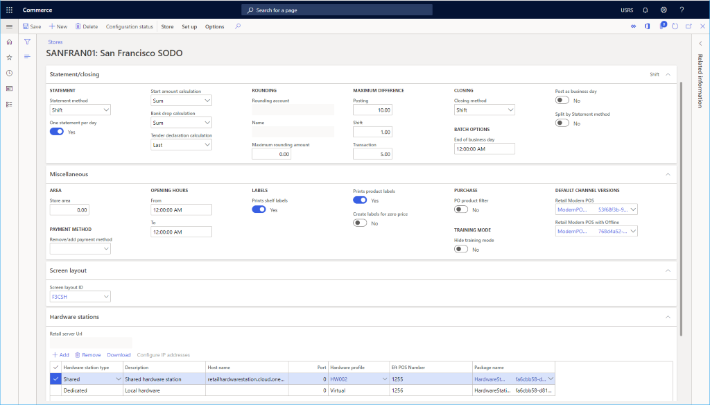

---
# required metadata

title: Set up a retail  channel
description: This topic presents the steps needed to create a new retail channel within Microsoft Dynamics 365 Commerce.
author: samjarawan
manager: annbe
ms.date: 10/01/2019
ms.topic: article
ms.prod: 
ms.service: dynamics-365-commerce
ms.technology: 

# optional metadata

# ms.search.form: 
audience: Developer
# ms.devlang: 
ms.reviewer: v-chgri
ms.search.scope: Retail, Core, Operations
# ms.tgt_pltfrm: 
ms.custom: 
ms.assetid: 
ms.search.region: Global
# ms.search.industry: 
ms.author: samjar
ms.search.validFrom: 2019-10-31
ms.dyn365.ops.version: Release 10.0.8

---
# Set up a retail channel

[!include [banner](../includes/preview-banner.md)]
[!include [banner](../includes/banner.md)]

This topic presents the steps needed to create a new retail channel within Microsoft Dynamics 365 Commerce.

## Overview
TBD

## Create a new retail channel
Before a retail channel is created ensure you follow the [channel prerequisites](channels-prerequisites.md).

* Go to **Navigation pane** > **Modules** > **Channels** > **Retail stores** > **All retail stores**.
* On the **Action pane** click **New**.

## Configure the new retail channel
* In the **Name** field, provide a name for the new channel.
* In the **Store number** field, provide a unique store number. THe number can be alphanumeric with a maximum of 10 characters.
* Select the appropriate **Legal entity** from the drop down.
* Select the appropriate **Warehouse** location from the drop down.
* Set the appropriate time zone in the **Store time zone** field.
* Select an appropriate **Sales tax group** for the store.
* Set the appropriate currency in the **Currency** field.
* In the **Customer address book** field, provide a valid address book.
* In the **Default customer** field, provide a valid default customer.
* In the **Functionality profile** field, select one if applicable.
* In the **Email notification profile** field, provide a valid email notification profile.
* Select **Save**

## Additional settings
There are numerous others settings that can be optionally set in the **Statement/closing**, **Miscellaneous** sections based on the needs of the retail store.

Additionally see [screen layouts for the POS](https://docs.microsoft.com/en-us/dynamics365/retail/pos-screen-layouts?toc=/dynamics365/commerce/toc.json) to setup the default **Screen Layout** and [configure and install Retail hardware station](https://docs.microsoft.com/en-us/dynamics365/retail/retail-hardware-station-configuration-installation) for **Hardware stations** set up information.

Below image shows an example retail channel setup configuration.

