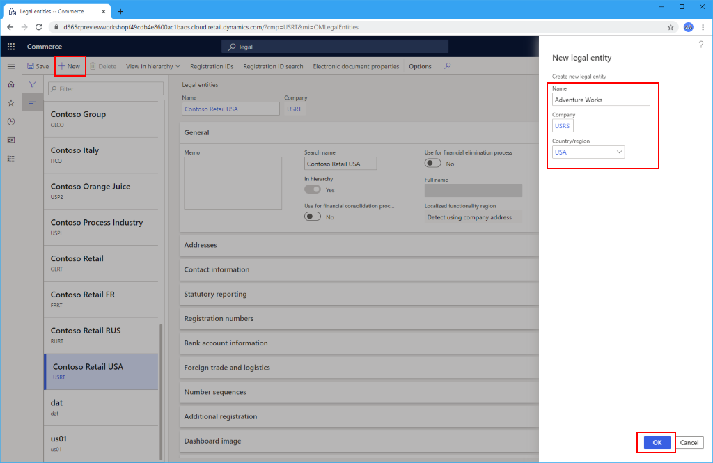
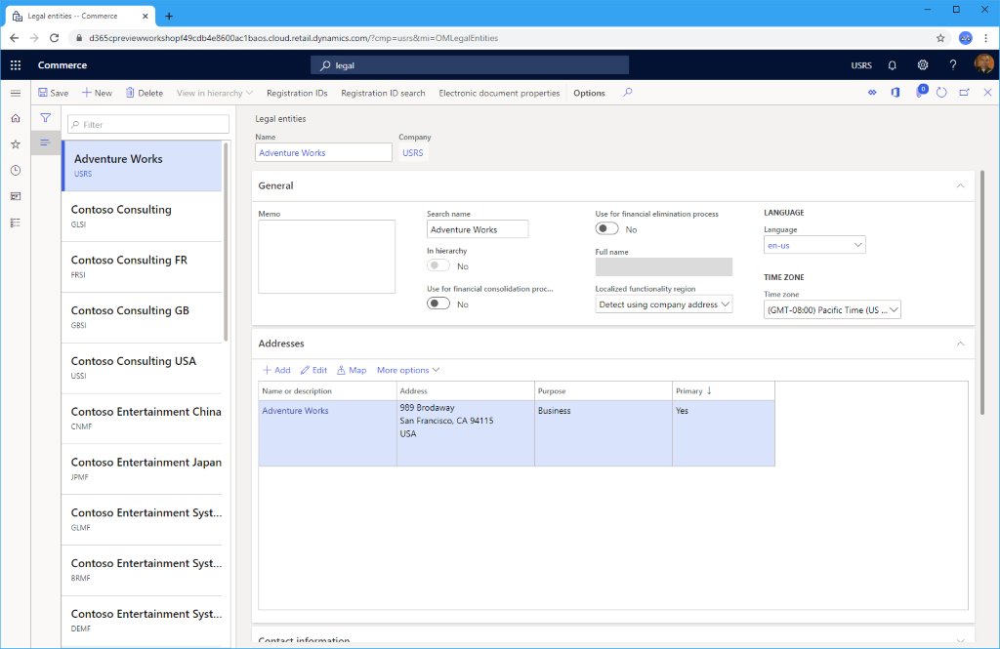

---
# required metadata

title: Create legal entities
description: This topic describes how to create legal entities in Microsoft Dynamics 365 Commerce, which must be created and configured before creating channels.
author: samjarawan
ms.date: 01/27/2020
ms.topic: article
ms.prod: 
ms.technology: 

# optional metadata

# ms.search.form: 
audience: Application User
# ms.devlang: 
ms.reviewer: v-chgri
# ms.tgt_pltfrm: 
ms.custom: 
ms.assetid: 
ms.search.region: Global
# ms.search.industry: 
ms.author: samjar
ms.search.validFrom: 2020-01-20
ms.dyn365.ops.version: Release 10.0.8

---
# Create legal entities

[!include [banner](includes/banner.md)]

This topic describes how to create legal entities in Microsoft Dynamics 365 Commerce, which must be created and configured before creating channels.

A legal entity is an organization that has a registered or legislated legal structure. Legal entities can enter into legal contracts and are required to prepare statements that report on their performance.

A company is a type of legal entity. Currently, companies are the only kind of legal entity that you can create, and every legal entity is associated with a company ID. This association exists because some functional areas in the program use a company ID, or *DataAreaId*, in their data models. In these functional areas, companies are used as a boundary for data security. Users can access data only for the company that they are currently logged on to. 

When creating a channel, you must specify which legal entity that channel belongs to.

## Create a new legal entity

To create a new legal entity in Dynamics 365 Commerce, follow these steps.

1. In the navigation pane, go to  **Modules \> Headquarters setup \> Legal entities**.
1. On the action pane, select **New**. The **New legal entity** pane appears on the right.
1. In the **Name** field, enter a value.
1. In the **Company** field, enter a value.
1. In the **Country/region** field, enter or select a value.
1. Select **OK**. 

   

1. In the **General** section, provide the following general information about the legal entity: 
   1. Enter a search name, if a search name is required. A search name is an alternate name that can be used to search for this legal entity. 
   1. Select whether this legal entity is being used as a consolidation company.
   1. Select whether this legal entity is being used as an elimination company. 
   1. Select the **default language** for the entity. 
   1. Select the **time zone** for the entity.
1. In the **Addresses** section, select **Edit** to enter address information, such as the street name and number, postal code, and city.
1. In the **Contact information** section, enter information about methods of communication, such as email addresses, URLs, and telephone numbers.
1. In the **Statutory reporting** section, enter the registration numbers that are used for statutory reporting.
1. In the **Registration numbers** section, enter any information required by the legal entity.
1. In the **Bank account information** section, enter bank accounts and routing numbers for the legal entity.
1. In the **Foreign trade and logistics** section, enter shipping information for the legal entity.
1. In the **Number sequences** section, you can view the number sequences that are associated with the legal entity. This will be empty to start with.
1. In the **Dashboard image** section, view or change the logo and dashboard image associated with the legal entity.
1. In the **Tax registration** section, enter the registration numbers that are used to report to tax authorities.
1. In the **Tax 1099** section, enter 1099 information for the legal entity.
1. In the **Tax invormation** section, enter tax information for the legal entity.
1. Select **Save**.

The following image shows details of an example legal entity.

   
## Additional resources

[Organizations and organizational hierarchies overview](../fin-ops-core/fin-ops/organization-administration/organizations-organizational-hierarchies.md?toc=/dynamics365/commerce/toc.json)

[Plan your organizational hierarchy](../fin-ops-core/fin-ops/organization-administration/plan-organizational-hierarchy.md?toc=/dynamics365/commerce/toc.json)

[Organization hierarchies](channels-org-hierarchies.md)

[Channels overview](channels-overview.md)

[Channel setup prerequisites](channels-prerequisites.md)

[!INCLUDE[footer-include](../includes/footer-banner.md)]
