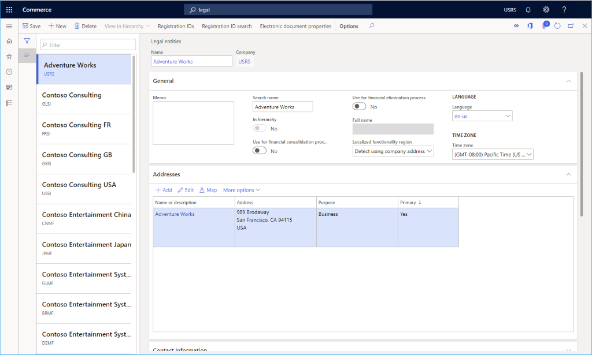

---
# required metadata

title: Legal entities
description: This topic is an overview of Microsoft Dynamics 365 Commerce legal entities, which must be created and configured before creating channels.
author: samjarawan
manager: annbe
ms.date: 01/20/2020
ms.topic: article
ms.prod: 
ms.service: dynamics-365-commerce
ms.technology: 

# optional metadata

# ms.search.form: 
audience: Application User
# ms.devlang: 
ms.reviewer: v-chgri
ms.search.scope: Retail, Core, Operations
# ms.tgt_pltfrm: 
ms.custom: 
ms.assetid: 
ms.search.region: Global
# ms.search.industry: 
ms.author: samjar
ms.search.validFrom: 2020-01-20
ms.dyn365.ops.version: Release 10.0.8

---
# Legal entities

[!include [banner](../includes/preview-banner.md)]
[!include [banner](../includes/banner.md)]

This topic is an overview of Microsoft Dynamics 365 Commerce legal entities, which must be created and configured before creating channels.

## Overview

A legal entity is an organization that has a registered or legislated legal structure. Legal entities can enter into legal contracts and are required to prepare statements that report on their performance.

A company is a type of legal entity. Currently, companies are the only kind of legal entity that you can create, and every legal entity is associated with a company ID. This association exists because some functional areas in the program use a company ID, or *DataAreaId*, in their data models. In these functional areas, companies are used as a boundary for data security. Users can access data only for the company that they are currently logged on to. When creating a channel you must specify which legal entity that channel belongs to.

## Create a new legal entity

To create a new legal entity in Dynamics 365 Commerce, follow these steps.

1. Go to **Navigation pane \> Modules \> Headquarters setup \> Legal entities.
1. On the **Action pane**, select **New**.
1. In the **Name** field, enter a value.
1. In the **Company** field, enter a value.
1. In the **Country/region** field, enter or select a value.
1. On the **Action pane**, select **OK**. 

   

1. In the **General** section, provide the following general information about the legal entity: 
   1. Enter a search name, if a search name is required. A search name is an alternate name that can be used to search for this legal entity. 
   1. Select whether this legal entity is being used as a **consolidation company**.
   1. Select whether this legal entity is being used as an **elimination company**. 
   1. Select the **default language** for the entity and **time zone**.
1. Expand the **Addresses** section. In the **Addresses** section, click **Edit** to enter address information, such as the street name and number, postal code, and city.

   

1. Expand the **Contact information** section. In the **Contact information** section, enter information about methods of communication, such as email addresses, URLs, and telephone numbers.
1. Expand the **Statutory reporting** section. In the **Statutory reporting** section, enter the registration numbers that are used for statutory reporting.
1. Expand the **Registration numbers** section. In the **Registration numbers** section, enter any information required by the legal entity.
1. Expand the **Bank account information** section. In the **Bank account information** section, enter bank accounts and routing numbers for the legal entity.
1. Expand the Foreign trade and logistics section. In the Foreign trade and logistics section, enter shipping information for the legal entity.
1. Expand the **Number sequences** section. In the **Number sequences** section, you can view the number sequences that are associated with the legal entity.  This will be empty to start with.
1. Expand the **Dashboard image" section. In the **Dashboard image** section, view or change the logo and/or dashboard image that are associated with the legal entity.
1. Expand the **Tax registration** section. In the **Tax registration** section, enter the registration numbers that are used to report to tax authorities.
1. Expand the **Tax 1099** section. In the **Tax 1099** section, enter 1099 information for the legal entity.
1. Expand the **Tax information** section. In the **Tax invormation** section, enter tax information for the legal entity.
1. Click **Save**.

For more information see
[Organizations and organizational hierarchies overview](https://docs.microsoft.com/en-us/dynamics365/fin-ops-core/fin-ops/organization-administration/organizations-organizational-hierarchies)
