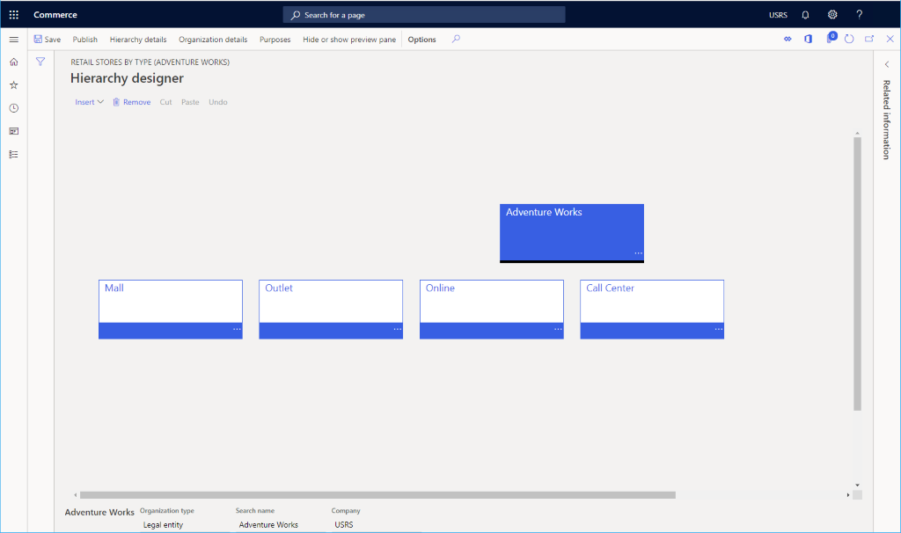

# Set up organization hierarchies

[!include [banner](includes/banner.md)]

This article describes how to set up organization hierarchies in Microsoft Dynamics 365 Commerce.

Before creating channels, you must set up your organization hierarchies.

You can use organization hierarchies to view and report on your business from various perspectives. For example, you can set up one hierarchy for tax, legal, or statutory reporting. You can then set up another hierarchy to report financial information that isn't legally required, but that is used for internal reporting.

Before you create an organization hierarchy, you must create organizations. For more information, see [Create legal entities](channels-legal-entities.md) or [Create operating units](../fin-ops-core/fin-ops/organization-administration/tasks/create-operating-unit.md?toc=/dynamics365/commerce/toc.json).

For more information, see the following articles.
- [Organizations and organizational hierarchies overview](../fin-ops-core/fin-ops/organization-administration/organizations-organizational-hierarchies.md?toc=/dynamics365/commerce/toc.json)
- [Plan your organization hierarchy](../fin-ops-core/fin-ops/organization-administration/plan-organizational-hierarchy.md?toc=/dynamics365/commerce/toc.json)
- [Create an organization hierarchy](../fin-ops-core/fin-ops/organization-administration/tasks/create-organization-hierarchy.md?toc=/dynamics365/commerce/toc.json)

## Create an organizational hierarchy

To create an organizational hierarchy, follow these steps.

1. In the navigation pane, go to **Modules \> Retail and commerce \> Channel Setup \> Organization hierarchies**.
1. On the action pane, select **New**.
1. In the **Name** field, enter a value.
1. In the **Purpose** section, select **Assign purpose**.
1. In the list, find and select the desired record. Select a purpose to assign to your organization hierarchy.
1. In the **Assigned hierarchies** section, select **Add**.
1. In the list, mark the selected row. Find the hierarchy you created.
1. Select **OK**.

The following image shows an example organizational hierarchy created for a fictitious "Adventure Works" set of stores.

### Add organizations to a hierarchy

To add organizations to a hierarchy, follow these steps.

1. In the list, find and select the desired record. Select your hierarchy.
1. On the action pane, select **View**.
1. Add organizations, as necessary.
1. To add an organization, select **Edit** and then select **Insert**. When you're done making changes, you can save a draft and publish the changes.

The following image shows a legal entity added at the hierarchy root with four cost centers added for "Mall," "Outlet," "Online," and "Call Center" channels. Various retail, call center, and online channels can then be added to each.

## Additional resources

[Organizations and organizational hierarchies overview](../fin-ops-core/fin-ops/organization-administration/organizations-organizational-hierarchies.md?toc=/dynamics365/commerce/toc.json)

[Plan your organizational hierarchy](../fin-ops-core/fin-ops/organization-administration/plan-organizational-hierarchy.md?toc=/dynamics365/commerce/toc.json)

[Create legal entities](channels-legal-entities.md)

[Create operating units](../fin-ops-core/fin-ops/organization-administration/tasks/create-operating-unit.md?toc=/dynamics365/commerce/toc.json)

[Channels overview](channels-overview.md)

[Channel setup prerequisites](channels-prerequisites.md)

[!INCLUDE[footer-include](../includes/footer-banner.md)]
