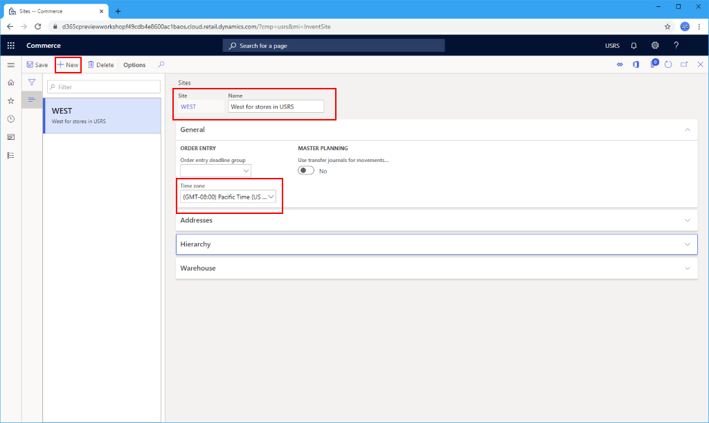
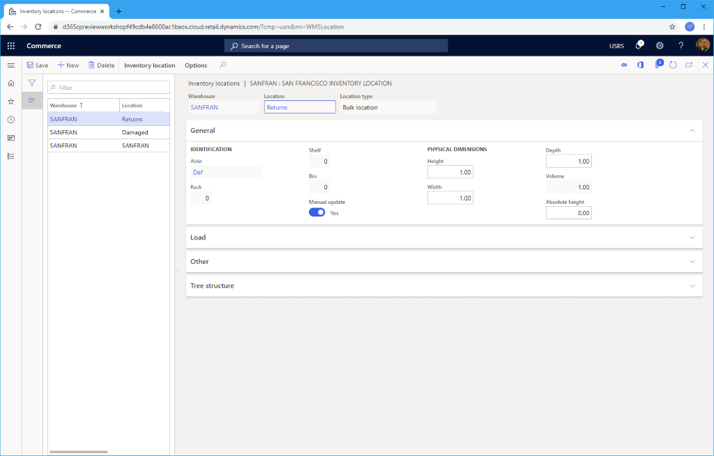
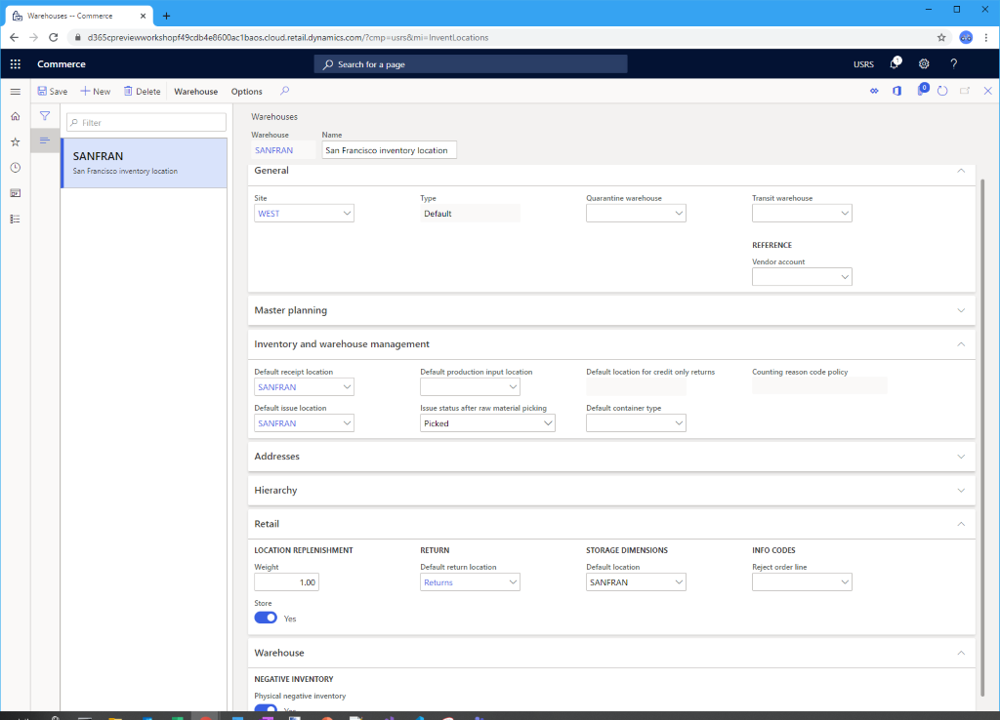

---
# required metadata

title: Set up a warehouse
description: This topic describes how to set up a warehouse to be used with a new channel in Microsoft Dynamics 365 Commerce.
author: samjarawan
ms.date: 01/27/2020
ms.topic: article
ms.prod: 
ms.technology: 

# optional metadata

# ms.search.form: 
audience: Application User
# ms.devlang: 
ms.reviewer: v-chgri
# ms.tgt_pltfrm: 
ms.custom: 
ms.assetid: 
ms.search.region: Global
# ms.search.industry: 
ms.author: samjar
ms.search.validFrom: 2020-01-20
ms.dyn365.ops.version: Release 10.0.8

---
# Warehouse set up

[!include [banner](includes/banner.md)]

This topic describes how to set up a warehouse to be used with a new channel in Microsoft Dynamics 365 Commerce.

Each Commerce channel requires a configured warehouse to be associated with it. The following procedures provide the minimum configuration required to set up a warehouse for a Commerce channel. For more information regarding warehouse setup, please see the [Warehouse management overview](../supply-chain/warehousing/warehouse-management-overview.md?toc=/dynamics365/commerce/toc.json).

## Configure a warehouse site

Before setting up a warehouse, you need to configure a warehouse site.

To configure a warehouse site, follow these steps.

1. In the navigation pane, go to **Modules \> Retail and commerce \> Channel setup \> Sites**.
1. On the action pane, select **New**.
1. In the **Site** field, enter a value.
1. In the **Name** field, enter a value.
1. In the **General** section, set the appropriate **Time zone**.
1. In the **Addresses** section, enter an address.
1. On the action pane, select **Save**.

The following image shows an example warehouse site.

## Set up a warehouse

To set up a warehouse, follow these steps.

1. In the navigation pane, go to **Modules \> Retail and commerce \> Channel setup \> Warehouses**.
1. On the action pane, select **New**.
1. In the **Warehouse** field, enter a value.  If this is a 1:1 mapping to a store, consider using the store name or the name of a regional distribution center.
1. In the **Name** field, enter a value.
1. In the **Site** drop-down list, select the warehouse site created previously.
1. In the **Type** field, select **Default**.
    - If you want to set a **Quarantine warehouse**, first you'll need to follow these steps to create an additional warehouse where the **Type** is set to **Quarantine**.
    - If you want to set a **Transit warehouse**, first you'll need to follow these steps to create an additional warehouse where the **Type** is set to **Transit**.
1. On the action pane, select **Save**.

## Set up inventory aisles

To set up inventory aisles, follow these steps.

1. In the navigation pane, go to **Modules \> Retail and commerce \> Channel setup \> Location setup \> Inventory aisles**.
1. On the action pane, select **New**.
1. In the **Warehouse** drop-down list, select the warehouse created previously.
1. In the **Aisle** field, enter a name (for example, "Def").
1. In the **Name** field, enter a name (for example, "Default aisle").
1. On the action pane, select **Save**.

## Set up warehouse inventory locations

To set up warehouse inventory locations for standard, damaged, and returned inventory, follow these steps.

1. In the navigation pane, go to **Modules \> Retail and commerce \> Channel setup \> Warehouses**.
1. Select the warehouse you created previously.
1. On the action pane, select **Edit**.
1. On the action pane, select **Warehouse**, and then select **Inventory location**.
1. On the action pane, select **New**. The **Warehouse** drop-down list should default to your new warehouse.
    1. In the **Aisle** box, enter the name of the aisle you specified earlier. 
    1. Set **Manual update** to **Yes**
    1. In the **Location** box, enter the name of the warehouse.
    1. On the action pane, select **Save**.
 1. On the action pane, select **New**.  The **Warehouse** drop-down list should default to your new warehouse.
    1. In the **Aisle** box, enter the name of the aisle you specified earlier.  
    1. Set **Manual update** to **Yes**
    1. In the **Location** box, enter "Damaged".
    1. On the action pane, select **Save**.
 1. On the action pane, select **New**.  The **Warehouse** drop-down list should default to your new warehouse.
    1. In the **Aisle** box, enter the name of the aisle you specified earlier. 
    1. Set **Manual update** to **Yes**
    1. In the **Location** box, enter "Returns".
    1. On the action pane, select **Save**.
    
The following image shows a San Francisco warehouse inventory location setup.

    
## Complete warehouse setup

To complete warehouse setup, follow these steps.

1. In the navigation pane, go to **Modules \> Retail and commerce \> Channel setup \> Warehouses**.
1. Select the warehouse you previously created.
1. On the action pane, select **Edit**.
1. Under **Inventory and warehouse management**:
    1. Set **Default receipt location** to the default location created above.
    1. Select **Default issue location** to the default location created above.
1. Under the **Addresses** section, enter a warehouse address.
1. Under the **Retail** section: 
    1. In the **Default return location** box, enter the returns location created previously.
    1. Set **Store** to **Yes**.
    1. Set **Weight** to **1.00**. 
    1. In the **Storage Dimensions** box, enter the default location created previously.
1. Under the **Warehouse** section, set **Physical negative inventory** to **Yes**.
1. On the action pane, select **Save**.

The following image shows details for a configured warehouse.

## Additional resources

[Warehouse management overview](../supply-chain/warehousing/warehouse-management-overview.md?toc=/dynamics365/commerce/toc.json)

[Channels overview](channels-overview.md)

[Channel setup prerequisites](channels-prerequisites.md)

[Set up a retail channel](channel-setup-retail.md)
	
[Set up an online channel](channel-setup-online.md)

[Set up a call center channel](channel-setup-callcenter.md)

[!INCLUDE[footer-include](../includes/footer-banner.md)]
