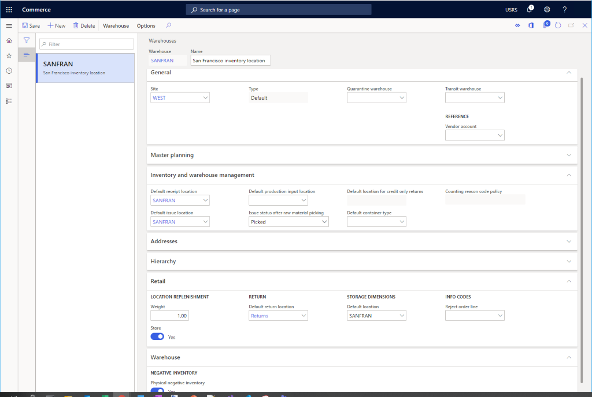

---
# required metadata

title: Set up a warehouse
description: This topic describes how to set up a warehouse to be used with a new channel in Microsoft Dynamics 365 Commerce.
author: samjarawan
manager: annbe
ms.date: 01/20/2020
ms.topic: article
ms.prod: 
ms.service: dynamics-365-commerce
ms.technology: 

# optional metadata

# ms.search.form: 
audience: Application User
# ms.devlang: 
ms.reviewer: v-chgri
ms.search.scope: Retail, Core, Operations
# ms.tgt_pltfrm: 
ms.custom: 
ms.assetid: 
ms.search.region: Global
# ms.search.industry: 
ms.author: samjar
ms.search.validFrom: 2020-01-20
ms.dyn365.ops.version: Release 10.0.8

---
# Warehouse set up

[!include [banner](../includes/preview-banner.md)]
[!include [banner](../includes/banner.md)]

This topic describes how to set up a warehouse to be used with a new channel in Microsoft Dynamics 365 Commerce.

This topic is meant only as a quick start guide to setting up a warehouse.  Warehouses can be quite powerful see links sections below for further details on warehouse managment.

## Overview

Before setting up a warehouse, you need to configure warehouse sites.

## Set up a warehouse site

To set up a warehouse site, follow these steps.

1. Go to **Navigation pane \> Modules \> Retail \> Channel Setup \> Sites**.
1. On the action pane, select **New**.
1. In the **Site** field, enter a value.
1. In the **Name** field, enter a value.
1. In the **General** section, set the appropriate **Time zone**.
1. In the **Addresses** section, enter an address.
1. On the action pane, select **Save**.

The following image shows an example warehouse site.

## Set up a warehouse

To set up a warehouse, follow these steps.

1. Go to **Navigation pane \> Modules \> Retail \> Channel Setup \> Warehouses**.
1. On the action pane, select **New**.
1. In the **Warehouse** field, enter a value.  If this is a 1:1 mapping to a retail store, consider using the store name or the name of a regional distribution center.
1. In the **Name** field, enter a value.
1. In the **Site** drop-down list, select the site previously created.
1. In the **Type** field, select **Default**
1. If you want to set a **Quarantine warehouse**, first you'll need to follow these steps to create an additional warehouse where the **Type** is set to **Quarantine**, then it can be set here.
1. If you want to set a **Transit warehouse**, first you'll need to follow these steps to create an additional warehouse where the **Type** is set to **Transit**, then it can be set here.
1. On the action pane, select **Save**.

## Set up inventory aisles

To set up inventory aisles, follow these steps.

1. Go to **Navigation pane \> Modules \> Retail \> Channel Setup \> Location setup \> Inventory aisles**.
1. On the action pane, select **New**.
1. In the **Warehouse** drop down, select the previously created Warehouse.
1. In the **Aisle** field, enter a name (for example, "Def").
1. In the **Name** field, enter a name (for example, "Default aisle").
1. On the action pane, select **Save**.

## Set up warehouse inventory locations

This section shows how to set up inventory locations for standard, damaged and returned inventory.

To set up warehouse inventory locations, follow these steps.

1. Go to **Navigation pane \> Modules \> Retail \> Channel Setup \> Warehouses**.
1. Select the warehouse you created previously.
1. On the action pane, click **Edit**.
1. On the action pane, select **Warehouse** and **Inventory locations**.
  1. On the action pane, select **New**.  The **Warehouse** drop down should default to your new Warehouse.
    1. Select **Aisle** to "Def" , **Manual update** to "Yes" and **Location** to the same name as the Warehouse.
    1. Select **Save**.
  1. On the action pane, select **New**.  The **Warehouse** drop down should default to your new Warehouse.
    1. Select **Aisle** to "Def" , **Manual update** to "Yes" and **Location** to "Damaged".
    1. Select **Save**.
  1. On the action pane, select **New**.  The **Warehouse** drop down should default to your new Warehouse.
    1. Select **Aisle** to "Def" , **Manual update** to "Yes" and **Location** to "Returns".
    1. Select **Save**.
    
The following image shows a San Francisco warehouse inventory location setup.

    
## Complete warehouse setup

To complete warehouse setup, follow these steps.

1. Go to **Navigation pane \> Modules \> Retail \> Channel Setup \> Warehouses**.
1. Select the warehouse you previously created.
1. On the action pane, click **Edit**.
1. Under **Inventory and warehouse Management**.
1. Set **Default receipt location** to the default location created above.
1. Select **Default issue location** to the default location created above.
1. Under the **Addresses** section add a warehouse address.
1. Under the **Retail** section set the **Default return location** to the returns location created above.
  1. Set the **Store** to "Yes".
  1. Set **Weight** to "1.00". 
  1. Set "Storage Dimensions" to the default location created above.
1. Under the **Warehouse** section, set **Physical negative inventory** to "Yes".
1. Select **Save**.

The following image shows a configured warehouse.

## Additional resources

[Warehouse management overview](https://docs.microsoft.com/en-us/dynamics365/supply-chain/warehousing/warehouse-management-overview)
