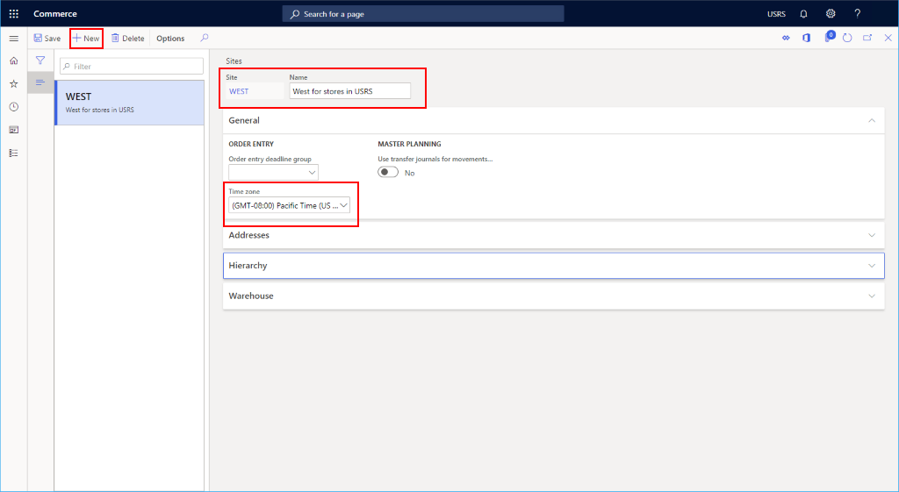
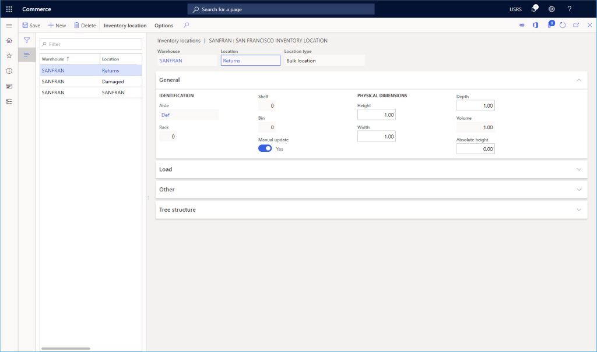

---
# required metadata

title: Warehouse set up
description: This topic presents an overview of warehouse creation to be used with a new channel.
author: samjarawan
manager: annbe
ms.date: 10/01/2019
ms.topic: article
ms.prod: 
ms.service: dynamics-365-commerce
ms.technology: 

# optional metadata

# ms.search.form: 
audience: Developer
# ms.devlang: 
ms.reviewer: v-chgri
ms.search.scope: Retail, Core, Operations
# ms.tgt_pltfrm: 
ms.custom: 
ms.assetid: 
ms.search.region: Global
# ms.search.industry: 
ms.author: samjar
ms.search.validFrom: 2019-10-31
ms.dyn365.ops.version: Release 10.0.8

---
# Warehouse set up

[!include [banner](../includes/preview-banner.md)]
[!include [banner](../includes/banner.md)]

This topic presents an overview of warehouse creation to be used with a new channel.  This topic is meant only as a quick start guide to setting up a warehouse.  Warehouses can be quite powerful see links sections below for further details on warehouse managment.

## Overview
Before setting up a warehouse, we need to configure warehouse sites.

## Set up a Site
* Go to **Navigation pane** > **Modules** > **Retail** > **Channel Setup** > **Sites**.
* On the **Action pane**, click **New**.
* In the **Site** field, type a value.
* In the **Name** field, type a value.
* In the **General** section, set the appropriate **Time zone**.
* In the **Addresses** section, add an address.
* Select **Save**.

Below shows an example site created for West US stores.

## Set up a Warehouse
* Go to **Navigation pane** > **Modules** > **Retail** > **Channel Setup** > **Warehouses**.
* On the **Action pane**, click **New**.
* In the **Warehouse** field, type a value.  If this is a 1:1 mapping to a Retail store, consider using the store name or the name of a regional distribution center.
* In the **Name** field, type a value.
* In the **Site** drop down, select the site previously created.
* In the **Type** field select **Default**
* If you want to set a **Quarantine warehouse**, first you'll need to follow these steps to create an additional warehouse where the **Type** is set to **Quarantine**, then it can be set here.
* If you want to set a **Transit warehouse**, first you'll need to follow these steps to create an additional warehouse where the **Type** is set to **Transit**, then it can be set here.
* Select **Save**.

## Set up Inventory aisles
* Go to **Navigation pane** > **Modules** > **Retail** > **Channel Setup** > **Location setup** -> **Inventory aisles**.
* On the **Action pane**, click **New**.
* In the **Warehouse** drop down, select the previously created Warehouse.
* In the **Aisle** field give it a name such as "Def".
* In the **Name** field give it a name such as "Default aisle".
* Select **Save**.

## Set up Warehouse inventory locations
This section shows how to set up inventory locations for standard, damaged and returned inventory.
* Go to **Navigation pane** > **Modules** > **Retail** > **Channel Setup** > **Warehouses**.
* Select the Warehouse you previously created.
* On the **Action pane**, click **Edit**.
* On the **Action pane**, select **Warehouse** and **Inventory locations**.
  * On the **Action pane**, select **New**.  The **Warehouse** drop down should default to your new Warehouse.
  * Select **Aisle** to "Def" , **Manual update** to "Yes" and **Location** to the same name as the Warehouse.
  * Select **Save**.
	* On the **Action pane**, select **New**.  The **Warehouse** drop down should default to your new Warehouse.
  * Select **Aisle** to "Def" , **Manual update** to "Yes" and **Location** to "Damaged".
  * Select **Save**.
	* On the **Action pane**, select **New**.  The **Warehouse** drop down should default to your new Warehouse.
  * Select **Aisle** to "Def" , **Manual update** to "Yes" and **Location** to "Returns".
  * Select **Save**.
    
Below example shows a San Francisco warehouse inventory location setup.

    
* Go to **Navigation pane** > **Modules** > **Retail** > **Channel Setup** > **Warehouses**.
* Select the Warehouse you previously created.
* On the **Action pane**, click **Edit**.
* Under **Inventory and warehouse Management**.
* Set **Default receipt location** to the default location created above.
* Select **Default issue location** to the default location created above.
* Under the **Addresses** section add a warehouse address.
* Under the **Retail** section set the **Default return location** to the returns location created above.
  * Set the **Store** to "Yes".
  * Set **Weight** to "1.00". 
  * Set "Storage Dimensions" to the default location created above.
* Under the **Warehouse** section, set **Physical negative inventory** to "Yes".
* Select **Save**.

The below example shows a warehouse fully configured.

## Links
[Warehouse management overview](https://docs.microsoft.com/en-us/dynamics365/supply-chain/warehousing/warehouse-management-overview)
