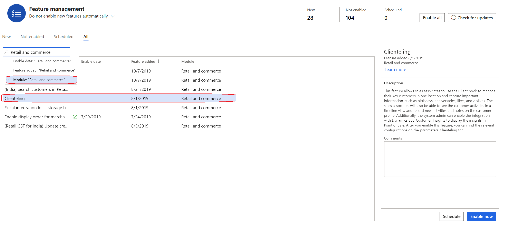
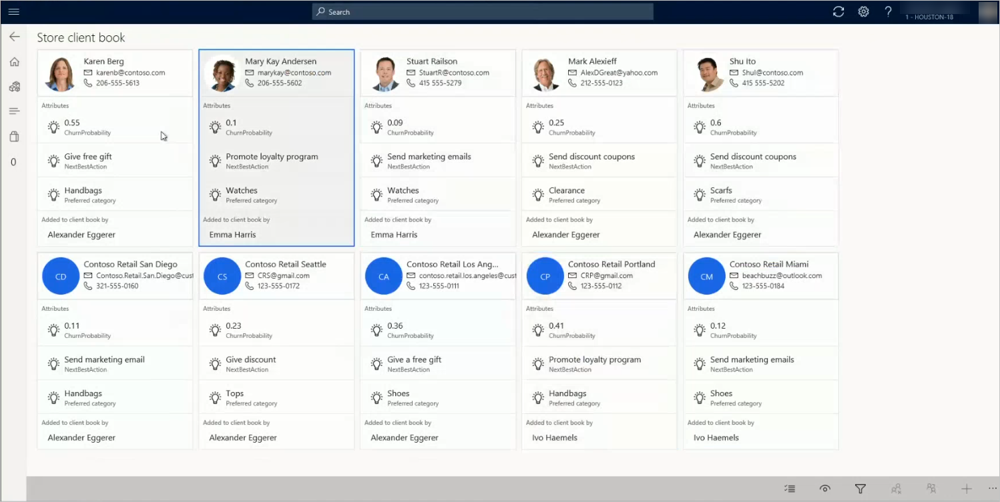

---
# required metadata

title: Clienteling overview
description: This article provides an overview of new clienteling capabilities that are available in the store application.
author: bebeale
ms.date: 11/16/2022
ms.topic: overview
audience: Application User, Developer, IT Pro
ms.reviewer: josaw
ms.custom: ["260624"]
ms.collection: get-started
ms.assetid: a4f9d315-9951-451c-8ee6-37f9b3b15ef0
ms.search.region: Global
ms.author: shajain
ms.search.validFrom: 2018-10-01

---

# Clienteling overview

[!include [banner](includes/banner.md)]

Many retailers, especially high-end specialty retailers, want their sales associates to form long-term relationships with their key customers. The associates are expected to know about these customers' likes and dislikes, purchase history, product preferences, and important dates, such as anniversaries and birthdays. Associates need a place where they can capture this information and easily find it when it's required. If this information is available in a single view, the associates can easily target customers who meet specific criteria. For example, they can find all customers who prefer to shop for handbags, or customers who have an important event approaching, such as a birthday or anniversary.

The following video walks through an example scenario of clienteling in Dynamics 365 Commerce.

> [!VIDEO https://www.microsoft.com/videoplayer/embed/RE5bMSP]

## Client book

In Microsoft Dynamics 365 Commerce, retailers can use the client book functionality to help store associates form long-term relationships with key customers.

The client book includes customer cards that show contact information for each customer, together with three more properties that are defined by the retailer and configured in Headquarters. Retailers can decide the three most important things that sales associates should know about customers. For example, a jewelry retailer might want to include important dates such as anniversaries or birthdays, because these dates are occasions when people might buy more jewelry. Similarly, a fashion retailer might want to include the customer's preferred shopping interests and brands.

The client book also lets sale associates filter the list so that it shows only customers who meet specific criteria. For example, a new collection of shoes has arrived in the store, and an associate wants to inform customers who like to buy shoes. In this case, the associate can filter the client book to find the relevant customers and then take further action.

If any customers are no longer considered key customers for some reason, and therefore should not be closely managed, sales associates can remove them from their client book.

Some retailers don't want to manage customers at the sales associate level. Instead, they want to manage a list of key customers at the store level. These retailers can view customers from store client books. By using this option, retailers can view the customers from the client books of all the sales associates whose address book matches the address book of the current store. In this way, if an associate works in multiple stores of the legal entity, the client book shows the customers from all those stores. This functionality supports additional capabilities. For example, customers can be reassigned from one associate to another associate. This capability is useful when associates are transferred or leave the company.

Each sales associate can have one client book per legal entity, and associates can add one or more customers to their client book. In Commerce, each customer can currently be added to only one client book. However, Microsoft plans to add functionality that lets a single customer be added to multiple client books.

> [!NOTE]
> Unlike customer search, the client book doesn't filter customer records based on the store's address books.

## Activities and notes

Online channels give retailers ways to learn about customer preferences without requiring that customers explicitly provide this information. By contrast, when customers interact with sales associates in the store, they explicitly share information about their preferences. Unfortunately, this information can be lost after the sale is over. However, if this information is recorded, it can help retailers better understand customers, and therefore help them provide better recommendations and a better overall shopping experience.

To capture the critical information that customers share, sales associates can use not only the client book attributes, but also use the activities and notes functionality. Retailers can configure the activity types, such as information about the store visit, email address, phone number, and appointments. Activities that associates create can be viewed in a timeline format at the point of sale (POS). They can also be viewed on the **Activities** tab on the **All customers \> General** page in Headquarters.

Sales associates can also use notes to capture generic customer information that can be referenced before every interaction. These notes are saved in Headquarters, and can be viewed in the customer profile or on the customer details page in the call center.

> [!NOTE]
> Currently, all notes and activities can be viewed by any sales associate who works for the legal entity and can view customer details pages. Notes and activities aren't limited to the associate who added a customer to the client book.

## Integration with Dynamics 365 Customer Insights

By using the Dynamics 365 Customer Insights application, retailers can aggregate data from the various systems that customers use to interact with the retailer's brand. They can then use this data to generate a single view of the customer and derive insights. The integration of Customer Insights with Commerce lets retailers select one or more measures that should be shown on the customer card in the client book. For example, retailers can use the data in Customer Insights to calculate the "churn probability" for a customer and define the "next best action." If these values are defined as measures, they can be shown on the customer card and can provide crucial information to sales associates. For more information about Customer Insights, see the [Dynamics 365 Customer Insights](/dynamics365/ai/customer-insights/overview) documentation. For more information about measures, see [Measures](/dynamics365/ai/customer-insights/pm-measures).

## Set up clienteling

To turn on the clienteling functionality in your environment, follow these steps.

1. In the **Feature management** workspace, filter the features by the **Retail and commerce** module.

    

2. Turn on the **Clienteling** feature by selecting **Enable now**.
3. On the **Commerce Parameters** page, on the **Number sequence** tab, select the **Client book identifier** row. Then, in the **Number sequence code** field, select a number sequence. The system will use this number sequence to assign an ID to client books.
4. Select **Save**.
5. Create a new attribute group that contains the attributes that you want to capture for customers who are managed in client books. For instructions, see [Attributes and attribute groups](./attribute-attributegroups-lifecycle.md).

    - Define the required attributes as **Can be refined**. Sales associates can then use these attributes to filter their client book.
    - Set the display order for these attributes. This display order determines which attributes should be shown on the customer card in the client book. A display order of 1 is considered higher than a display order of 2. Therefore, the attribute that has a display order of 1 will be shown before to the attribute that has a display order of 2.

    > [!NOTE]
    > You can make Customer Insights available from the same page. However, an Azure application ID and secret must be created, for authentication purposes. (For information about the requirements, see the [Turn on the integration of Customer Insights with Commerce](#turn-on-the-integration-of-customer-insights-with-commerce) section later in this article.) If Customer Insights is turned on, and you select one or more measures that should be shown on the customer card, those measures will be shown first. Next, client book attribute groups will be shown, based on the display order. For example, if you select two measures from Customer Insights, those two measures and one client book attribute will be shown on the customer card. (The client book attribute that is shown will be the attribute that has the highest display order.)

6. On the **Commerce parameters** page, on the **Clienteling** tab, in the **Client book attribute group** field, select the attribute group that you just created.

    

7. To capture activities that occur at the POS, define the activity types on the **Activity types** page (**Retail and Commerce \> Customers \> Activity types**).

    > [!NOTE]
    > Activity types are pulled by the Commerce Scale Unit when it makes a real-time call for the first time. After the activities are pulled, they are cached for a few hours. If you change the activity types, wait until the cache is no longer valid. Alternatively, for non-production environments, restart the Commerce Scale Unit service.

8. Add two buttons to the appropriate POS screen layout, so that sales associates can view their own client book and the store client book. (Store client books include clients from all client books of all associates who share an address book with the store.) The corresponding operations are named **View customers in client book** and **View customers from store client books**, respectively. Three additional operations that are related to client books are available. These operations determine which associates can add, remove, and reassign customers from the client book. They are named **Add customer to client book**, **Remove customers from client book**, and **Reassign customers to a client book**, respectively.
9. Run the following distribution schedule jobs: 1040, 1150, 1110, and 1090.

After you've completed this procedure, sales associates can open the customer details page at the POS, and add customers to their client book, view and capture activities and notes for customers, and target customers by using customer and client book attributes to filter the client book. The following illustration shows an example of a client book.

## Turn on the integration of Customer Insights with Commerce

To turn on the integration of Customer Insights with Commerce, you must make sure that you have an active instance of Customer Insights in the tenant where Commerce is provisioned. You must also have an Azure Active Directory (Azure AD) user account that has an Azure subscription.

Follow these steps to set up the integration.

1. In the Azure portal, register a new application and make a note of the application name, application ID, and secret. This information will be used for service-to-service authentication between Commerce and Customer Insights. Note the secret safely, as it will be required to save it in the key vault. For the following example, use CI_Access_name, CI_Access_AppID, CI_Access_Secret for the application name, application ID, and secret respectively. For more information, see [Quickstart: Register an application with the Microsoft identity platform](/azure/active-directory/develop/quickstart-register-app).

    > [!IMPORTANT]
    > Take steps so that you will remember to change the secret before it expires. Otherwise, the integration will unexpectedly stop.

2. Go to your Customer Insights instance and search for the name of the application created above (in this example, "CI_Access_name").
3. Create an Azure key vault, and take a note of the name and URL (in this example, "KeyVaultName", "KeyVaultURL"). For instructions, see [Quickstart: Set and retrieve a secret from Azure Key Vault using the Azure portal](/azure/key-vault/quick-create-portal).
4. Save the secret (in this example, "CI_Access_Secret") in the vault. When this secret is stored in the vault, the secret gets a name. Note the secret name (in this example, 'SecretName").
5. To access the secret from Azure Key Vault, you need to create another application with an application ID and secret (in this example, "KeyVault_Access_AppID" and "KeyVault_Access_Secret"). Note the secret safely, as it will not be displayed again.
6. Next, you need to give permissions to the application to access the Key Vault from Commerce using APIs. Go to the application page in Azure portal. Under the **Manage** section, select **API permissions**. Add the permission to access **Azure key vault**. For this permission, select **Access policy**. Select the template as **Secret management**, and select the **Get**, **List**, **Decrypt**, and **Encrypt** options. 
5. In Commerce headquarters, go to **System administration \> Setup \> Key Vault parameters**, and enter the required information for the key vault. Then, in the **Key Vault client** field, enter the application ID that you used in step 4, so that Commerce can access the secrets in the key vault.
6. To add the application that you created in step 1 to the list of safe applications (sometimes referred to as a safe list), go to Customer Insights, and select **View** access to the application. For instructions, see [Permissions](/dynamics365/ai/customer-insights/pm-permissions).
7. On the **System administration > Setup > Key Vault parameters** page in Commerce HQ, update the fields as described below: 

- **Key Vault url**: "KeyVaultURL" (from step 3 above).
- **Key Vault client**: "KeyVault_Access_AppID" (from step 5 above).
- **Key Vault secret key**: "KeyVault_Access_Secret" (from step 5 above).
- Under **Secrets** section:
    - **Name**: Any name, for example "CISecret".
    - **Description**: Any value.
    - **Secret**: **vault**:`//<Name of key vault>/<name of secret>>` In this  example it will be `vault://KeyVaultName/SecretName`.

After you update the fields, select **Validate** to ensure the secret can be accessed by the Commerce application.

8. In Commerce, on the **Commerce parameters** page, on the **Clienteling** tab, on the **Dynamics 365 Customer Insights** FastTab, set the **Application ID** to "CI_Access_AppID" (from step 1 above). For **Secret name**, select the name of the secret entered in step 7 above ("CISecret"). Set the **Enable Customer Insights** option to **Yes**. If the setup is unsuccessful for any reason, an error message will be displayed, and this option will be set to **No**. 

You can have multiple environments in Customer Insights, such as test and production environments. In the **Environment instance ID** field, enter the appropriate environment. In the **Alternate customer ID** field, enter the property in Customer Insights that is mapped to the customer account number. (In Commerce, the customer account number is the customer ID.) The remaining three properties are the measures that will be shown on the customer card in the client book. You can select up to three measures to show on the customer card. However, you are not required to select any measures. As mentioned previously, the system shows these values first, and then it shows the values for the client book attribute group.

[!INCLUDE[footer-include](../includes/footer-banner.md)]
