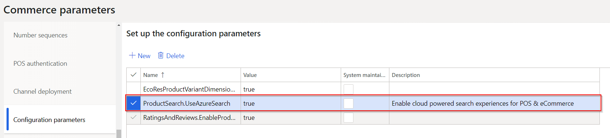
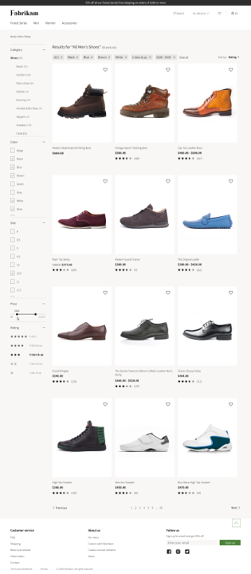
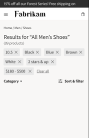
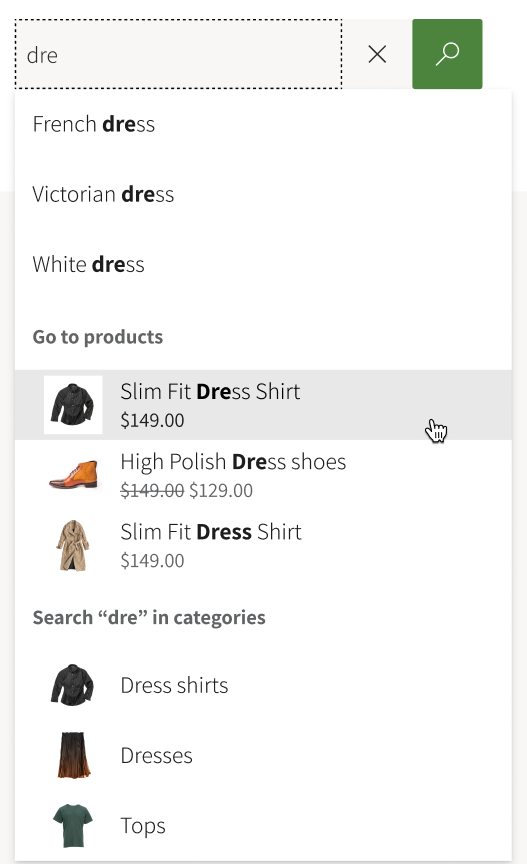

# Cloud-powered search overview

[!include [banner](includes/banner.md)]

This article gives an overview of cloud-powered search in Microsoft Dynamics 365 Commerce.

Product discoverability helps guarantee that customers can quickly and easily find products by browsing categories, searching, and filtering. Retailers consider product discovery a primary tool for customer interaction across channels powered by Cloud Scale Unit (CSU), such as e-commerce and point of sale (POS).

Customers are accustomed to the nearly instantaneous response times of web search engines, sophisticated e-Commerce websites, social apps, automatic suggestions that appear as they type search terms, faceted navigation, and highlighting. If customers can't quickly find the product that they are looking for in one e-commerce store, they won't hesitate to go to a different e-commerce store.

The cloud-powered product discoverability in Commerce helps retailers continue to increase consumer retention and conversion rates across channels powered by CSU.

The Commerce search experience has improved capabilities to help retailers achieve better product discoverability. At the same time, these capabilities deliver the scalability and performance that are required for e-commerce traffic.

## Prerequisites

The cloud-powered search capabilities are available starting in version 10.0.8. Ensure that there is an entry for "ProductSearch.UseAzureSearch" set to 'true' in **Commerce Parameters > Configuration Parameters**.

## Browse and search

Search relevance and performance are key factors in the omnichannel experience, because product discovery relies primarily on search functionality for information retrieval and content navigation. An effective and efficient browse and search experience helps increase conversion.

The following illustration shows an example of typical browse and search functionality.

## Faceted navigation and choice summary

Faceted navigation helps customers more easily browse for content by letting them filter on refiners that are linked to terms in a term set. After a customer has selected and applied refiners, a summary of the choices is shown.

By using faceted navigation, you can configure different refiners for different terms in a term set, without having to create additional pages.

The following illustration shows an example where faceted navigation is used in a search.

## Immersive autosuggest

Current autosuggest functionality shows keywords that trigger a search for the matching keyword. Because of new enhancements in Commerce, customers can often discover links to products before they have finished typing.

Commerce also supports functionality for keyword matches in various categories. This functionality lets customers see the number of matching keywords across categories and trigger a search for a keyword in other categories.

The following illustration shows an example where immersive autosuggest is being used.

## Sort

Sort functionality enables customers to sort, search, and browse category results, and refine them by criteria such as price, product name, and product number. If you enable [Product recommendations](product-recommendations.md)in your environment, customers can also sort results based on advanced sorting criteria such as new, best-selling, and trending.

> [!NOTE]
>Advanced sorting options like new, best-selling, and trending are available with Commerce SSK version of 9.35+ and Dynamics 365 Commerce 10.0.20 release.

## Additional resources

[Default category landing page and search results page overview](category-search-page-overview.md)

[Manage SEO metadata](manage-seo-metadata.md)

[!INCLUDE [footer-include](../includes/footer-banner.md)]
