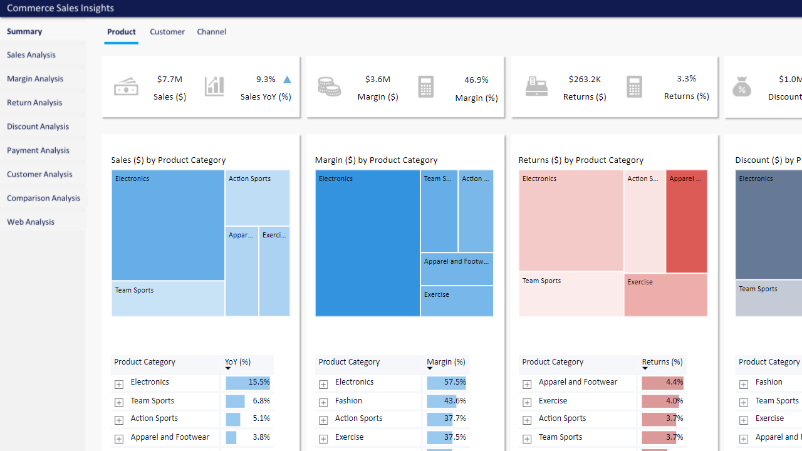
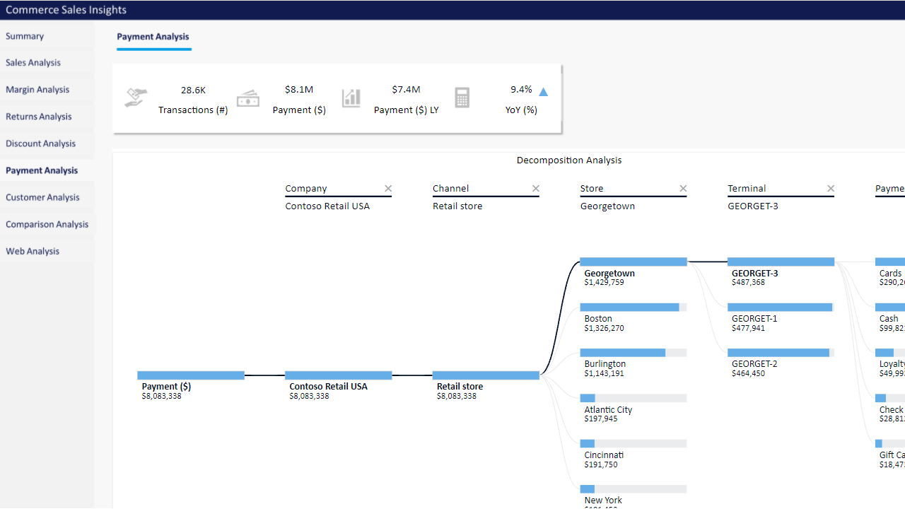
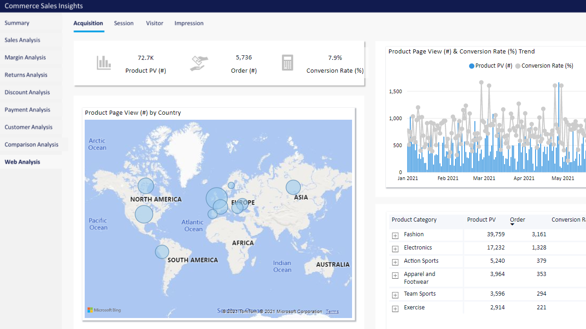
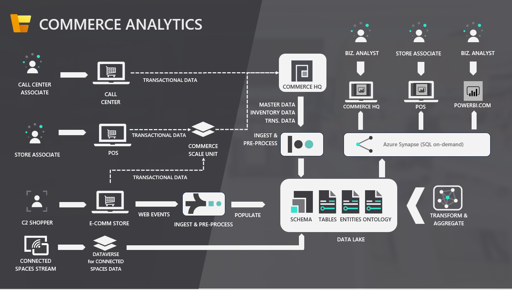

---
# required metadata

title: Commerce analytics (Preview)
description: This topic explains how to install and use the analytics capability in Microsoft Dynamics 365 Commerce. 
author: AamirAllaq
ms.date: 02/24/2022
audience: Application user
ms.reviewer: sericks
ms.search.region: Global
ms.author: aamiral
ms.search.validFrom: 2021-11-12

---

# Commerce analytics (Preview)

[!include [banner](includes/banner.md)]

This topic explains how to install Commerce analytics (Preview), the functional analytics capability that is included in Microsoft Dynamics 365 Commerce.

## Commerce Analytics (Preview) live demo

You can try out a [live demo of Commerce Analytics (Preview)](https://aka.ms/CommerceAnalyticsDemo).

## Commerce analytics (Preview) system architecture

### Key components

Commerce analytics (Preview) consists of the following key components:

- Ready-to-use interactive Power BI reports
- SQL views in Azure Synapse Analytics
- Entity and ontology data in Azure Data Lake
- Raw data in Data Lake

### Data flow

#### Step 1: Data generation

Data originates either as transactional data or behavioral data from one of the following sources:

- A call center associate uses the Commerce HQ client to process sales orders.
- A cashier at the point of sale (POS) processes sales transactions.
- Sales are created in custom applications by using Headless Commerce (Commerce Scale Unit).
- An e-commerce shopper browses your e-commerce website.
- An e-commerce shopper places an order on your e-commerce website.
- Data is produced by other systems, such as Dynamics 365 Connected Spaces.

#### Step 2: Ingestion and pre-processing

Transactional data goes to Commerce HQ either directly (in the case of orders that are captured directly in the Commerce HQ client) or via Commerce Scale Unit (in the case of orders that are captured at the POS, in e-commerce, or in custom clients that use Headless Commerce).

The Export to Data Lake feature is then used to copy the transactional data to your data lake as raw data. In the data lake, the raw data is stored in the Tables folder.

E-commerce web activity data is sent directly to the data lake. Data that is produced by other systems, such as Dynamics 365 Connected Spaces, is sent directly to the data lake by those systems.

#### Step 3: Transformation and aggregation

After raw data is in your data lake, the Commerce analytics service reads it, transforms it, aggregates it, and writes it back to the data lake in the form of logical entities (in the Entities folder) and aggregated metrics (in the Ontologies folder).

#### Step 4: Querying

Azure Synapse Analytics is used to query data in your data lake via a Transact-SQL (T-SQL) interface. This interface includes SQL views. SQL views enable federated querying of data in the data lake, either directly via a T-SQL client (for ad-hoc analysis) or via a visualization tool such as Power BI.

#### Step 5: Modeling and serving

Data that is queried by Azure Synapse Analytics goes to Power BI's semantic model. Depending on the type of data, it's either periodically imported in-memory into Power BI or directly queried at runtime.

Finally, the data is rendered in Power BI visuals, so that users can view and interact with it.

## Commerce analytics (Preview) functional overview

### Summary

Commerce Analytics template app includes the following main report pages:

1. [Top-level filters](#TopLevelFilters)
2. [Products](#ProductsPage)
3. [Customers](#CustomersPage)
4. [Channels](#ChannelsPage)
5. [Sales](#SalesPage)
6. [Margins](#MarginsPage)
7. [Returns](#ReturnsPage)
8. [Discounts](#DiscountsPage)
9. [Payments](#PaymentsPage)
10. [Customers](#CustomersPage)
11. [Comparison](#ComparisonPage)
12. [Web activity](#WebActivityPage)
13. [Web activity - Top level filter](#WebActivityTopLevelFilters)

####  Top-level filters

- Date settings

    - Year
    - Quarter
    - Month
    - Week
    - Day

- Channel settings

    - Legal entity
    - Channel type
    - Customer type
    - Sales type
    - Channel
    - Organization hierarchy

- Product settings

    - Category hierarchy
    - Category

####  Products

- Sales
- Margin
- Returns

####  Customers

- Sales
- Margin
- Returns

####  Channels

- Sales
- Margin
- Returns

### Sales 

- By delivery location
- By channel/store/terminal
- By employee
- By date
- By hour
- By product category

###  Margins

- By delivery location
- By product
- By date

###  Returns

- Return by amount

    - By store
    - By product
    - By date

- Return by transaction

    - By store
    - By product
    - By date

###  Discounts

- By store
- By product
- By date
- Decomposition

    - Legal entity
    - Store
    - Discount type
    - Discount name
    - Product

###  Payments

- By channel/terminal
- By payment method/type
- By date
- Decomposition

    - Legal entity
    - Channel type
    - Store
    - Terminal
    - Payment method

###  Customers

- Lifetime value (LTV)

    LTV is calculated based on the total amount that a customer spends across all Dynamics 365 Commerce sales channels (including POS, e-commerce, and call center).

- Recency

    Recency is calculated based on the number of days since a customer's last transactional engagement with the organization. Currently, recency doesn't consider non-transactional engagement signals, such as e-commerce browsing activity.

- Frequency

    Frequency is calculated based on a customer's transactional engagement with the organization. Currently, frequency doesn't consider non-transactional engagement signals, such as e-commerce browsing activity.

- Relationship length

    Relationship length is calculated based on the number of days since the customer record was created in the system.

- Transaction count

###  Comparison

- Product comparison by time period

    - Sales and sales difference
    - Margin and margin difference

- Customer by time period

    - Sales and sales difference
    - Margin and margin difference

###  Web activity

####  Top-level filters

- Date range
- Channel type
- Channel
- Category hierarchy

#### Acquisitions

- Page views

    - By country or region
    - By product
    - By user signed-in status
    - By date

- E-commerce orders
- Conversion rate

    - By date

- Conversion funnel

    - Page view by page type (home page, category page, or product details page)
    - Add to cart
    - Checkout
    - Purchase

#### Sessions

A session is an episode of a user's visit to your e-commerce website. A session is considered ended after 30 minutes of inactivity or 24 hours of active use.

- By country or region
- By origin (external referrer)
- By user signed-in status
- Session count

    - By date
    - By entry page

- Order per session

    - By date

- Session bounce rate

    A session bounce is a session where a user leaves immediately after they visit your e-commerce website. For more information, see [Bounce rate](https://en.wikipedia.org/wiki/Bounce_rate).

- Clicks per session

#### Visitors

An anonymous visitor on your e-commerce site is uniquely identified based on the specific browser and the specific device that the user is using. Commerce analytics doesn't track anonymous visitors across different browsers or devices. An anonymous visitor who uses the same browser on the same device is uniquely identified across multiple user sessions, until either the browser's cached data is cleared or a period (typically 12 months) passes, whichever occurs first.

If visitors browse your e-commerce site while they are signed in, Commerce analytics can provide additional information about them. This information is based on the existing relationship that your organization has with the visitors as a result of their previous purchases across all Dynamics 365 Commerce sales channels (including POS, e-commerce, and call center). The additional information includes recency, relationship length, lifetime value, and frequency data.

- Visitor margin
- Visitor average orders
- Visitor average sales
- E-commerce visitor count

    - By date
    - By location

        Currently, Commerce analytics can provide only country/region-level granularity for location insights for e-commerce visitors.

    - By recency

        Recency is calculated based on the number of days since a customer's last transactional engagement with the organization. Currently, recency doesn't consider non-transactional engagement signals, such as e-commerce browsing activity.

    - By relationship length

        Relationship length is calculated based on the number of days since the customer record was created in the system.

    - By lifetime value (LTV)

        LTV is calculated based on the total amount that a customer spends across all Dynamics 365 Commerce sales channels (including POS, e-commerce, and call center).

    - By frequency

        Frequency is calculated based on a customer's transactional engagement with the organization. Currently, frequency doesn't consider non-transactional engagement signals, such as e-commerce browsing activity.

#### Impressions

An impression is a single view of a product visual by an e-commerce visitor. For example, an e-commerce visitor goes to the home page of your e-commerce website and views a yoga mat product in a **Top selling** list module. The visitor then views the same yoga mat product in a **Picks for you** list module. In this case, there are two product impressions.

Currently, impressions are tracked in the following surfaces:

- Lists (for example, **Recommended**, **Top selling**, **Picks for you**, and **Trending**)
- Cart module
- Search result container
- Category search result container

Currently, products that are rendered in a carousel module or in custom visuals aren't counted in impression-related metrics.

The **Impression report** page includes the following metrics:

- Impression count

    - By page type and module

        Page type is the generic type of page that is defined for each page on your e-commerce website. Module type is the type of e-commerce visual module that the product is shown in.

        To view impressions by module, you might have to drill down into the page and module visuals.

    - By product
    - By user signed-in status
    - By date

- Impression click count

    An impression click occurs when an e-commerce visitor selects a product visual. Typically, the visitor is then taken to the product details page for the product.

- Impression click-through rate (CTR)

    CTR is calculated as the total number of impression clicks divided by the total number of impressions.

## Commerce analytics (Preview) installation

> [!NOTE]
> Commerce analytics (Preview) is in preview in the United States, Canada, United Kingdom, Europe, South East Asia, East Asia, Australia, and Japan regions. If your Finance and Operations environment is in any of those regions, you can enable this feature in your environment by using Microsoft Dynamics Lifecycle Services (LCS). Before you can use this feature, see [Configure export to Azure Data Lake](../fin-ops-core/dev-itpro/data-entities/configure-export-data-lake.md).

### Enable and configure Commerce analytics (Preview)

To install Commerce analytics (Preview), you must have permissions to create resources in an Azure subscription. You must also have permissions to install add-ins in LCS.

To enable and configure Commerce analytics (Preview), follow these steps.

1. [Submit the Preview intake form for Commerce analytics (Preview)](#joinPreview)
2. [Enable and configure the Export to Data Lake add-in](#enableExportToDataLake).
3. [Install and configure an Azure Synapse workspace](#configureAzureSynapse).
4. [Add secrets to the key vault](#addSecrets).
5. [Enable and configure the Commerce analytics (Preview) add-in](#enableCommerceAnalyticsAddin).
6. [Install the Power BI template app](#powerbi).

### Submit the Preview intake form for Commerce analytics (Preview)

Submit the [Preview intake form for Commerce analytics (Preview)](https://forms.office.com/r/vW5VLJGXZ2). After your request is processed, a confirmation email will be sent to the email address that you provided in the form.

### Enable and configure the Export to Data Lake add-in

> [!IMPORTANT]
> When you configure the Export to Data Lake add-in, clear the **Real-time data changes** checkbox on the Export to Data Lake add-in setup page to ensure that real-time data changes aren't enabled. The **Real-time data changes** feature is in preview and isn't currently supported by Commerce Analytics. If you enable the feature, Commerce Analytics won't be able to process your data in the data lake, and most of your Power BI reports will show no data.

Commerce analytics (Preview) relies on the Export to Data Lake feature to export Commerce headquarters data to Data Lake and keep the data fresh. Before you configure Commerce analytics (Preview), enable and configure Export to Data Lake by following the steps in [Configure export to Azure Data Lake](../fin-ops-core/dev-itpro/data-entities/configure-export-data-lake.md).

While you configure the Export to Data Lake add-in, make a note of the following information, because you will have to enter it later:

- The Domain Name System (DNS) name of the key vault that you provided.
- The secret names that you provided, and that contain the application ID and application secret. For more information, see [Add secrets to the key vault](../fin-ops-core/dev-itpro/data-entities/configure-export-data-lake.md#addsecrets).

### Install and configure an Azure Synapse workspace

Commerce Analytics (Preview) requires that Synapse SQL on-demand be provisioned in your Azure Synapse workspace. To install and configure an Azure Synapse workspace, follow these steps.

1. Install an Azure Synapse workspace in your Azure subscription. For more information, see [Quickstart: Create a Synapse workspace](/azure/synapse-analytics/quickstart-create-workspace).
1. After the workspace is provisioned, open the resource overview page, and make note of the **Serverless SQL endpoint** value. You will have to store this value in the key vault in the next section.
1. On the overview page, select the **Open Synapse Studio** link to open the Azure Synapse Studio for your workspace.
1. Select **Manage** on the left menu. To see the menu names, you might have to select the expand link on the left menu.
1. Under **Security group**, select **Access control**. 
1. Select **Add**.
1. In the **Add role assignment** pane, set the options as described in the following table.

    | Option | Value |
    |--------|-------|
    | Scope | Select **Workspace**. |
    | Role | Select **Synapse SQL Administrator**.|
    | Select user | Search for the name of the application that you [created during installation of the Export to Data Lake add-in](../fin-ops-core/dev-itpro/data-entities/configure-export-data-lake.md#createapplication). When the application appears in the search results, select it. The application will now appear in the **Selected user(s), group(s), or service principal(s)** section. |

1. Select **Apply** to complete the role assignment. The application is granted Synapse SQL Administrator privileges. Therefore, it can create the required views during configuration of the Commerce Analytics (Preview) LCS add-in.

### Add secrets to the key vault

In the same [key vault](../fin-ops-core/dev-itpro/data-entities/configure-export-data-lake.md#createkeyvault) that you used while you configured the Export to Data Lake add-in, you must add the secrets that are shown in the following table. For each secret, you must provide a secret name and the specified value.

| Suggested secret name | Secret value | Example secret value |
|---------|---------|---------|
| synapse-sql-server | The serverless SQL endpoint value that you noted while you [configured the Azure Synapse workspace](#serverlessep). | `test-ondemand.sql.azuresynapse.net` |
| readonly-sql-pwd | The password to set for the SQL read-only user. The Power BI report will use this password to connect to the serverless SQL. To set the password, follow your organization's password policies. | |

### Enable and configure the Commerce analytics (Preview) add-in

To install the Commerce analytics (Preview) add-in in LCS, you must be an environment administrator in LCS for the environment that you plan to use.

To install and configure the Commerce analytics (Preview) add-in, follow these steps.

1. Sign in to [LCS](https://lcs.dynamics.com/), and go to your environment.
2. On the **Environment** page, on the **Environment add-ins** tab, select **Install a new add-in**.
3. In the dialog box, select **Commerce analytics (Preview)**.
4. In the **Setup add-in** dialog box, enter the following information.

    | Information | Source | Example value |
    |---|---|---|
    | Azure Active Directory (Azure AD) Tenant ID | Sign in to the [Azure portal](https://portal.azure.com/), and open the **Azure Active Directory** service. Then open the **Properties** page, and copy the value in the **Tenant ID** field. | `72f988bf-0000-0000-00000-2d7cd011db47` |
    | DNS name of your Azure key vault | Enter the DNS name of your key vault. You should have made a note of this value while you [configured the Export to Data Lake add-in](#keyVault). | `https://contosod365datafeedpoc.vault.azure.net/` |
    | Secret name that contains the Application ID | Enter the secret name that stores the application ID. You should have made a note of this value while you [configured the Export to Data Lake add-in](#keyVault). | `app-id` |
    | Secret name that contains the application secret | Enter the secret name that stores the application secret. You should have made a note of this value while you [configured the Export to Data Lake add-in](#keyVault). | `app-secret` |
    | Secret name that contains the serverless SQL endpoint for Azure Synapse | Enter the secret name that stores the serverless SQL endpoint. You should have created the secret while you the [added secrets to the key value](#addSecrets). | `synapse-sql-server` |
    | Secret name that contains the password to set for SQL read-only users in Azure Synapse | Enter the secret name that stores the password to set for the serverless SQL read-only user. This user will be created for you and should be used in the Power BI report to connect to the serverless SQL server. You should have created the secret while you [added secrets to the key value](#addSecrets). | `readonly-sql-pwd` |

1. Accept the terms of the offer by selecting the checkbox, and then select **Install**.

    The system installs and configures the Commerce analytics (Preview) add-in for the environment. This process might take a few minutes. After it's completed, **Commerce analytics (Preview)** should be listed on the **Environment** page, and the status should be **Installed**.

### Install the Power BI template app

To install the Power BI template app for Commerce analytics (Preview), follow these steps.

1. Sign in to the [Power BI portal](https://powerbi.microsoft.com/) by using your organization ID.
1. Install the Commerce analytics (Preview) Power BI template app by going to [https://aka.ms/cdireport-installapp](https://aka.ms/cdireport-installapp). Alternatively, visit the [AppSource page for Dynamics 365 Commerce Analytics](https://appsource.microsoft.com/product/power-bi/dynamics-365-commerce.dydnamics-365-commerce-analytics), and select **Get it now**.
1. If you're installing the app for the first time, skip ahead to step 5. If you've installed it before, the following options for updating the app apply:

    - **Update the workspace and the app** – Update the existing template app, and overwrite your existing app settings, such as the app instance name and permission configurations.
    - **Update only workspace content without updating the app** – Update the existing template app, but keep your existing app settings. *This option is the recommended option for app updates.*
    - **Install another copy of the app into a new workspace** – Create a new workspace, and then create a copy of the existing template app in it. The existing workspace will be left intact.

1. Select one of the update options, and then select **Install**.
1. Open the installed app by selecting **Apps** in the left pane and then selecting the app.
1. Connect the app to your data source by selecting **Connect**. If you've installed the app before, select the **Connect your data** link in the yellow message bar.
1. Set the following fields.

    | Field | Value |
    |---|---|
    | Server | Enter the serverless SQL endpoint that you made a note of after you [created the Azure Synapse workspace](#serverlessep). |
    | Database | Enter **CommerceAnalytics**. |
    | Language | Select a value in the list. This field is used for localized product and category names. The value is case-sensitive. |
    | Date Range | Select a value in the list. Data for the selected number of months will be imported into the Power BI dataset. The value that you select affects the size of the dataset and the time that is required for synchronization. |

1. Select **Next**. When you're prompted to enter the credentials for connecting to the Azure Synapse SQL database, set the field values as shown in the following table.

    | Field | Value |
    |---|---|
    | Authentication method | Select **Basic**. |
    | User name | Enter **reportreadonlyuser**. |
    | Password | Enter the password that you [stored for the SQL read-only user in the key vault](#roUser). |

1. Select **Sign in and connect**.
1. Wait until the dataset has been successfully updated. Then select **Edit app** to open the App workspace, where you can view the update status of the dataset. In the App workspace, you can also optionally set up automatic update schedules for your dataset, manage permissions, and rename the app instance.

### Privacy

Your privacy is important to us. To learn more, read our [Privacy Statement](https://go.microsoft.com/fwlink/?LinkId=521839).

[!INCLUDE[footer-include](../includes/footer-banner.md)]
