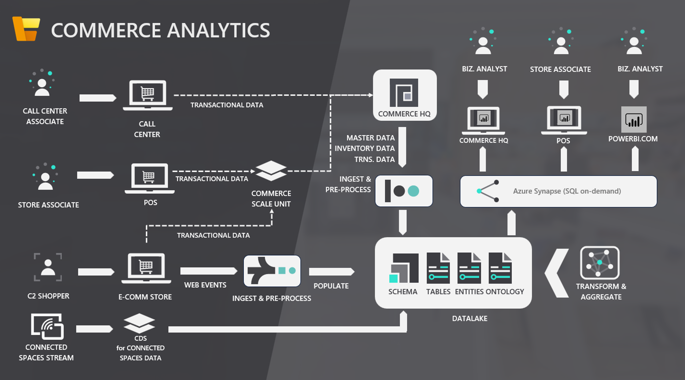

---
# required metadata

title: Commerce analytics (Preview)
description: This topic details installation and usage of the analytics capability in  Dynamics 365 Commerce. 
author: AamirAllaq
ms.date: 11/15/2021
audience: Application user
ms.reviewer: sericks
ms.search.region: Global
ms.author: aamiral
ms.search.validFrom: 2021-11-12

---

# Commerce analytics (Preview)

[!include [banner](includes/banner.md)]

Commerce analytics is the functional analytics capability included in Dynamics 365 Commerce. This topic describes Commerce analytics in detail, and explains how to install it. 

## System architecture
### Key components
Commerce analytics is composed of the following key components:
- Ready to use interactive Power BI reports
- SQL views in Azure Synapse Analytics
- Entity and ontology data in Azure Data Lake
- Raw data in Azure Data Lake



### Data flow
#### Step 1: Data generation
Data originates either as transactional data or behavioral data from one of the following sources:
- Call center associate using Commerce HQ client to process sales orders
- Cashier at point of sale (POS) processing sales transactions
- Sales created within custom applications using Headless Commerce (Commerce Scale Unit)
- E-commerce shopper browsing your e-commerce website 
- E-commerce shopper placing an order on your e-commerce website
- Data produced by other systems such as Dynamics 365 Connected Spaces

#### Step 2: Ingestion and pre-processing
Transactional data enters Commerce HQ either directly (orders captured directly in Commerce HQ client) or from Commerce Scale Unit (orders captured at POS, e-commerce, or custom clients using Headless Commerce). 

Transactional data is then copied over to your Azure Data Lake as raw data with the the **Export to Data Lake** feature, and the data is stored within the "Tables" folder. E-commerce web activity data is sent directly to the data lake.

Data produced by other systems, such as Dynamics 365 Connected Spaces, is also sent directly to the data lake.

#### Step 3: Transformation and aggregation
Once raw data is in the data lake, the Commerce analytics service reads the data, transforms, aggregates it, and writes it back to the data lake in the form of logical entities in the "Entities" folder, and aggregated metrics in the "Ontologies" folder. 

#### Step 4: Querying
Data in the lake is queried via a T-SQL interface by using Azure Synapse Analytics. The interface includes SQL views that allow for federated querying of data in the lake, either by directly using a T-SQL client for ad-hoc analysis, or through a visualization tool such as Power BI.

#### Step 5: Modeling and serving
Data queried by Azure Synapse Analytics then goes to the Power BI semantic model. Depending on the type of data, it is either imported in-memory into Power BI on a periodic basis or directly queried at run-time. 

The final stage is for the data to be rendered within Power BI visuals for users to view and interact with. 

## Commerce analytics functional overview
### 1. Summary
#### Top-level filters
1.  Date settings
    1. Year
    2. Quarter    
    3. Month    
    4. Week    
    5. Day
2. Channel settings
    1. Legal entity    
    2. Channel type    
    3. Customer type    
    4. Sales type    
    5. Channel    
    6. Org hierarchy
3. Product settings
    1. Category hierarchy    
    2. Category

#### a.	Product
1. Sales
2. Margin
3. Returns

#### b.	Customer
1. Sales
2. Margin
3. Returns

#### c.	Channel
1. Sales
2. Margin
3. Returns

### 2. Sales
1. By delivery location
2. By channel/store/terminal
3. By employee
4. By date
5. By hour
6. By product category

### 3. Margin
1. By delivery location
2. By product
3. By date

### 4. Return
1. Return by amount
    1. By store    
    2. By product    
    3. By date
2. Return by transaction
    1. By store    
    2. By product    
    3. By date

### 5. Discount
1. By store
2. By product
3. By date
4. Decomposition
    1. Legal entity    
    2. Store    
    3. Discount type    
    4. Discount name    
    5. Product

### 6. Payment
1. By channel/terminal
2. By payment method/type
3. By date
4. Decomposition
    1. Legal entity    
    2. Channel type    
    3. Store    
    4. Terminal    
    5. Payment method

### 7. Customer
1. Life-time value (LTV): Life-time value is calculated based on total amount spent by a customer across all Commerce sales channels (POS, e-commerce, and call center).
2. Recency: Recency is calculated based on number of days since a customer's last transactional engagement with the organization. Recency does not consider non-transactional engagement signals such as e-commerce browsing activity.
3. Frequency: Frequency is calculated based on a customer's transactional engagement with the organization. Frequency does not consider non-transactional engagement signals such as e-commerce browsing activity.
4. Relationship length: Relationship length is calculated based on number of days since the customer record was created in the system. 
5. Transaction count

### 8. Comparison
1. Product comparison by time period
    1. Sales and sales difference
    2. Margin and margin difference
2. Customer by time period
    1. Sales and sales difference
    2. Margin and margin difference

### 9. Web activity

#### Top-level filters
1. Date range
2. Channel type
3. Channel
4. Category hierarchy

#### a.	Acquisition
1. Page views
    1. By country/region    
    2. By product    
    3. By user signed-in status    
    4. By date
2. E-commerce orders
3. Conversion rate
    1. By date
4. Conversion funnel
    1. Page view by page type (home page, category page, product details page)  
    2. Add to cart    
    3. Checkout   
    4. Purchase

#### b.	Session
Session is defined as an episode of a user's visit to your e-commerce website. A session is considered ended after 30 minutes of inactivity, or after 24 hours of active usage.
1. By country/region
2. By origin (external referrer)
3. By user signed-in status
4. Session count
    1. By date    
    2. By entry page
5. Order per session
    1. By date
6. Session bounce rate: Session bounce is defined as a session where the user immediately leaves after visiting your e-commerce website. 
7. Clicks per session

#### c.	Visitor
An anonymous visitor on your e-commerce site is determined based on a unique identifier within that specific browser on that specific device. Commerce analytics does not track anonymous users across different browsers or devices. An anonymous user using the same browser on the same computer is uniquely identified across multiple user sessions, until the browser cache data is cleared or typically until a 12 month period, whichever comes first.

Commerce analytics can provide you with more information about visitors who browse your e-commerce site while signed-in. The information is based on your existing relationship with these users, including purchases the users have made from your organization across all Commerce sales channels (POS, call center, and e-commerce), and includes recency, relationship length, lifetime value, and frequency.

1. Visitor margin
2. Visitor average orders
3. Visitor average sales
4. E-commerce visitor count
    1. By date
    2. By location: Commerce analytics can only provide granularity on the level of country/region for location insights for e-commerce visitors.     
    3. By recency: Recency is calculated based on number of days since a customer's last transactional engagement with the organization. Recency does not consider non-transactional engagement signals such as e-commerce browsing activity.    
    4. By relationship length: Relationship length is calculated based on number of days since the customer record was created in the system.     
    5. By lifetime value (LTV): Life-time value is calculated based on total amount spent by a customer across all Commerce sales channels (POS, e-commerce, and call center).
    6. By frequency: Frequency is calculated based on a customer's transactional engagement with the organization. Frequency does not consider non-transactional engagement signals such as e-commerce browsing activity.

#### d.	Impression
Impression is defined as each viewing of a product visual by an e-commerce visitor. For instance, if an e-commerce visitor navigates to the home page of your website and views a yoga mat product within a top selling list module, and also views the same yoga mat product within a picks for you list module, these interactions count as two product impressions. Impressions track product views within the following surfaces:
1. Lists (for example, recommended, top selling, picks for you, trending)
2. Cart module
3. Search result container
4. Category search result container
    
Products rendered within a carousel module or within custom visuals are not counted in the impressions metric.

The **Impression report** page includes the following metrics:
1. Impression count
    1. By page type and module: Page type is the generic page type defined for each page in your e-commerce website. Module type defines the type of e-commerce visual module within which the product is shown. You may need to drill down in the page and module visual to view impressions by module.    
    2. By product    
    3. By user signed-in status    
    4. By date
2. Impression click count: Impression click is defined as an e-commerce visitor clicking on a product visual, which typically navigates users to the product details page for that product.     
3. Impression click-through rate (CTR): Click-through rate is defined as the total number of impression clicks divided by the total number of impressions.

## Install Commerce analytics

> [!NOTE]
> Commerce analytics is in the preview phase in the United States, Canada, United Kingdom, Europe, South East Asia, East Asia, Australia, and Japan regions. If your environment is in any of those regions, you can enable Commerce analytics in your environment with Microsoft Dynamics Lifecycle Services (LCS). Before you can use Commerce analytics, see [Configure export to Azure Data Lake](../fin-ops-core/dev-itpro/data-entities/configure-export-data-lake.md).

### Enable and configure Commerce analytics
To install Commerce analytics, you need permissions to create resources in an Azure subscription and permissions to install add-ins in LCS. Complete the steps outlined below to enable and configure Commerce analytics.
1. [Submit the Preview intake form for Commerce analytics (Preview)](#Submit-the-Preview-intake-form-for-Commerce-analytics).
2. [Enable and configure Export to Data Lake](#enable-and-configure-Export-to-Data-Lake).
3. [Enable and configure Commerce analytics (Preview) add-in](#Enable-and-configure-Commerce-analytics-add-in).
4. [Generate storage account SAS token](#Generate-storage-account-SAS-token).
5. [Download deployment scripts for Azure Synapse views](#Download-deployment-scripts-for-Azure-Synapse-views).
6. [Install and configure Azure Synapse workspace](#Install-and-configure-Azure-Synapse-workspace).
7. [Install Power BI template app](#Install-Power-BI-template-app). 

### Submit the Preview intake form for Commerce analytics
Complete and submit the [Commerce analytics (Preview) intake form](https://forms.office.com/r/vW5VLJGXZ2). Please allow up to three business days for the request to be processed. Once the form is processed, a confirmation email will be sent to the email address provided in the form.

### Enable and configure Export to Data Lake
Commerce analytics relies on the **Export to Data Lake** feature to export Commerce HQ data to Azure Data Lake and keep the data fresh. Before you configure Commerce analytics, enable and configure **Export to Data Lake** by following the steps outlined in [Configure export to Azure Data Lake](../fin-ops-core/dev-itpro/data-entities/configure-export-data-lake.md). When you configure the **Export to Data Lake** feature, note the following information. You will need to enter this information in subsequent steps.
1. The key vault DNS name and the secret names where you store the application ID and application secret. For more information, see [Add secrets to the key vault](../fin-ops-core/dev-itpro/data-entities/configure-export-data-lake.md#addsecrets).
2. The storage account name for the Azure Data Lake instance. For more information, see [Create a Data Lake Storage (Gen2) account in your subscription](../fin-ops-core/dev-itpro/data-entities/configure-export-data-lake.md#createsubscription).

### Enable and configure Commerce analytics add-in
To install the Commerce analytics add-in in LCS, you must be an environment administrator in LCS for the environment that you plan to use.

You will need the following information to configure the Commerce analytics add-in. 
|Field| Information source| Example|
|----|----|----|
|Azure AD Tenant ID for your environment| Your Azure AD tenant ID in the Azure portal. Sign in to the **Azure portal** and open the **Azure Active Directory** service. Open the **Properties** page and copy the value in the **Directory ID** field.|72f988bf-0000-0000-00000-2d7cd011db47|
|DNS name of your key vault|Enter the [DNS name](#Enable-and-configure-Export-to-Data-Lake) of your key vault.|`https://contosod365datafeedpoc.vault.azure.net/`|
|Secret that contains the Application ID|Enter the [secret name](#Enable-and-configure-Export-to-Data-Lake) that stores the application ID. This is the same value that you used when installing the **Export to Data Lake** add-in.|app-id|
|Secret that contains the application secret|Enter the [secret name](#Enable-and-configure-Export-to-Data-Lake) that stores the application secret. This is the same value that you used when installing the **Export to Data Lake** add-in.|app-secret|
1. Sign in to [Lifecycle Services](https://lcs.dynamics.com/) and navigate to your environment.
2. On the **Environment** page, select the **Environment add-ins** tab.
3. Select **Install a new add-in**, and in the dialog box, select **Commerce analytics (Preview)**. If **Commerce analytics (Preview)** isn't listed, make sure you have joined the Insider Program.
4. In the **Setup add-in** dialog box, enter the required information as outlined in the table above.
5. Accept the terms of the offer by selecting the check box, and then select **Install**.

The system installs and configures Commerce analytics (Preview) for the environment. The operation may take a few minutes. After installation and configuration are completed, **Commerce analytics (Preview)** is listed on the **Environment** page, and the status is **Installed**.

### Generate storage account SAS token
> [!NOTE]
> A known limitation of Commerce analytics (Preview) is that the Azure Synapse instance will lose access to the data lake when the SAS token expires. You should set the maximum expiration date allowed by your organization security policies when you generate the Shared Access Signature (SAS) token.

A SAS token enables external entities to access your storage account, with a specific set of privileges for a finite amount of time. Azure Synapse will use the SAS token to access the underlying data in Azure Data Lake. To generate a SAS token, complete the steps below.
1. Go to the storage account in Azure portal that you created while configuring **Export to Data Lake**, as outlined in [Create a Data Lake Storage (Gen2) account in your subscription](../fin-ops-core/dev-itpro/data-entities/configure-export-data-lake.md#createsubscription).
2. In the **Options** pane on the left, under the storage account, select **Shared access signature**.
3. Select the following options on the SAS options page:
    | Option name | Option value |
    |-------------|--------------|
    | Allowed services | Select **Blob**. |
    | Allowed resource types | Select **Service**, **Container** and **Object**.|
    | Allowed permissions | Select **Read**, **Write**, **Delete**, **List**, **Add**, and **Create**. |
    | Blob versioning permissions | Select **Enables deletion of versions**. |
    | Start and expiry date/time | Set an end date and time for the SAS token as appropriate. |
    | Allowed IP addresses | Leave blank. |
    | Allowed protocols | Select **HTTPS only**. |
    | Preferred routing tier | Select **Basic (default)**. |
    | Signing key | Select **key1** or **key2** as appropriate. |
4. Select **Generate SAS and connection string**.
5. Copy the value from the **SAS token** text box into a text editor such as Notepad.

### Download deployment scripts for Azure Synapse views
To create and publish the necessary views in Azure Synapse workspace, you must download and execute a set of scripts. Complete the steps below to download the scripts.
1. Go to the [microsoft/Dynamics365Commerce.Solutions](https://github.com/microsoft/Dynamics365Commerce.Solutions) GitHub repo. The scripts are available in the repo.
2. To download the scripts to your local machine, you can either clone the repo or download the repo as a zip file.

### Install and configure Azure Synapse workspace
To install and configure an Azure Synapse workspace, complete the steps below.
1. Install Azure Synapse workspace in your Azure subscription by following the steps outlined in [Quickstart: Create a Synapse workspace](/azure/synapse-analytics/quickstart-create-workspace).
2. Open the SetupSynapse.sql script file in Notepad from the local machine folder where you cloned or downloaded the Dynamics365Commerce.Solutions repo. For more information, see [Download deployment scripts for Azure Synapse views](#Download-deployment-scripts-for-Azure-Synapse-views). The script file will be under the "/Pipeline/CommerceAnalyticsSynapse/" folder. Edit the script to replace the placeholder text with values below.
   | Placeholder text | Replacement value |
   |------------------|-------------------|
   | placeholder_storageaccount | Replace with the name for the storage account that you created while configuring **Export to Data Lake**, as outlined in  [Create a Data Lake Storage (Gen2) account in your subscription](../fin-ops-core/dev-itpro/data-entities/configure-export-data-lake.md#createsubscription). |
   | <a name="phContainer"></a>placeholder_container | Replace with the name of the storage container that was created in your Azure Data Lake instance after you installed the **Export to Data Lake** add-in in LCS. To get the container name, you need to use the Storage Explorer in Azure portal to browse your storage account. |
   | placeholder_sastoken | Replace with the SAS token that you copied in [Get Storage Account SAS token](#Generate-storage-account-SAS-token). Be sure to remove the **'?'** at the beginning of the SAS token value. |
   | <a name="phUserPwd"></a>placeholder_password | Replace with a strong password of your choice. Make a note of the password. The password will be set as the password for the new 'reportreadonlyuser' account that will be created by the script. **DO NOT** enter the password of the 'sqladminuser' account here.  |
3. Go to the new Azure Synapse workspace in Azure portal. Select the **Open Synapse Studio** option on the **Overview** page.
4. Copy the contents of `SetupSynapse.sql` that you updated in Step 2 above. In Synapse Studio on Azure portal, select **New > SQL script**. Paste the contents into the SQL script editor in Synapse Studio.
5. Verify that **Use database** is set to **Master**. Select **Run** to execute the script.
6. Wait for the script to complete. The script will create the database for Commerce analytics, credential for accessing the Azure Data Lake, and a read-only user account that will be used by Power BI to connect to the Azure Synapse instance.
7. On your local machine, open PowerShell in admin mode. Go to the "/Pipeline/CommerceAnalyticsSynapse/" folder under the folder where you cloned or downloaded the Dynamics365Commerce.Solutions repo, as outlined in [Download deployment scripts for Azure Synapse views](#Download-deployment-scripts-for-Azure-Synapse-views).
8. Set up the PowerShell execution policy by running the following command in the PowerShell window:

   ```powershell
   Set-ExecutionPolicy -Scope Process -ExecutionPolicy Bypass
   ```
   
9. Install the SQL Server PowerShell module by running the following command in the PowerShell window:

   ```powershell
   Install-Module sqlserver
   ```
   
   > [!NOTE]
   > If you already have the SQL Server module installed, you can skip this step. During installation of this module, you may be prompted to install NuGet provider. Press **Y** to proceed with the installation of NuGet provider. You may also receive a message that you are installing modules from an untrusted repository. Press **Y** to continue with the installation. Optionally, you may run the `Set-PSRepository` cmdlet to trust the `PSGallery` repository.
   
10. Publish the Azure Synapse views by running the following command in the PowerShell window:

    ```powershell
    .\PublishSynapseViews.ps1 -serverName SERVER_NAME -password PASSWORD -storageAccount STORAGE_ACCOUNT -containerName CONTAINER_NAME -datarootpath DATA_ROOT_PATH
    ```
    
    Replace the placeholder values in the command as follows:
    | Placeholder value | Replacement value |
    |-------------------|-------------------|
    | SERVER_NAME | Replace with the name of the Azure Synapse Serverless SQL endpoint. You can get this value from the Azure Synapse workspace **Overview** page in Azure portal. |
    | PASSWORD | Replace with the password for the sqladminuser. |
    | STORAGE_ACCOUNT | Replace with the name of the storage account for Azure Data Lake. |
    | CONTAINER_NAME | Replace with the name of the container that was created by **Export to Data Lake**. The name is for the same container that you specified in the [placeholder_container](#Install-and-configure-Azure-Synapse-workspace) value above. |
    | DATA_ROOT_PATH | Replace with the folder name under the container that contains all the data. |

    > [!NOTE]
    > You can find the storage account name, container name, and the data root path from Azure portal, using Azure Storage browser with your Azure Data Lake storage account.

11. Wait for the script to complete. The script will create SQL views in the Azure Synapse serverless SQL instance.

### Install Power BI template app
To install the Power BI template app for Commerce analytics, complete the steps below.
1. Sign in to [Power BI portal](https://powerbi.microsoft.com/) using your organization ID.
2. Install the Commerce analytics Power BI template app by going to [https://aka.ms/cdireport-installapp](https://aka.ms/cdireport-installapp). You may receive a warning about the app not being listed on AppSource. Select **Install**.
3. If this is the first time you are installing the app, skip to step 5. If you have already installed this app, you will be presented with the following options to update the app.
   1. Update the workspace and the app: This option updates the existing template app and overwrites app settings such as the app instance name and permission configurations.
   2. Update workspace content without updating the app: This option updates the existing template app and preserves your app settings. This is the **recommended** option for an app update.
   3. Install another copy of the app into a new workspace: This option creates a new copy of the app into a new workspace that will be created for you. The existing workspace is left intact.      
4. Select one of the above options, and then select **Install**.
5. Open the installed app by selecting the **Apps** menu item on the left pane and then selecting the app.
6. Connect the app to your data source by selecting **Connect**. If this is not the first time installing the app, select **Connect your data** in the yellow info bar.
7. Enter the following parameter values:
   | Parameter name | Value |
   |----------------|-------|
   | Server       | Enter the name of the Azure Synapse serverless SQL endpoint that you created in the [Install and Configure Azure Synapse workspace](#Install-and-configure-Azure-Synapse-workspace) section. You can find this value on the Azure Synapse workspace **Overview** page in Azure portal. |
   | Database | Enter the value "CommerceAnalytics".
   | Language | Select a value from the dropdown list. The setting is used for your localized product and category names. The value is case-sensitive. |
   | Date Range | Select a value from the dropdown list. Data for the selected number of months will be imported to the Power BI dataset. The size of the dataset and the time required to sync depends on the value that you select. |
8. Select **Next**. You will be prompted to enter the credentials for connecting to the Azure Synapse SQL database. Enter the following values:
   | Parameter name | Value |
   |----------------|-------|
   |Authentication method|Select **Basic**.|
   |User name| Enter "reportreadonlyuser".|
   |Password|Enter the value that you used to replace the [placeholder_password](#Install-and-configure-Azure-Synapse-workspace) with in the SetupSynapse.sql script. This is the password for the reportreadonlyuser account.| 
9. Select **Sign in and connect**.
10. Wait until the dataset is refreshed. Then go to the app workspace by selecting the **Edit app** icon. You can check the refresh status of the dataset on the workspace. You can also set up auto-refresh schedules for your dataset, manage permissions, and rename the app instance.

### Privacy
Your privacy is important to us. To learn more about privacy, read our [Privacy Statement](https://go.microsoft.com/fwlink/?LinkId=521839).

[!INCLUDE[footer-include](../includes/footer-banner.md)]
