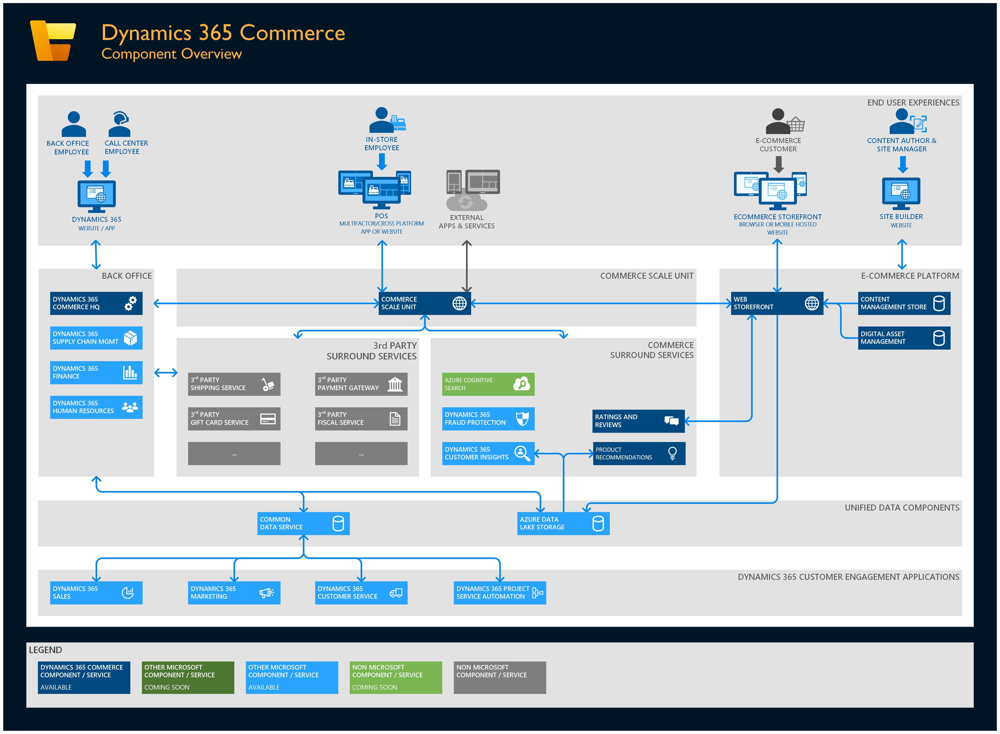

# Dynamics 365 Commerce architecture overview

[!include [banner](includes/banner.md)]

This article provides an overview of all components in the Microsoft Dynamics 365 Commerce ecosystem, including integration points to the suite of Dynamics 365 products. 

The following illustration shows an overview of Dynamics 365 Commerce components.

## Architecture benefits

### Omni-enabled headless commerce engine

The Commerce Scale Unit hosts the headless commerce engine. It serves as the central integration point for all commerce business logic, and powers a complete omni-channel solution across physical and digital stores. The Commerce Scale Unit is built by using a portable architecture, and allows for flexible hosting options across cloud, edge, and hybrid topologies. 

The headless commerce engine powers all native Dynamics 365 Commerce channels, including in-store and e-commerce channels. It also serves as the single integration point for third-party channel solutions. Therefore, those solutions can take advantage of the power of Dynamics 365 Commerce business logic and integration with other commerce-related services that are provided by Microsoft and independent software vendors (ISVs).

### Interconnected business processes

The platform that is shared among the various Dynamics 365 business applications, such as Dynamics 365 Commerce, Dynamics 365 Supply Chain Management, and Dynamics 365 Finance, provides a set of interconnected business processes that users can immediately benefit from. All back-office capabilities across these applications are built on the same web experience and data stores. Therefore, there is a seamless flow of business processes across various functions in the organization, but custom integrations across applications and services aren't required. The out-of-box integration between the headless commerce engine and the back office further expands the coverage of these interconnected business processes across the back office and commerce channels.

### Unified data

Dynamics 365 Commerce provides a unified data solution through out-of-the-box integrations with [Microsoft Dataverse](https://powerplatform.microsoft.com/dataverse/) and [Azure Data Lake Storage](/azure/storage/blobs/data-lake-storage-introduction). Integrations and data sharing across Dynamics 365 apps such as Dynamics 365 Sales and Dynamics 365 Marketing are supported through Microsoft Dataverse. Transactional data in Azure Data Lake Storage is used to power analytics and insight scenarios using various integrations.

### Powered by AI and analytics

Because of the accessible, persistent, up-to-date, and unified organizational data that is available in Data Lake Storage, the whole organization has a "single source of truth" that analytics, artificial intelligence (AI), and machine learning (ML) can be applied on top of. In this way, the organization can derive insights and get key performance indicators (KPIs) that can be used optimize and automate business processes across all channels.

#### Business and transactional analytical reports in POS and Commerce headquarters

The prepackaged set of business and transactional analytical reports in Commerce provides retailers with intelligent insights across all points of the Commerce ecosystem by embedding high-charts and SSRS-based reports in Store commerce point of sale (POS) systems and Commerce headquarters. The commerce analytics solution provides a comprehensive set of out-of-the-box business and transactional reports, enabling retailers to take avantage of insights across all channels.

The highcharts-based reports on POS are real-time, enabling store associates to analyze their channel's transactional and other POS activities at the conclusion of a transaction. This contrasts with the out-of-the-box reports in Commerce headquarters, which enable retailers to view analytical reports for transactional activity across all channels, once the data is synced. Commerce headquarters reports are specifically designed for channel managers who focus on sales performance to predict trends and uncover insights, allowing them to drill down in reports about organization-wide sales performance across global geography by employee, category, product, terminal, channel, and more.

## Component overview

### User experiences

#### Dynamics 365

Dynamics 365 is a collection of applications that together provide comprehensive and flexible enterprise resource planning (ERP) solutions for medium to large businesses. It provides an extensible framework and ecosystem that can be tailored to customer-specific requirements via an extensive set of partners. Dynamics 365 applications provide capabilities for their target business segments. They also take advantage of each other, and other Microsoft services and offerings, to provide solutions that help run customers' complex businesses.

#### POS

POS simplifies the experience for the retailers by providing Omnichannel solutions in emerging channels. These channels perform a variety of commerce business operations like cash and carry transactions, cash/shift management, customer engagement, assisted selling, clienteling, endless aisle, order processing/fulfillment, inventory management, and reporting.

#### Store Commerce app

The Store Commerce app is a cross-platform (Windows, iOS, and Android), multi–form factor (desktop, tablet, and phone) solution for all in-store first-line workers, such as cashiers, sales associates, stock clerks, and store managers. It can be deployed as an app that has offline capabilities. Alternatively, it can be deployed in the cloud and accessed through a web browser. The application is role-based and fully configurable from headquarters. It's also highly customizable, and can be extended or integrated into third-party services by using the Retail software development kit (SDK).

In addition to standard "cash and carry" transaction processing, Store Commerce includes features for assisted selling, clienteling, endless aisle, order processing/fulfillment, inventory management, cash/shift management, and reporting. For more information, see [Modern POS (MPOS) architecture](./dev-itpro/retail-modern-pos-architecture.md) and [Choose between Store Commerce app and Store Commerce for web](./mpos-or-cpos.md).

#### E-commerce storefront

The e-commerce storefront is the customer-facing website rendering system. It's built on the React.js framework, and uses a combination of server-side and client-side rendering to deliver responsive web experiences for one or more online channels. Although the storefront has a rich set of out-of-box capabilities, it's also highly customizable, and delivers an efficient and scalable solution for online business. For more information, see [Online store overview](./online-store-overview.md).

#### Site builder

Site builder is the web-based authoring interface for the content management and storefront website rendering systems. Visual page builder in site builder is a what-you-see-is-what-you-get (WYSIWYG) editor for site managers and content authors who perform the day-to-day workflow tasks of managing and producing the marketing content for the e-commerce experience. In site builder, a marketer can provide more marketing detail for specific products to enhance the shopping experience for consumers. In addition, site builder includes integrated accessibility reporting, URL management, site map generation, and image focal point management, among other features. For more information, see [Online store overview](./online-store-overview.md).

#### External services and apps

The headless commerce engine that is exposed via the Commerce Scale Unit lets partners and customers take advantage of all the same channel-side capabilities and business logic that are used by the out-of-box e-commerce and point of sale (POS) components. Therefore, by tapping into the same data and business process capabilities, it allows for seamless omni-channel capabilities across out-of-box channel components and partner-provided/customer-developed services and applications. It also provides access to all out-of-box and ISV-developed surround services that are available through the Commerce Scale Unit.

### Back office

#### Dynamics 365 Commerce headquarters

The Dynamics 365 Commerce application, which is often referred to as the Commerce headquarters component, provides back-office capabilities that enable the configuration of products, employees, business processes, and other functionality that is required for the business. It's also the application that call center workers use to provide assisted commerce-related workflows.

#### Dynamics 365 Supply Chain Management

[Dynamics 365 Supply Chain Management](https://dynamics.microsoft.com/supply-chain-management/overview/) provides functionality to help you manage your products throughout the supply chain lifecycle, from production, to inventory and warehouse, to transportation and distribution. For more information, see [Supply Chain Management documentation](../supply-chain/index.yml).

#### Dynamics 365 Finance

[Dynamics 365 Finance](https://dynamics.microsoft.com/finance/overview/) provides functionality to automatically manage your global finances. For customers of the Dynamics 365 Commerce application, Dynamics 365 Finance offers an integrated experience for managing stores and e-commerce financial statements alongside the rest of their operations. For more information, see [Dynamics 365 Finance help resources](../finance/index.yml).

#### Dynamics 365 Human Resources

[Dynamics 365 Human Resources](https://dynamics.microsoft.com/human-resources/overview/) lets businesses get a comprehensive view of their employee resources and manage them in a unified way. It provides integrated experiences from the hiring process through workforce planning and employee time management. For more information, see [Dynamics 365 Human Resources help resources](./index.md).

### Commerce Scale Unit

Retailers are distributed organizations, where the business topography can be represented as a hub and spoke model. Dynamics 365 Commerce supports this model by having head-office capabilities (the hub), and also many distributed channel components (the spokes) that can be deployed and self-managed in-store or in nearby Microsoft-managed Azure datacenters. The spokes are referred to as Scale Units, because they represent physical isolation (a function of scale) and an atomic unit of update.

To facilitate cloud and edge computing scenarios, a Commerce Scale Unit is available both as a software as a service (SaaS) component that is managed by Microsoft (Commerce Scale Unit in the Cloud) and as a self-managed component that can be deployed locally (self-hosted). A single environment can have a mixture of Commerce Scale Units (cloud and self-hosted). Therefore, organizations can tune their investments in operational overhead on a store-by-store basis by implementing network redundancy for poor connectivity. For more information, see [Select an in-store topology](./dev-itpro/retail-in-store-topology.md).

#### Commerce Scale Units (cloud)

Multiple Commerce Scale Units can be associated with each environment. Each Commerce Scale Unit can be independently serviced and updated, and each can serve one or more channels across one or more legal entities. Each Commerce Scale Unit can be deployed to any of the supported Azure regions, and multiple Commerce Scale Units can be deployed to the same region. The independent nature of each Commerce Scale Unit allows for phased rollout of updates across a collection of channels.

#### Commerce Scale Units (self-hosted)

The ability to bring the Commerce Scale Units to edge computing helps accommodate scenarios where internet connectivity is poor or unreliable. For retailers, this approach typically means having a physical footprint in their stores. By using a Commerce Scale Unit (self-hosted), retailers can bring the same business logic and capabilities that run in the Azure cloud into their stores. In these cases, although in-store connectivity is presumably more reliable, self-management of these components will involve additional overhead in terms of monitoring and updates. For more information, see [Select an in-store topology](./dev-itpro/retail-in-store-topology.md).

### E-commerce platform

#### Content management system

A fully featured content management system (CMS) is integrated directly into the e-commerce platform. In addition to rich indexing features, the CMS provides lifecycle management for marketing materials that supplement the product information that is managed by the headless commerce engine. It includes features for localization and multi-item publishing through releases. The system is built on top of a scalable, resilient Azure infrastructure that includes Azure Active Directory (Azure AD) and Azure Cosmos DB.

#### Digital asset management

Commerce digital asset management extends the content management store, and keeps track of images, videos, and file downloads that are served by the web storefront site. Its image resizer service optimizes downloaded images for different devices and contexts. In this way, it helps enhance performance while it also manages image quality. Digital asset management is also integrated with Azure Media Services for efficient playback of video streams.

#### Web storefront

The CMS stores its pages as a series of modules. The storefront web server assembles those modules into a rendered HTML page. The web storefront is composed of the rendering platform, the commerce data proxy, and the extensibility layer. Those components form a base that is supplemented by a set of modules that power a web-based commerce experience, the Dynamics 365 Commerce module library. The initial module library can be modified to meet each business's unique requirements. Alternatively, it can be supplemented by extensions and modules that are developed by a partner.

### Commerce surround services

#### Dynamics 365 Fraud Protection

[Dynamics 365 Fraud Protection](/dynamics365/fraud-protection/overview) is integrated into the e-commerce checkout flows that are managed and processed through the Commerce Scale Unit. The connection to the service is automatically provisioned with the Commerce Scale Unit, and customers who sign up for Dynamics 365 Fraud Protection can enable and configure the integration in Commerce headquarters. The service can run either in "evaluate" mode, so that you can assess the effectiveness of the service, or in "protect" mode, so that you can catch fraudulent transactions by using configured business rules. For more information, see [Dynamics 365 Fraud Protection integration with Dynamics 365 Commerce](./dev-itpro/dfp.md).

#### Dynamics 365 Customer Insights

Dynamics 365 Customer Insights helps you gain a deeper understanding of your customers by connecting data from various transactional, behavioral, and observational sources to create a 360-degree customer view and generate insights. Dynamics 365 Commerce makes it easy for retailers to enable the integration with Dynamics 365 Customer Insights and show the generated insights at the POS. These insights include churn probability and next best action, and they are valuable because they help sales associates have effective conversations with customers and deliver personalized shopping experiences to them. For more information, see [Dynamics 365 Customer Insights integration with Dynamics 365 Commerce](./clienteling-overview.md#integration-with-dynamics-365-customer-insights).

#### Azure cognitive search

[Azure Cognitive Search](/azure/search/search-what-is-azure-search) is integrated into Commerce to provide consistent product discovery and search experiences across all of the Commerce channels that use the Commerce Scale Unit (CSU). With integrated Azure Cognitive Search, customers can quickly find products by browsing categories, searching, and filtering. Improved product discoverability capabilities help retailers increase customer retention and conversion rates. Azure Cognitive Search also provides the scalability and performance required for e-commerce traffic. For more information, see the [Cloud powered search overview](./cloud-powered-search-overview.md) article.

#### Product recommendations

Dynamics 365 Commerce can be used to show product recommendations on the e-commerce website and POS devices. These product recommendations are items that a customer might be interested in, and they are based on the purchase trends of other customers in online and brick-and-mortar stores.

Product recommendations let customers easily and quickly find products that they might want to purchase, and cross-selling and upselling can be used to help customers find additional products that they didn't originally intend to buy. When recommendations are used to assist with product discovery, they can help create more conversion opportunities, increase sales revenue, and enhance customer satisfaction and retention. For more information, see [Product recommendations overview](./product-recommendations.md).

#### Ratings and reviews

The Commerce ratings and reviews solution lets online retail customers enter product reviews and ratings through the e-commerce storefront. Retailers can then show averaged ratings and review information across their e-commerce websites. Azure Cognitive Services offers automatic moderation of profane words in 40 languages, and because human approval isn't required, moderation costs are reduced. The system also offers moderator tools that can be used to respond to customer concerns, feedback, and take-down requests, and to address data requests from users. For more information, see [Rating and reviews overview](./ratings-reviews-overview.md).

### Unified data components

#### Azure Data Lake Storage

Customers who bring their own Azure Data Lake Storage accounts can take advantage of structured business data from back-office operations and clickstream data from the e-commerce storefront. This data flows back into intelligence services such as product recommendations, customer insights, and commerce analytics to power customer-centric business processes and user experiences. Those business processes and user experiences can then be embedded back into Dynamics 365 Commerce headquarters, the POS, and e-commerce storefronts. For more information, see [Make Entity store available as Data Lake](../fin-ops-core/dev-itpro/data-entities/entity-store-data-lake.md).

#### Dataverse

Dataverse is the unified data store that integrates the data from all your business applications. Dynamics 365 applications such as Dynamics 365 Sales, Dynamics 365 Customer Service, and Dynamics 365 Commerce use Dataverse to store business data. Therefore, Dataverse enables cross-business application scenarios, and can power new scenarios through Power Apps and Power Automate. For more information, see [What is Microsoft Dataverse?](/powerapps/maker/common-data-service/data-platform-intro).

## Additional resources

[Dynamics 365 Commerce authentication flows](arch-auth-flow.md)

[Azure Data Lake Storage](/azure/storage/blobs/data-lake-storage-introduction)

[Microsoft Dataverse](https://powerplatform.microsoft.com/dataverse/)

[Modern POS (MPOS) architecture](./dev-itpro/retail-modern-pos-architecture.md)

[Dynamics 365 Supply Chain Management](https://dynamics.microsoft.com/supply-chain-management/overview/)

[Dynamics 365 Human Resources](https://dynamics.microsoft.com/human-resources/overview/)

[Dynamics 365 Finance](https://dynamics.microsoft.com/finance/overview/)

[Dynamics 365 Fraud Protection](/dynamics365/fraud-protection/overview)

[Dynamics 365 Fraud Protection integration with Dynamics 365 Commerce](./dev-itpro/dfp.md)

[Dynamics 365 Customer Insights](/dynamics365/ai/customer-insights/overview)

[Azure Cognitive Search](/azure/search/search-what-is-azure-search)

[!INCLUDE[footer-include](../includes/footer-banner.md)]
