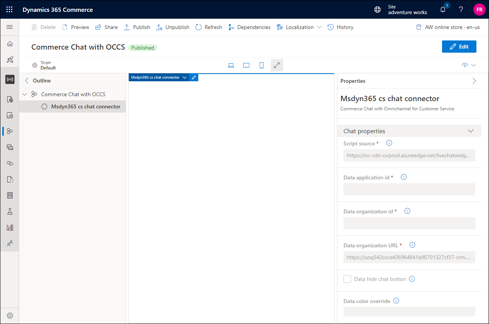
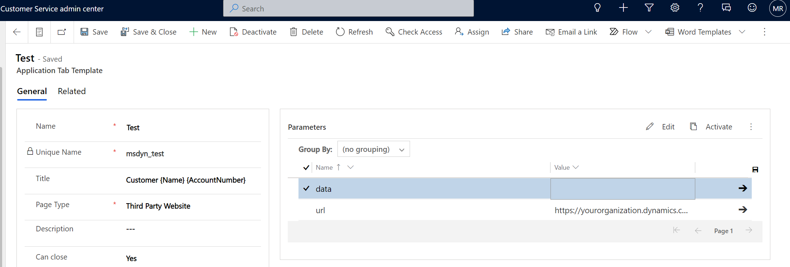

---
# required metadata

title: Commerce Chat with Omnichannel for Customer Service module
description: This article describes the Commerce Chat with Omnichannel for Customer Service module in Microsoft Dynamics 365 Commerce.
author: gvrmohanreddy
ms.date: 12/02/2022
ms.topic: article
audience: Application User, Developer, IT Pro
ms.reviewer: v-chgriffin
ms.search.region: Global
ms.author: mashneer
ms.search.validFrom: 2022-07-20

---

# Commerce Chat with Omnichannel for Customer Service module

[!include [banner](includes/banner.md)]

This article describes the *Commerce Chat with Omnichannel for Customer Service* module in Microsoft Dynamics 365 Commerce.

In the Commerce version 10.0.29 release, a new Commerce Chat with Omnichannel for Customer Service module has been added to the Commerce module library. The Commerce chat feature provides e-commerce customers with the chat capabilities of Dynamics 365 Omnichannel for Customer Service, which includes live agent support to help address customer queries, provide customer service, and facilitate sales for Commerce customers.

The Commerce chat feature enables retailers to achieve these goals:

- Increase personalized engagement with customers to help improve customer retention.
- Improve customer service through the integration of human agent and self-service chatbots.
- Help agents gain experience through real-time customer profile, order, and purchasing data that drives operational improvements and engagement.
- Improve overall customer satisfaction to help increase sales.

The following capabilities are available as part of the Commerce chat feature:

- Commerce Chat with Omnichannel for Customer Service
- The addition of **Commerce Call Center** as an application tab in the agent experience in Dynamics 365 Omnichannel for Customer Service

## Prerequisites for Omnichannel for Customer Service

As a prerequisite, you must configure chat in the Omnichannel for Customer Service Administration widget and obtain some of the parameters to configure the Commerce chat experience. For instructions, see [Configure a chat channel](/dynamics365/customer-service/set-up-chat-widget).

After you configure chat in the Omnichannel for Customer Service Administration widget, you'll get a script that resembles the following example.

``

Copy this script, because you'll need the values in it to configure the chat module.

### Commerce Chat with Omnichannel for Customer Service mandatory fields

The following table shows the script values from the Omnichannel for Customer Service Administration widget that are required to configure the Commerce Chat with Omnichannel for Customer Service module.

| Widget property | Description |
| ------------- |--------------|
| Script source | The value of **src** in the chat widget script. |
| Data application ID | The value of **data-app-id** in the chat widget script. |
| Data organization ID | The value of **data-org-id** in the chat widget script. |
| Data organization URL | The value of **data-org-url** in the chat widget script. |

## Configure the Commerce chat experience for your e-commerce site

One recommended way to implement the chat experience for your e-commerce site is to add the Commerce Chat with Omnichannel for Customer Service module to the shared header fragment that is used on your e-commerce site pages.

To add the chat module to your site's header fragment in Commerce site builder, follow these steps.

1. In site builder for your site, go to **Fragments**.
1. Select **New**.
1. In the **Select a fragment** dialog box, select the **Commerce Chat with Omnichannel for Customer Service** module, enter a name for the fragment, and then select **OK**.
1. In the outline view, select the **Msdyn365 cs chat connector** slot.
1. In the **Chat properties** pane on the right, follow these steps:

    1. In the **Script source** field, enter the **src** value that you obtained from the Omnichannel for Customer Service script.
    1. In the **Data application id** field, enter the **data-app-id** value that you obtained from the Omnichannel for Customer Service script.
    1. In the **Data organization id** field, the **data-org-id** value that you obtained from the Omnichannel for Customer Service script.
    1. In the **Data organization URL** field, enter the **data-org-url** value that you obtained from the Omnichannel for Customer Service script.

    

1. Select **Save**, select **Finish editing** to check in the fragment, and then select **Publish** to publish it.
1. Go to **Fragments**, and open the header fragment for your site.
1. In the **Default container** slot, select the ellipsis (**...**), and then select **Add fragment**.
1. In the **Select modules** dialog box, select the chat fragment that you created earlier, and then select **OK**.
1. Select **Save**, select **Finish editing** to check in the fragment, and then select **Publish** to publish it.

> [!NOTE]
> For a complete list of configuration parameters, see [Commerce chat module proactive chat parameters](chat-proactive-chat-parameters.md).

## Add Commerce headquarters as an application tab for Omnichannel for Customer Service

You can add an application tab for Commerce headquarters in Omnichannel for Customer Service. Live agents can then use the user interface for the Omnichannel for Customer Service agent experience to easily access the Dynamics 365 Commerce Customer Service module that contains contextual information for the customer together with their sales orders information. In addition, customer service agents can place new orders, initiate returns, and verify order status information.

### Create a new application tab that loads Commerce headquarters in an iFrame module 

To create a new application tab that loads Commerce headquarters in an iFrame module, follow these steps.

1. Open the [Power Apps Maker portal](https://make.powerapps.com).
1. In the navigation pane on the left, select **Apps**.
1. Select **Customer Service admin center**.
1. Go to **Agent experience**.
1. For **Application tab templates**, select **Manage**.
1. Create a new application tab of the **Third-party website** type. For instructions, see [Manage application tab templates](/dynamics365/app-profile-manager/application-tab-templates?tabs=customerserviceadmincenter).
1. Under **Parameters**, in the **Value** field of the **url** parameter, enter the following URL, where `<YourOrganizationHeadquartersURL>` and `<LegalEntityname>` are replaced with the appropriate values. Omnichannel customer service reads **{AccountNumber}** from the chat context. Therefore, leave **{AccountNumber}** as is.

    `https://<YourOrganizationHeadquartersURL>/?mi=MCRCustomerService&cmp=<LegalEntityName>&embedded=true&customerId={AccountNumber}`

1. Leave the **Value** field of the **data** parameter blank.

## Enable a new application tab for customer agents in Dynamics 365 Omnichannel for Customer Service

To enable a new application tab for customer agents in Dynamics 365 Omnichannel for Customer Service, follow these steps.
	
1. Open the [Power Apps Maker portal](https://make.powerapps.com).
1. In the navigation pane on the left, select **Apps**.
1. Select **Customer Service admin center**.
1. Go to **Customer support \> Workstreams**.
1. Open the workstream that you've created for your agents, and then, under **Advanced settings**, select **Sessions default**.
1. Under **Application Tabs**, select **Add Existing Application Tab**, and then add the new application tab that you created earlier. This step ensures that an application tab that loads Commerce headquarters in an iFrame module will appear when an agent receives an incoming chat call from your e-commerce website.

> [!NOTE]
> You can't modify the default chat session template in the workstream. Therefore, you might want to create a new template or duplicate the existing template to update it. For more information, see [Associate templates with workstream](/dynamics365/app-profile-manager/associate-templates).

## Add context variables in Dynamics 365 Omnichannel for Customer Service

To add context variables in Dynamics 365 Omnichannel for Customer Service, follow these steps.

1. Open the [Power Apps Maker portal](https://make.powerapps.com).
1. In the navigation pane on the left, select **Apps**.
1. Select **Customer Service admin center**.
1. Go to **Customer support \> Workstreams**.
1. Open the workstream that you've created for your agents, and then, under **Advanced settings**, go to the **Context variable** section.
1. Select **Edit**, and then add **AccountNumber** as a context variable of the **text** type. This variable will help Commerce headquarters load customer information with matching account numbers.

> [!NOTE]
> If you want to read the email addresses and names of signed-in users from an e-commerce channel, you can add **Email** and **Name** as context variables of the **text** type, in addition to the **AccountNumber** context variable.

## Update Content Security Policy (CSP) in site builder

To update Content Security Policy (CSP) for your site in site builder, follow these steps.

1. In site builder, select the site you're working on.
1. Select **Site Settings \> Extensions**.
1. On the **Content security policy** tab, add `https://oc-cdn-ocprod.azureedge.net` as a new entry to the following directives:
    - Child-src
    - Connect-src
    - Font-src
    - Frame-ancestors
    - Frame-src
    - Img-src
    - Media-src
    - Object-src
    - Script-src
    - Style-src
1. Select **Save and Publish**.

For more information, see [Manage Content Security Policy (CSP)](manage-csp.md).

## Additional resources

[Commerce chat features overview](commerce-chat-overview.md)

[Commerce Chat with Power Virtual Agents module](chat-module-pva.md)

[Commerce chat module proactive chat parameters](chat-proactive-chat-parameters.md)

[Manage Content Security Policy (CSP)](manage-csp.md)
