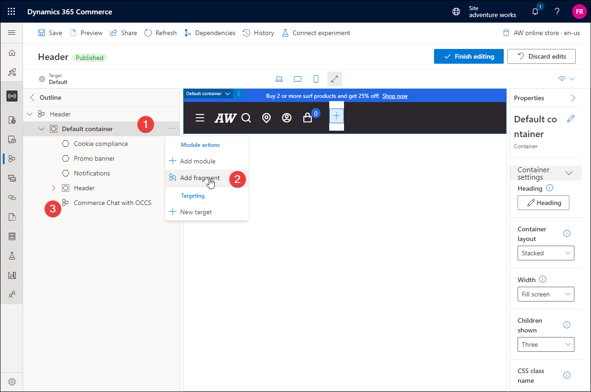

---
# required metadata

title: Commerce Chat with Omnichannel for Customer Service module
description: This article describes the Commerce Chat feature for online shoppers in Microsoft Dynamics 365 Commerce.
author: gvrmohanreddy
ms.date: 08/03/2022
ms.topic: article
audience: Application User, Developer, IT Pro
ms.reviewer: v-chgriffin
ms.search.region: Global
ms.author: gmohanv
ms.search.validFrom: 2022-07-20
---

# Commerce Chat with Omnichannel for Customer Service module

[!include [banner](includes/banner.md)]
[!include [banner](includes/preview-banner.md)]

This article describes the Commerce Chat feature for online shoppers in Microsoft Dynamics 365 Commerce.

With Commerce Chat, Dynamics 365 Commerce is empowering e-commerce customers with the chat capabilities of Dynamics 365 Omnichannel for Customer Service. Omnichannel for Customer Service includes live agent support to help address customer queries, provide customer service, and facilitate sales for Commerce customers. 

The Commerce Chat feature enables retailers to:

- Increase personalized engagement with their customers that can result in improved customer retention.
- Augment customer service with integration of human agent and self-service chatbots.
- Garner agent experience with real-time customer profile, order, and purchasing data that drives operational improvements and engagement.
- Improve overall customer satisfaction which can lead to an increase in sales.
 
The following capabilities are available as part of the Commerce Chat feature:

 - Commerce Chat with Omnichannel for Customer Service
 - Addition of Commerce Call Center as an application tab to the agent experience in Dynamics 365 Omnichannel for Customer Service.

## Prerequisites for Omnichannel for Customer Service 

As a prerequisite, you must configure chat in the Omnichannel for Customer Service Administration module and obtain some of the parameters to configure the Commerce Chat experience. For instructions, see [Configure a chat channel](/dynamics365/customer-service/set-up-chat-widget).

Once you've configured chat within the Omnichannel for Customer Service administration module, you will have a script similar to to that in the following example. Copy the script for later use because values from the script are required to configure the Commerce Chat module. 

``

## Configure the Commerce Chat experience for your e-commerce site 

Starting with the Commerce version 10.0.29 release, a new **Commerce Chat with Omnichannel for Customer Service** module was added to the Commerce module library. One of the recommended approaches to add the chat module to your site pages is to add the module to the shared header fragment. 

To add the chat module to your site's header fragment in Commerce site builder, follow these steps.

1. Go to **Home \> Sites**.
1. Select the name of your site.
1. Go to **Fragments \> Create a new fragment** and module **Commerce Chat with Omnichannel for Customer Service**.
1. Fill the mandatory properties using the information from prerequisites step above. 
1. **Publish** newly created fragment.
1. Open header fragment for your site. 
1. Edit header fragment and add the newly created fragment within the header fragment.

## Commerce Chat with Omnichannel for Customer Service mandatory fields

| Module property| Description  |
| ------------- |--------------|
| Script source | From the chat-widget script source, locate **src** and use its value for this property. |
| Data application id      | From the chat-widget script source, locate **data-app-id** and use its value for this property. |
| Data organization id      | From the chat-widget script source, locate **data-org-id** and use its value for this property. |
| Data organization url     | From the chat-widget script source, locate **data-org-url** and use its value for this property. |

## Commerce headquarters as an application tab for Omnichannel for Customer Service

Commerce Headquarters as an application tab for Omnichannel for Customer Service enables live agents using Omnichannel for Customer Service agent experience user interface to easily access Dynamics 365 Commerce Customer Service module with contextual information for the customer along with their sales orders information. It also enables customer service agents to place new orders, perform returns and verify order status information. 

## Create a new application tab that loads Commerce headquarters in an iFrame module 

To create a new application tab that loads Commerce headquarters in an iFrame module, follow these steps.

1. Go to Power Apps Make Portal and select **Apps** from the left-hand navigation bar.
1. In **Customer Service admin center**, go to **Agent experience \>  Workspaces**.
1. Select **Manage** for **Application tab templates**. 
1. Create a new application tab of type **Third-party website** by following the documentation at [Manage application tab templates](/dynamics365/app-profile-manager/application-tab-templates?tabs=customerserviceadmincenter).
1. Under **Parameters**  give **URL** as `https://<YourOrganizationHeadquartersURL>/?mi=MCRCustomerService&cmp=<LegalEntityName>&embedded=true&customerId={AccountNumber}`.  Replace `<YourOrganizationHeadquartersURL>` and `<LegalEntityname>` with the appropriate values. Omnichannel customer service reads {AccountNumber} from the chat context, so leave {AccountNumber} as is.
1. Give **data** as  empty.

## Enable a new application tab for customer agents in Dynamics 365 Omnichannel for Customer Service

To enable a new application tab for customer agents in Dynamics 365 Omnichannel for Customer Service, follow these steps.
	
1. Go to Power Apps Make Portal.
1. In the **Customer Service admin center**, go to **Customer support \> Workstreams**.
1. Open the workstream you've created for your agents, then under **Advanced settings** then select sessions default. 
1. Under **Application Tabs**, select **Add Existing Application Tab** then add the new application tab you've created above.
1. This will ensure that an application tab appear and loads Dynamics 365 Commerce Headquarter in iFrame, when agent receives incoming chat call from e-Commerce website.  

## Add context variables in Dynamics 365 Omnichannel for Customer Service

To add context variables in Dynamics 365 Omnichannel for Customer Service, follow these steps.

1. Go to Power Apps Make Portal.
1. In **Customer Service admin center**, go to **Customer support \>  Workstreams**.
1. Open the workstream you've created for your agents, then under **Advanced settings** go to **Context variable** section. 
1. Select **Edit**, and then add **AccountNumber** as a context variable of type **text**. This will help Commerce headquarters load customer information with matching account numbers. 

> [!NOTE] 
> In addition to AccountNumber, If you want to read the Email and Name from e-Commerce channel, for signed-in users, you can add Email and Name as context variables with text type. 

