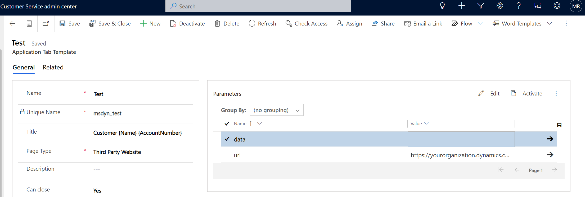

---
# required metadata

title: Commerce Chat for online shoppers with Dynamics 365 Omnichannel Customer Service
description: This article describes the commerce chat feature for online shoppers by integrating Dynamics 365 Commerce with Dynamics 365 Omnichannel Customer Service.
author: gvrmohanreddy
ms.date: 07/20/2022
ms.topic: article
audience: Application User, Developer, IT Pro
ms.reviewer: v-chgriffin

ms.search.region: Global
# ms.search.industry: 
ms.author: gmohanv
ms.search.validFrom: 2022-07-20
---

# Dynamics 365 Commerce & Dynamics 365 Omnichannel Customer Service 

With Commerce Chat, we are empowering Dynamics 365 e-Commerce customers to leverage chat capabilities of Dynamics 365 Omnichannel for Customer Service with live agent support to address customer queries, enable customer service and sales for commerce customers. 

This feature enables retailers to

	1.  Increase personalized engagement with their consumers and better retention.
	2.  Increase customer service with integration of human agent and self-service chatbots
	3.  Increase agent experience with real-time customer profile, order, and purchasing data driving operational improvements and engagement.
	4.  Increase overall customer satisfaction thus increase in sales.
 

Following capabilities are available as part of this feature

 - Commerce Chat with Omnichannel for Customer Service.
 - Enabling Commerce Call Center as an application tab for agent's experience in Dynamics 365 Omnichannel for Customer Service.

### Prerequisites within Omnichannel for Customer Service 

As a pre-requisite, you need to [configure chat](https://docs.microsoft.com/en-us/dynamics365/customer-service/set-up-chat-widget) in Omnichannel for Customer Service Administration module and obtain some of the parameters to configure the chat experience. 

Once chat has been configured within Omnichannel for Customer Service administration, you can obtain a script similar to below. Copy it to notepad as values from this are needed for configuration of Commerce Chat module. 

## Configure Chat experience in your e-Commerce site 
Starting from Dynamics 365 Commerce 10.0.29 release, a new module called **Commerce Chat with Omnichannel for Customer Service** is added to SSK.  To configure a site to show chat module, follow these steps.

	1. In Site Builder, go to Home > Sites.
	2. Select the name of your site.
	3. Go to Fragments > Header fragment. It's recommended to add it in the header module. 
	4. Add module **Commerce chat with omnichannel for customer service**.
	5. Fill the following mandatory properties using the information from prerequisites step above. 
	
| Chat module property| Description  |
| ------------- |:--------------:|
| Script source | from the chat-widget script source locate **src** and use its value for this property|
| Data application id      | from the chat-widget script source locate **data-app-id** and use its value for this property|
| Data organization id      | from the chat-widget script source locate **data-org-id** and use its value for this property|
| Data organization url     | from the chat-widget script source locate **data-org-url** and use it's value for this property|

# Commerce Headquarters as an application tab for Omnichannel for Customer Service

Commerce Headquarters as an application tab for Omnichannel for Customer Service enables live agents using Omnichannel for Customer Service agent experience user interface to easily access Dynamics 365 Commerce Customer Service module with contextual information for the customer along with their sales orders information. It also enables customer service agents to place new orders, perform returns and verify order status information. 

## Steps to create a new application tab that loads Commerce Headquarters in iFrame. 
	1. Go to Power Apps Make Portal and select **Apps** from the left-hand navigation bar.
	2. In **Customer Service admin center**  Navigate to **Agent experience** >  **Workspaces**.
	3. Click **Manage** for  **Application tab templates**. 
	4. Create a new application tab of type **Third-party website** by following the documentation at **[Manage application tab templates](https://docs.microsoft.com/en-us/dynamics365/app-profile-manager/application-tab-templates?tabs=customerserviceadmincenter)**
	5. Under **Parameters**  give **URL** as **https://<YourOrganizationHeadquartersURL>/?mi=MCRCustomerService&cmp=<LegalEntityName>&embedded=true&customerId={AccountNumber}**.  Replace <YourOrganizationHeadquartersURL> and <LegalEntityname> with appropriate values.  Omnichannel Customer Service reads {AccountNumber} from the chat context, so leave {AccountNumber} as is.
	6. Give **data** as  empty.

## Steps to enable new application tab for customer agent in D365 Omnichannel for Customer Service.
	1. Go to Power Apps Make Portal.
	2. In **Customer Service admin center**  Navigate to **Customer support** >  **Workstreams**.
	3. Open the workstream you've created for your agents, then under **Advanced settings** then click on sessions default. 
	4. Under Application Tabs, click **Add Existing Application Tab** then add the new application tab you've created above.
	5. This will ensure that an application tab appear and loads Dynamics 365 Commerce Headquarter in iFrame, when agent receives incoming chat call from e-Commerce website.  

## Steps to add context variables in D365 Omnichannel for Customer Service.

	1. Go to Power Apps Make Portal.
	2. In **Customer Service admin center**  Navigate to **Customer support** >  **Workstreams**.
	3. Open the workstream you've created for your agents, then under **Advanced settings** go to **Context variable** section. 
	4. Click **Edit** to add **AccountNumber** as context variable of type **text**.  This will help Commerce Headquarters loading customer information with matching AccountNumber. 

> [!Note] 
>In addition to AccountNumber, If you want to read the Email and Name from e-Commerce channel, for signed-in users, you can add Email and Name as context variables with text type. 

