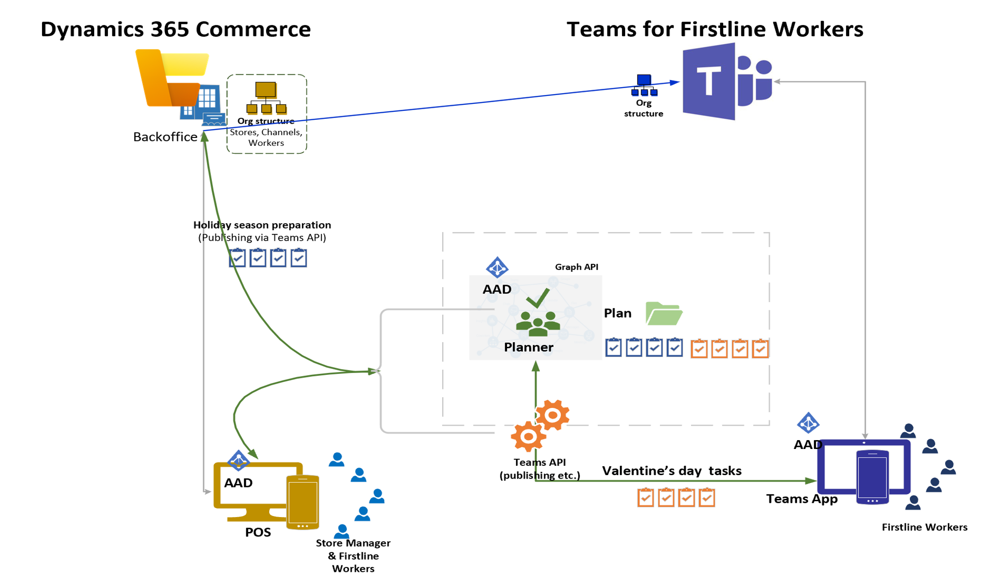

# Dynamics 365 Commerce and Microsoft Teams integration overview

[!include [banner](includes/banner.md)]

This article presents an overview of Microsoft Dynamics 365 Commerce and Microsoft Teams integration.

Dynamics 365 Commerce is integrating with Teams to help customers and their employees improve productivity by synchronizing task management between the two applications. The seamless task management that Commerce and Teams integration provides lets store managers and employees create task lists, assign tasks to multiple stores, and track the status of tasks across stores, from either application.

Commerce and Teams integration is available as of the Commerce version 10.0.18 release.

## Key features

Here are some of the key features that the Commerce and Microsoft Teams integration provides:

- Provision Teams by taking advantage of well-defined information from Commerce, such as the organizational structure and information about stores, workers, permissions, and business context.
- Easily synchronize ongoing changes (for example, the addition of new stores or hiring of new employees) between Commerce and Teams, but keep Commerce as the master source of organizational structure data.
- Integrate task management between Commerce and Teams to help store workers, store managers, regional managers, and communications managers handle task management from either application.

## Prerequisites for using integration features

The following prerequisites must be in place before you can start to use Microsoft Teams integration features:

- Microsoft 365 Business Standard License (includes Teams.).
- Microsoft Entra accounts for all store managers and workers.
- Point of sale (POS) systems that are configured with Microsoft Entra authentication.

## Conceptual architecture

The following illustration shows the conceptual architecture of Dynamics 365 Commerce and Microsoft Teams integration, using a San Francisco store as an example. Both Teams and the Commerce POS application use Microsoft Planner as a repository so that tasks that are published from Teams appear in the POS application and improvised tasks that are created by store managers in the POS application appear in Teams, resulting in a seamless task management experience between the applications.    

## Additional resources

[Enable Dynamics 365 Commerce and Microsoft Teams integration](enable-teams-integration.md)

[Provision Microsoft Teams from Dynamics 365 Commerce](provision-teams-from-commerce.md)

[Synchronize task management between Microsoft Teams and Dynamics 365 Commerce POS](synchronize-tasks-teams-pos.md)

[Manage user roles in Microsoft Teams](manage-user-roles-teams.md)

[Map stores and teams if there are pre-existing teams in Microsoft Teams](map-stores-existing-teams.md)

[Dynamics 365 Commerce and Microsoft Teams integration FAQ](teams-integration-faq.md)
