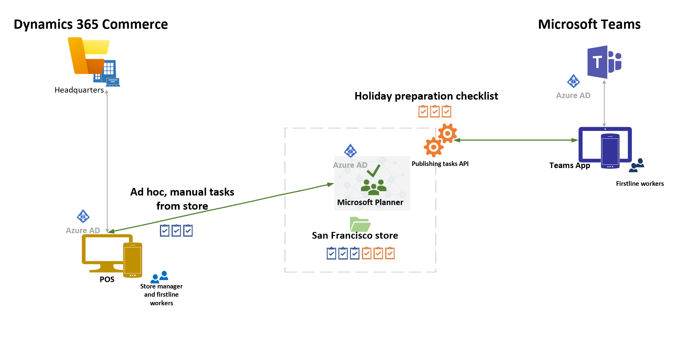

---
# required metadata
title: Dynamics 365 Commerce and Microsoft Teams integration
description: This topic presents an overview of Microsoft Dynamics 365 Commerce and Microsoft Teams integration.
author: gvrmohanreddy
manager: annbe
ms.date: 03/12/2021
ms.topic: article
ms.prod: 
ms.service: dynamics-365-commerce
ms.technology: 
# optional metadata
# ms.search.form: 
#ROBOTS: 
audience: Application User
# ms.devlang: 
ms.reviewer: v-chgri
ms.search.scope: Retail, Core, Operations
# ms.tgt_pltfrm: 
# ms.custom: 
ms.search.region: Global
# ms.search.industry: 
ms.author: gmohanv
ms.search.validFrom: 2021-01-15
ms.dyn365.ops.version: 10.0.18
---

# Dynamics 365 Commerce and Microsoft Teams integration

[!include [banner](includes/banner.md)]
[!include [banner](includes/preview-banner.md)]

This topic presents an overview of Microsoft Dynamics 365 Commerce and Microsoft Teams integration.

Dynamics 365 Commerce is integrating with Teams to help customers and their employees improve productivity by synchronizing task management between the two applications. The seamless task management that Commerce and Teams integration provides lets store managers and employees create task lists, assign tasks to multiple stores, and track the status of tasks across stores, from either application.

Commerce and Teams integration is available as of the Commerce version 10.0.18 release.

## Key features

Here are some of the key features that the Commerce and Microsoft Teams integration provides:

- Provision Teams by taking advantage of well-defined information from Commerce, such as the organizational structure and information about stores, workers, permissions, and business context.
- Easily synchronize ongoing changes (for example, the addition of new stores or hiring of new employees) between Commerce and Teams, but keep Commerce as the master source of organizational structure data.
- Integrate task management between Commerce and Teams to help store workers, store managers, regional managers, and communications managers handle task management from either application.

## Prerequisites for using integration features

The following prerequisites must be in place before you can start to use Microsoft Teams integration features:

- Microsoft 365 Business Standard License (This license includes Teams.)
- Azure Active Directory (Azure AD) accounts for all store managers and workers
- Point of sale (POS) systems that are configured with Azure AD authentication

## Conceptual architecture

The following illustration shows the conceptual architecture of Commerce and Microsoft Teams integration.

## Additional resources

[Provision Microsoft Teams from Dynamics 365 Commerce](provision-teams-from-commerce.md)

[Synchronize task management between Microsoft Teams and Dynamics 365 Commerce POS](synchronize-tasks-teams-pos.md)

[Enable Dynamics 365 Commerce and Microsoft Teams integration](enable-teams-integration.md)

[Manage user roles in Microsoft Teams](manage-user-roles-teams.md)
