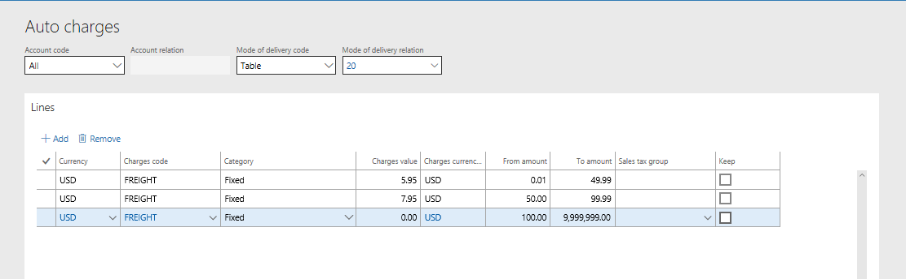
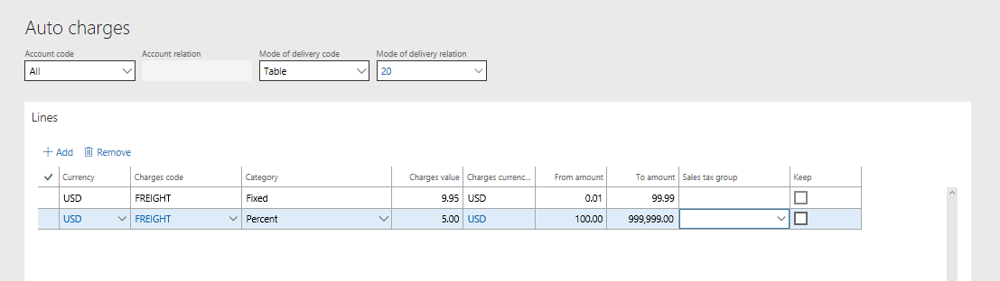

# Configure call center delivery modes and charges

[!INCLUDE [banner](includes/banner.md)]

This article describes how to set up modes of delivery and charges for a call center order in Microsoft Dynamics 365 Commerce.

When a sales order is placed in Dynamics 365 Commerce, if the person who entered the sales order is linked to a call center channel, logic and rules are used to validate the mode of delivery (delivery mode) and calculate charges for the order.

When you create a sales order, you can select a delivery mode on the sales order header and the sales order lines. By default, the delivery mode that you select on the header is used for all sales order lines. However, you can override the default delivery mode on individual sales lines as you require. You can also define a delivery mode on a customer record. Then, when orders are created for the customer, that delivery mode is used by default on the sales order header.

Commerce has capabilities that let users limit the delivery modes that can be used by a channel, the delivery modes that can be used for a product, and the delivery modes that are valid for specific shipping destinations. Charges can also be defined so that additional fees are added to a customer's order, based on the delivery modes that are selected for the sales order and the total order value.

## Define delivery modes

Before you specify which delivery modes can be used for call center orders, and define the associated rules and charges, you must define the delivery modes. Go to **Sales and marketing \> Setup \> Distribution \> Modes of delivery**. Select **New** to create a new delivery mode. Alternatively, select an existing delivery mode in the list, and then select **Edit** to make changes.

In the **Mode of delivery** field, you can enter any combination alphanumeric characters, based on your business requirement. You can then use the **Description** field to provide additional context. The **Charges group** and **Expedite** fields are optional and will be explained in more detail later in this article.

On the **Commerce channels** FastTab, add any channel that should be allowed to use the delivery mode when sales transactions are created in that channel.

On the **Products** FastTab, you can specify which products and/or product categories the delivery mode can and can't be used for. For example, if a product can't be shipped by air because of hazardous material (hazmat) restrictions, make sure that the product or product category is excluded from all delivery modes that involve air transportation.

On the **Addresses** FastTab, you can specify which countries or regions, or states, the delivery mode can and can't be used for. For example, orders that are shipped to Hawaii or Alaska aren't eligible for ground delivery. Therefore, these states should be excluded from any delivery mode that is associated with a ground delivery service but included in any delivery mode that is associated with an air delivery service.

## Validate delivery modes for a call center order

After the delivery modes are defined, you must run the **Process delivery modes** batch job. This job makes the delivery modes available so that they can be used in sales order processes for channels. To run the **Process delivery modes** job, go to **Retail and Commerce \> Retail and Commerce IT \> Process delivery modes**. This job should be run any time that new delivery modes are added to a channel or changes are made to existing delivery mode/channel relationships.

After you run the **Process delivery modes** batch job, you can go to **Retail and Commerce \> Channels \> Call centers \> All call centers**. On the **All call centers** page, on the Action Pane, on the **Set up** tab, select **Modes of delivery**. The **Modes of delivery** page lists all the valid delivery modes for the selected call center channel. To edit existing delivery modes or add new delivery modes, select **Manage modes of delivery**. Note that the **Process delivery modes** job must be run whenever changes are made.

## Define charges for delivery services

When sales orders are created for customers, a company might want to add charges that are automatically calculated based on the delivery modes that are selected for the order. These charges can be configured so that they are the same for all customers and delivery modes. Alternatively, the charges can vary, depending on the customer and/or the delivery modes that are selected for the sales order.

To define the charges, go to **Retail and Commerce \> Channel setup \> Charges \> Auto charges**. Select **New** to add new charges. Alternatively, select an existing entry, and then select **Edit**.

Charges can be defined so that they are calculated at the level of either the order header or the order lines. Use the **Level** field to select the level desired.

Charges can be defined for a specific customer, a group of customers, or all customers. In the **Account code** field, select **Table** to define charges that are applied only to a specific customer. Select **Group** to define charges for a specific customer group. Select **All** to apply the charges to every customer who places a sales order that uses the related delivery mode. If you selected **Table** or **Group** in the **Account code** field, select the customer or customer group in the **Account relation** field.

Charges can be configured so that they are applied for a specific delivery mode, a delivery mode group, or all delivery modes. If you select **Table** in the **Mode of delivery code** field, you must select a specific delivery mode in the **Mode of delivery relation** field. If you select **Group**, you must select a delivery mode group in the **Mode of delivery relation** field. Delivery mode groups are defined at **Retail and Commerce \> Channel setup \> Charges \> Delivery charges group**. They can then be linked to one or more delivery modes on the **Modes of delivery** page. If you select a group when you define charges, any delivery mode that is linked to the selected delivery group uses those charges. Finally, if you select **All** in the **Mode of delivery code** field, all delivery modes use the charges. Therefore, you don't select a value in the **Mode of delivery relation** field.

In the **Lines** section, you can define one or more charges by currency, as you require. Charges must be linked to a charges code that defines the financial posting rules for the charge. The **Category** field is used to define how charges are calculated. For example, if customers should be charged a flat rate of $9.95 to have an order shipped by a specific delivery mode, use the **Fixed** category. If the business decides to charge customers a percentage of the order total to cover the delivery charges, use the **Percent** category. The actual charge to the customers is defined in the **Charges value** field.

Companies often configure tiered charges. In this case, the amount that customers pay for delivery is based on the order value. To configure tiered charges, enter values in the **From amount** and **To amount** fields in addition to defining the charge itself in the **Charges value** field. For example, for orders that have a value that is less than $50, a retailer charges $5.95 for ground shipping. For orders that have a value that is equal to or more than $50, but less than $100, the retailer charges $7.95. Finally, for orders that have a value that is equal to or more than $100, the retailer provides free shipping. The following illustration shows the configuration of these charges.

You can use a mixture of categories for charges, depending on your business requirements. For example, for all orders that have a value that is less than $100, there is a fixed charge of $9.95 for shipping. Then, for orders that have a value that is equal to or more than $100, delivery charges are calculated at a rate of 5 percent of the order value. The following illustration shows the configuration of these charges.

## Apply delivery modes during order entry in a call center

When a new sales order is created, a value must be specified in the **Mode of delivery** field on the **Delivery** FastTab of the sales order header. This field might be filled in automatically, based on default values from the customer record.

The delivery mode that is defined on the order header is automatically copied to the sales order lines as they are created. However, you can change the delivery mode setup for a specific line item on the **Delivery** tab in the **Line details** section of the sales order entry page.

If the selected delivery mode isn't valid for the product or the delivery address that is defined for the order or order line, you receive an error message. You must then select a delivery mode that has been defined to support that product or address configuration.

## Calculation of delivery charges during entry of order

If the **Enable order completion** setting is turned on for your call center channel, shipping charges are automatically calculated for sales orders when users select **Complete**. The following message appears at the top of the **Sales order summary** page: "Tiered charges calculated." The charges that are calculated are added to the value of the **Sales total** field. On the **Amount** FastTab, the **Charges** field shows the total amount of all charges that have been calculated for the order and lines. To see a more detailed breakdown of the charges, select **Order** on the **Sales order summary** page, and then select the **Charges** option to view, add, or edit the charges. Note that the calculation of delivery charges on the order header is based on the delivery mode that is linked to the header. Line-level delivery charges are calculated based on the delivery mode that is configured for the sales line. If multiple delivery modes are used on different lines, multiple charges might be applied and added together. The total amount is then shown in the **Charges** field on the **Sales order summary** page.

If the **Enable order completion** setting is turned off, users must manually trigger the calculation of charges. On the **Sales order** page, on the Action Pane, on the **Sell** tab, in the **Calculate** group, select **Tiered charges**. The "Tiered charges calculated" message appears. You can then select the **Charges** option on the **Sell** tab to view, edit, or delete the calculated charges.

## Use expedited delivery modes on call center orders

You can optionally link an expedite code to any delivery mode that you configure. This code is used as a prioritization sorting and reporting tool. It doesn't currently cause additional fees to be applied to the order. To set up expedite codes, go to **Sales and marketing \> Setup \> Distribution \> Expedite codes**.

For example, for orders that will be shipped by next-day air, picking must be done in the warehouse by 1 PM every day. In this case, an expedite code can be created, and that code can be linked to any next-day delivery mode that is configured in the system. When the warehouse creates its pick wave, the appropriate expedite code in the **Expedite** field can be used as a filter, so that picking is run only for orders that have delivery modes that are linked to that code.

Additionally, when a call center order is entered, an expedite code can be manually applied either to the sales order header or to an individual sales order line. Again, the code can be used for sorting or reporting purposes. Sometimes, an order must be handled carefully because of a customer service issue. In this case, a specific expedite code can be applied to the order header or lines to help identify and prioritize the order during the fulfillment process.

[!INCLUDE[footer-include](../includes/footer-banner.md)]
