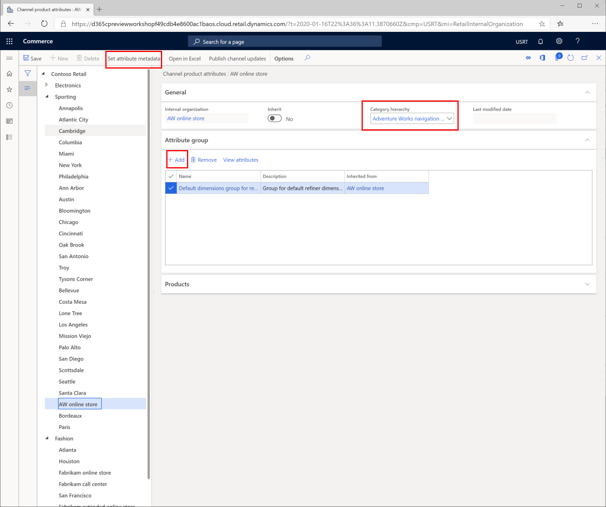
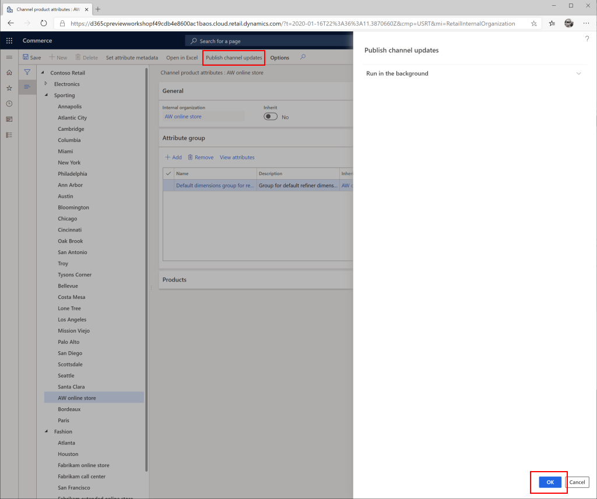

# Configure a channel to use a channel navigation hierarchy

[!include [banner](includes/banner.md)]

This article describes how to configure a channel to use a channel navigation hierarchy in Microsoft Dynamics 365 Commerce.

Channel navigation hierarchies organize products into categories so that the products can be browsed on an e-commerce site or at the point of sale (POS). Retail and online channels must be configured with channel navigation hierarchies.

## Configure the channel

To configure a channel to use a channel navigation hierarchy, follow these steps.

1. In Commerce headquarters, go to **Modules \> Retail and commerce \> Channel setup \> Channel categories and product attributes**.
1. Select the channel to configure.
1. On the action pane, select **Set attribute metadata**.
1. In the **Category hierarchy** drop-down list, select the appropriate channel navigation hierarchy.
1. On the action pane, select **Save**.
1. Under **Attribute group**, add any attribute groups that will be global attributes for all nodes.

The following image shows how to configure a channel to use a channel navigation hierarchy.

## Set attribute metadata

Setting the attribute metadata will allow configuration of attributes on each node.

To set attribute metadata, follow these steps.

1. In Commerce headquarters, on the action pane, select **Set attribute metadata**.
1. For each node select **Channel product attributes**.
1. Set **Show attribute on channel** to **Yes** and **Can be refined** to **Yes**, to enable refiners on that channel.
1. After configuring each node as desired, on the **Action pane**, select the **Save** button to save.
1. Select the **X** in the top right corner to exit this screen back to the **Channel categories and product attributes** page.

The following image shows an example set of channel product attributes configured on a channel category node.

## Publish changes

For changes to take effect, you will need to publish the changes.

To publish changes, follow these steps.

1. In Commerce headquarters, on the action pane, select **Publish channel updates**.
1. In the **Publish channel updates** pane, select **OK**.

The following image shows how to publish channel updates.

## Configure the distribution schedule job

To configure the distribution schedule job to push changes to channel databases, follow these steps.

1. In Commerce headquarters, go to **Retail and Commerce \> Retail and Commerce IT \> Distribution schedules**.
1. Run the **1040 (Products)** and **1150 (Catalog)** jobs.

## Additional resources

[Create a channel navigation hierarchy](create-channel-hierarchy.md)

[!INCLUDE[footer-include](../includes/footer-banner.md)]
