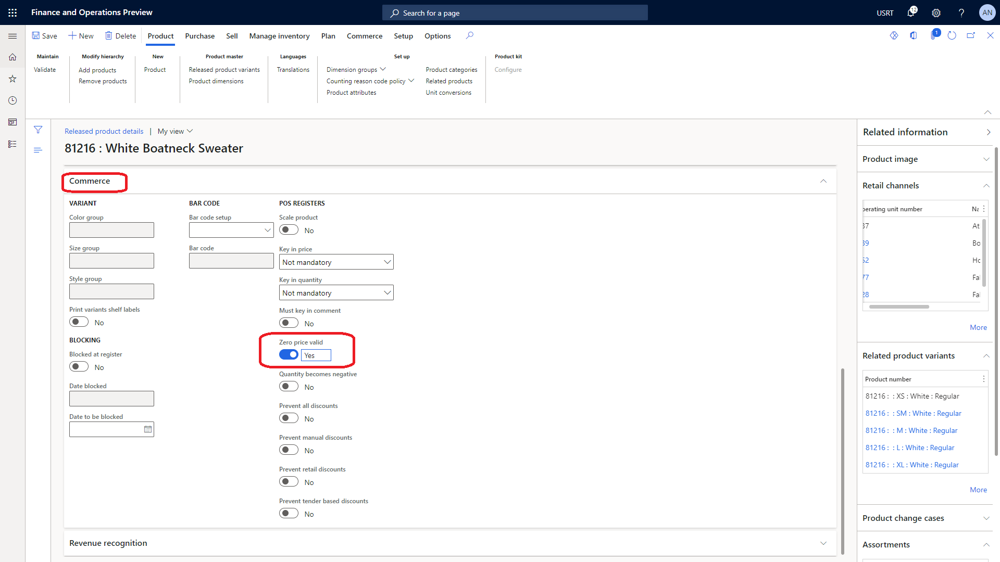

---
# required metadata

title: Configure a product to be purchased for free
description: This topic describes how to configure a product so that it can be purchased for free in Microsoft Dynamics 365 Commerce.
author:  anupamar-ms
ms.date: 10/27/2021
ms.topic: article
ms.prod: 
ms.technology: 

# optional metadata

# ms.search.form: 
# ROBOTS: 
audience: Application User
# ms.devlang: 
ms.reviewer: v-chgri
# ms.tgt_pltfrm: 
ms.custom: 
ms.assetid: 
ms.search.region: Global
ms.search.industry: 
ms.author: anupamar
ms.search.validFrom: 2019-10-31
ms.dyn365.ops.version: 
---

# Configure a product to be purchased for free

[!include [banner](includes/banner.md)]

This topic describes how to configure a product so that it can be purchased for free in Microsoft Dynamics 365 Commerce.

## Configure the product

To sell a product for free in Dynamics 365 Commerce, you must set its price to 0 (zero). Additionally, you must configure the product's **Zero price valid** setting.

To configure the **Zero price valid** setting in Commerce headquarters, follow these steps.

1. Go to **Retail and Commerce \> Products and categories \> Released products by category**.
1. Go to the product that you want to sell for free. 
1. In the **Commerce** section of the product page, set the **Zero Price Valid** option to **Yes**.

The following illustration shows an example of a product where the **Zero price valid** option is set to **Yes**.

## Configure the online store's functionality profile

Before free transactions can be processed, you should configure the **Allow checkout with no payments** setting of the functionality profile for your online store so that transactions that have no payments are allowed. For information about how to create functionality profiles, see [Create an online functionality profile](online-functionality-profile.md).

To configure the **Allow checkout with no payments** setting in Commerce headquarters, follow these steps.

1. Go to **Retail and Commerce \> Channel setup \> Online store setup**.
1. On the page for your store's functionality profile, under **Checkout**, set the **Allow checkout with no payments** option to **Yes**.

The following illustration shows an example of an online store profile where the **Allow checkout with no payments** option is set to **Yes**.

## Additional resources

[Retail sales price management](price-management.md)

[Create an online functionality profile](online-functionality-profile.md)

[!INCLUDE[footer-include](../includes/footer-banner.md)]
