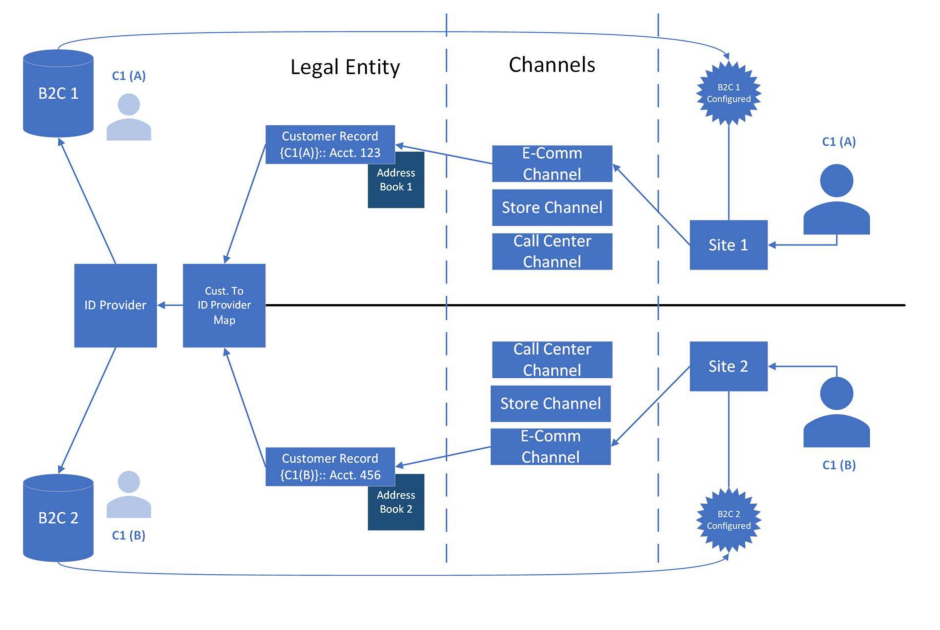

---
# required metadata

title: Configure multiple B2C tenants in a Commerce environment
description: This topic describes when and how to set up multiple per-channel Microsoft Azure Active Directory (Azure AD) business-to-consumer (B2C) tenants for user authentication in a dedicated Dynamics 365 Commerce environment.
author: BrianShook
ms.date: 03/17/2021
ms.topic: article
ms.prod: 
ms.technology: 

# optional metadata

ms.search.form:  
audience: Application User
# ms.devlang: 
ms.reviewer: v-chgri
# ms.tgt_pltfrm: 
# ms.custom: 
ms.search.region: Global
ms.search.industry: retail
ms.author: brshoo
ms.search.validFrom: 2020-02-12
ms.dyn365.ops.version: 

---

# Configure multiple B2C tenants in a Commerce environment

[!include [banner](includes/banner.md)]

This topic describes when and how to set up multiple Microsoft Azure Active Directory (Azure AD) business-to-consumer (B2C) tenants per channel for user authentication in a dedicated Dynamics 365 Commerce environment.

Dynamics 365 Commerce uses the Azure AD B2C cloud identity service to support user credentials and authentication flows. Users can use the authentication flows to sign up, sign in, and reset their password. Azure AD B2C stores a user's sensitive authentication information, such as the user name and password. The user record is unique to each B2C tenant, and it uses either user name (email address) credentials or social identity provider credentials.

In most cases, a single Azure AD B2C tenant is used in a Commerce environment. Commerce customers can then create and publish multiple sites in the same Commerce environment, and the same customer credentials will be used across these sites. However, if the sites in the environment should be treated as different brands and appear to users as separate businesses, a B2C tenant can be configured for the channel that is used for the site/brand separation.

## Considerations when multiple B2C tenants are set up per channel

Often, when each channel or site is being treated as a separate business, the best option with respect to user authentication flows in Commerce is to use separate legal entities. However, if you want to keep each channel/site in the same environment and legal entity, but want to have separate user authentication for each site, it's important that you consider the following points before you proceed:

- Users will have their own distinct credentials for each channel/site.

    The same person can have two separate accounts per channel/site, because each account will be a unique entry into a separate B2C tenant.

- In the Microsoft Dynamics environment, separate customer records will be returned for global record searches.

    If a user uses the same email address across channels/sites, global customer searches will return results for each channel/site. (A channel indicator will be shown.)

- The address book can be used to help group users, so that they can be tracked per channel.
- The number of customer records per channel might increase, and this increase might affect the performance of global customer searches.
- B2C tenants must be carefully mapped to a channel, to help prevent situations where customers sign up for an incorrect tenant. Otherwise, confusion or tracking issues can occur.

The following illustration shows multiple B2C tenants in a Commerce environment.

If you decide that your business requires distinct B2C tenants per channel in the same Commerce environment, complete the procedures in the following sections to request this feature.

## Configure B2C tenants in your environment

To configure B2C tenants in your environment, complete the relevant procedures in this section.

### Add an Azure AD B2C tenant

To add an Azure AD B2C tenant to your environment, follow these steps.

1. Sign in to Commerce site builder for your environment as a system admin. To configure Azure AD B2C tenants, you must be a system admin for the Commerce environment.
1. In the left navigation pane, select **Tenant Settings** to expand it.
1. Select **B2C Settings**, and then select **Manage**.
1. Select **Add B2C Application**, and then enter the following information:

    - **Application Name**: Enter the name that should be used for the application in the context of managing it in Commerce. We recommend that you use the application name that you chose when you set up the Azure AD B2C application in the Azure portal. In this way, you can help reduce confusion when you manage B2C tenants in Commerce.
    - **Tenant Name**: Enter the B2C tenant name as it appears in the Azure portal.
    - **Forget Password Policy ID**: Enter the policy ID (the name of the policy in the Azure portal).
    - **Signup Signin Policy ID**: Enter the policy ID (the name of the policy in the Azure portal).
    - **Client GUID**: Enter the Azure AD B2C tenant ID as it appears in the Azure portal (not the application ID for the B2C tenant).
    - **Edit Profile Policy ID**: Enter the policy ID (the name of the policy in the Azure portal).

1. When you've finished entering this information, select **OK** to save your changes. Your new Azure AD B2C tenant should now appear in the list under **Manage B2C Applications**.

> [!NOTE]
> You should leave fields such as **Scope**, **Non Interactive Policy ID**, **Non Interactive Client ID**, **Login Custom Domain**, and **Sign Up Policy ID** blank unless the Dynamics 365 Commerce team instructs you to set them.

### Manage or delete an Azure AD B2C tenant

1. Sign in to Commerce site builder for your environment as a system admin. To configure Azure AD B2C tenants, you must be a system admin for the Commerce environment.
1. In the left navigation pane, select **Tenant Settings** to expand it.
1. Select **B2C Settings**, and then select **Manage**.
1. To edit a B2C tenant, select the pencil symbol next to it. To delete a B2C tenant, select the trash can symbol next to it.
1. Select **Save**, and then select **Publish** to activate your changes.

> [!WARNING]
> When a B2C tenant is configured for a live/published site, users might have signed up by using accounts that are present on the tenant. If you delete a configured tenant on the **Tenant Settings \> B2C Tenant** menu, you remove the association of that B2C tenant from sites that are associated with any channels of the tenant. In this case, your users might no longer be able to sign in to their accounts. Therefore, use extreme caution when you delete a configured tenant.
>
> When a configured tenant is deleted, the B2C tenant and records will continue to be maintained, but the Commerce system configuration of that tenant will be changed or removed. Users who try to sign up or sign in to the site will create a new account record in the default or newly associated B2C tenant that is configured for the channel of the site.

## Configure your channel with a B2C tenant

1. Sign in to Commerce site builder for your environment as a system admin. To configure Azure AD B2C tenants, you must be a system admin for the Commerce environment.
1. In the left navigation pane, select **Site Settings** to expand it.
1. Select **Channels**, and then select the channel to configure.
1. In the properties pane on the right, in the **Select B2C Application** field, select the configured Azure AD B2C tenant to use for this channel.
1. On the command bar, select **Save and Publish** to commit the new or updated configuration.

> [!WARNING]
> If you change the B2C application that is assigned to the channel, you remove the current references that have been established for any users who have already signed up in the environment. In this case, any credentials that are associated with the currently assigned B2C application won't be available to users. Therefore, change a channel Azure AD B2C configuration only if you're setting up the channel for the first time, and no users have been able to sign up. Otherwise, users might have to sign up again to establish a record in the new Azure AD B2C tenant.
## Additional resources

[Configure your domain name](configure-your-domain-name.md)

[Deploy a new e-commerce tenant](deploy-ecommerce-site.md)

[Create an e-commerce site](create-ecommerce-site.md)

[Associate a Dynamics 365 Commerce site with an online channel](associate-site-online-store.md)

[Manage robots.txt files](manage-robots-txt-files.md)

[Upload URL redirects in bulk](upload-bulk-redirects.md)

[Set up a B2C tenant in Commerce](set-up-B2C-tenant.md)

[Set up custom pages for user logins](custom-pages-user-logins.md)

[Add support for a content delivery network (CDN)](add-cdn-support.md)

[Enable location-based store detection](enable-store-detection.md)

[!INCLUDE[footer-include](../includes/footer-banner.md)]
