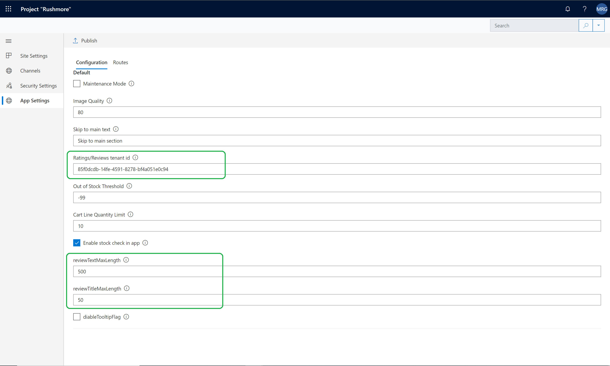
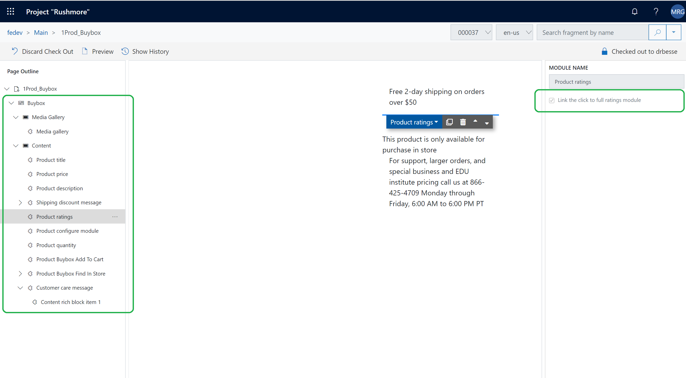
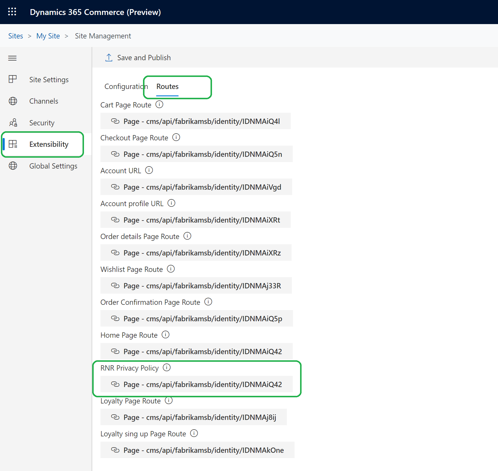

---
# required metadata

title: Configure ratings and reviews
description: This topic describes how to configure your e-Commerce site to show customer ratings and reviews in Microsoft Dynamics 365 Commerce.
author: gvrmohanreddy
ms.date: 02/17/2020
ms.topic: article
ms.prod: 
ms.technology: 

# optional metadata

# ms.search.form: 
audience: Application user
# ms.devlang: 
ms.reviewer: v-chgri
# ms.tgt_pltfrm: 
ms.custom: 
ms.assetid: 
ms.search.region: Global
# ms.search.industry: 
ms.author: gmohanv
ms.search.validFrom: 2019-10-31
ms.dyn365.ops.version: Release 10.0.5

---

# Configure ratings and reviews

[!include [banner](includes/banner.md)]

This topic describes how to configure your e-Commerce site to show customer ratings and reviews in Microsoft Dynamics 365 Commerce.

Ratings and reviews on e-Commerce websites help customers learn about products before they make a purchase decision by showing them what other customers think about those products. For e-Commerce websites, ratings and reviews are also a mechanism for collecting customer feedback about products. 

## Configure a site to show ratings and reviews

Configuration values for ratings and reviews, such as the tenant ID, review text length, and review title length, are configured at the site level. 

To configure a site to show ratings and reviews, follow these steps. 

1. Go to **Home \> Sites**.
1. Select the name of your site. 
1. Go to **Site settings \> Extensions**. 
1. In the **Review text max length** field, enter the maximum number of characters that review text can have (for example, **1000**). 
1. In the **Review title max length** field, enter the maximum number of characters that review titles can have (for example, **55**). 
1. Select **Save and Publish**. 

The following illustration shows what this configuration looks like in Dynamics 365 Commerce.

## Link a product rating to the Reviews section of a PDP

A product rating is shown below the product title at the top of PDP. The product rating can be configured so that it's linked to the **Reviews** section of the same PDP. 

To link a product rating to the **Reviews** section of the PDP, follow these steps.

1. Open the PDP template. 
1. Go to **Buy box container module settings**.
1. Under **Buy box**, select **Product ratings**, and then select the **Link the click to full reviews module** check box.

The following illustration shows what this configuration looks like in Dynamics 365 Commerce.

## Configure the link for the privacy and policy page

To configure the link for the privacy and policy page, follow these steps.

1. Go to **Home \> Sites**.
1. Select the name of your site. 
1. Go to **Site settings \> Extensions**.
1. On the **Routes** tab, under **RNR Privacy and Policy**, select **Add a link**. If a link is already entered, and you want to replace it, select the link. 
1. In the **Add a link** dialog box, select the link for the privacy and policy page, and then select **OK**. 
1. Select **Save and Publish**. 

The following illustration shows what this configuration looks like in Dynamics 365 Commerce.

## Configure ratings and reviews modules on product details pages

For information on configuring ratings and reviews modules on product details pages, see [Ratings and reviews modules](ratings-reviews-modules.md).

## Additional resources

[Ratings and reviews overview](ratings-reviews-overview.md)

[Opt in to use ratings and reviews](opt-in-ratings-reviews.md)

[Manage ratings and reviews](manage-reviews.md)

[Sync product ratings in Dynamics 365 Retail](sync-product-ratings.md)

[Enable manual publishing of ratings and reviews by a moderator](manual-publish-rating-reviews.md)

[Import and export ratings and reviews](import-export-reviews.md)

[Configure Service-to-Service authentication](service-to-service-auth.md)

[Ratings and reviews FAQ](ratings-reviews-faq.md)

[Ratings and reviews modules](ratings-reviews-modules.md)

[!INCLUDE[footer-include](../includes/footer-banner.md)]
